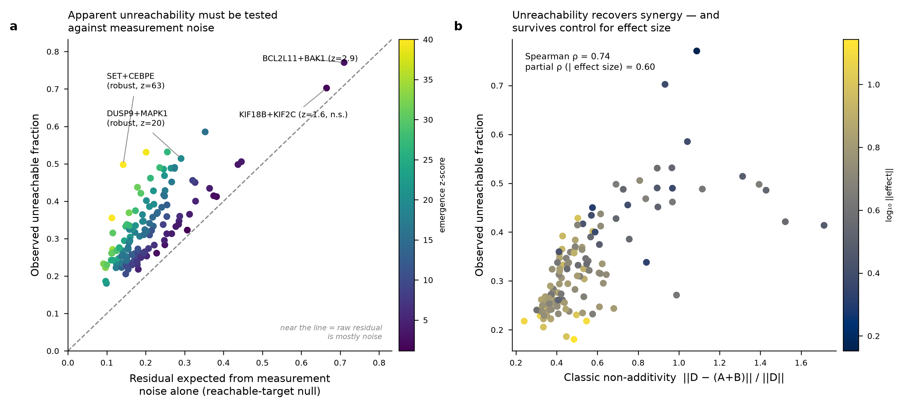
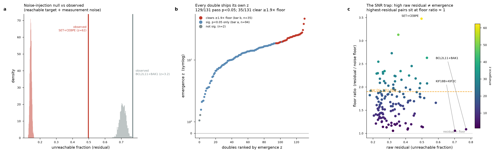
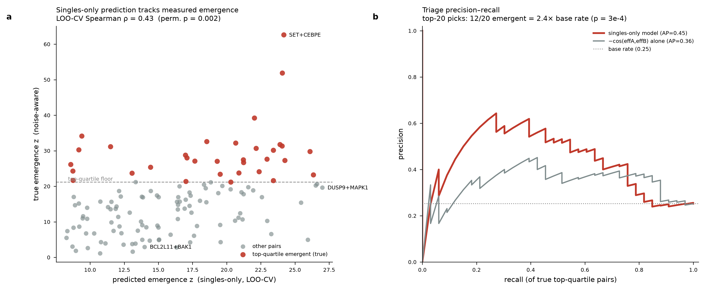
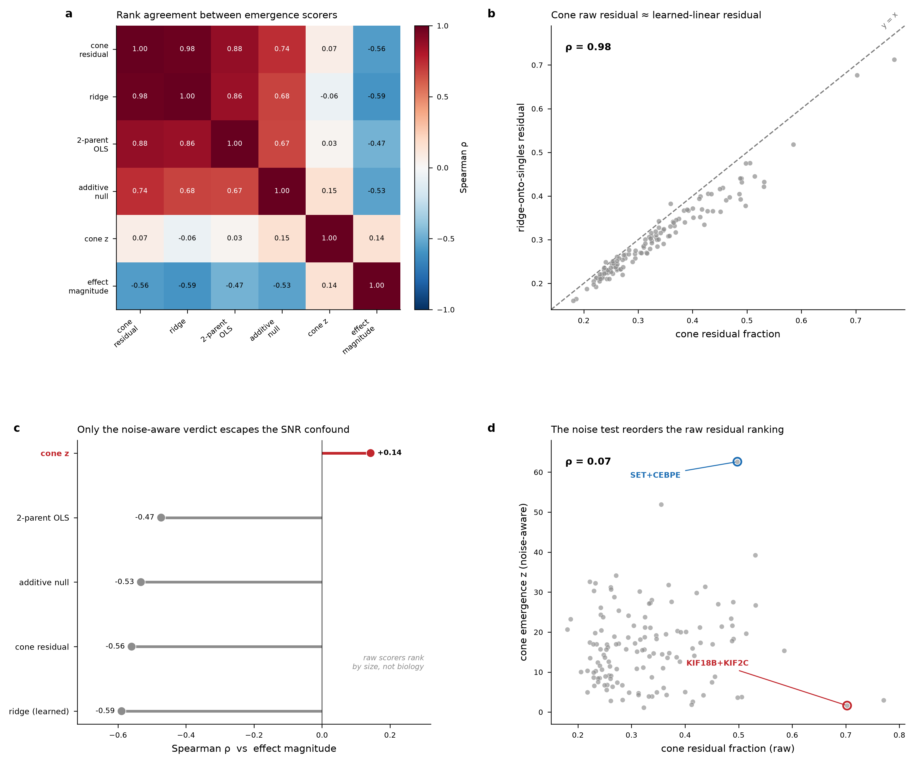
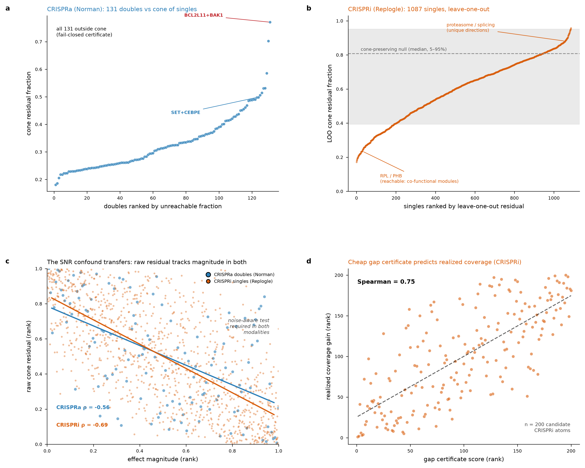
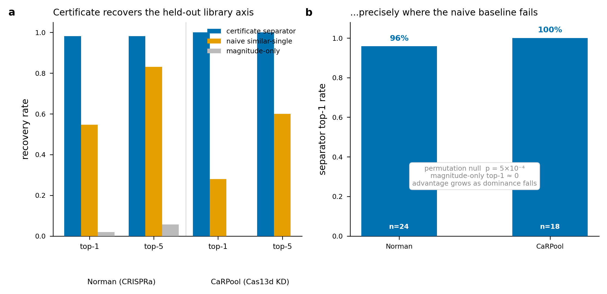

# CombiCone — certified triage for combinatorial perturbation screens

[](https://github.com/MasalaKimchi/cell-state-reachability/actions/workflows/ci.yml)
[](LICENSE)

**Which combinations are worth running?** A combinatorial perturbation screen
explodes super-linearly: 100 single perturbations imply ~5,000 pairs and ~160,000
triples. You cannot measure them all, and most combinations are *additive* — they
do nothing the two singles didn't already do, and the well is wasted. The
decision that costs real money is **which combinations produce a cell state the
singles cannot reach on their own.**

CombiCone answers that with certified convex geometry rather than a black box.
Every measured single-gene effect is an atom; their non-negative combinations
form a cone of everything the singles can additively reach. A combination is
**emergent** when its measured effect lands *outside* that cone — and the engine
returns a model-relative **separator certifying** the unreachable direction,
together with a **measurement-noise test** so you never mistake a low signal-to-noise
residual for biology.

This is the one thing a virtual-cell predictor (GEARS, scGPT, STATE, CPA) does
*not* do: those models always emit *a* prediction. CombiCone emits a certificate
of infeasibility when the target is not representable — the honest "I can't get
there from here" that a triage decision actually needs.



> **Scope, stated once and everywhere.** "Unreachable" is *model-relative*: it
> means outside the non-negative cone of **these** measured single-gene effects
> under **this** metric — never a claim of biological impossibility. Every result
> object carries this disclaimer in a `scope` field. The geometry is a triage and
> hypothesis-ranking instrument, not a calibrated biological decision rule.

## The two questions, in one screen

```python
import numpy as np
import combicone as cc

# Measured single-gene effect profiles (rows = perturbations, cols = genes)
singles = np.array([
    [1.0, 0.0, 0.0, 0.0],   # A
    [0.0, 1.0, 0.0, 0.0],   # B
    [0.0, 0.0, 1.0, 0.0],   # C
])
names = ["A", "B", "C"]

# 1) PROSPECTIVE TRIAGE — rank unmeasured combinations from the singles alone.
triage = cc.triage_combinations(singles, names)
print(triage.top(1))          # the pair to run first

# 2) CERTIFY EMERGENCE — test a MEASURED combination against the single-gene cone,
#    with a measurement-noise null so a noisy residual is not called emergent.
measured_AB = np.array([1.0, 1.0, 0.0, 3.0])       # big unreachable 4th-axis move
noise_sd    = np.full(4, 0.05)                      # per-gene SE (e.g. split-half)
cert = cc.certify_emergence(singles, measured_AB, noise_sd=noise_sd)
print(cert.verdict)           # -> "certified emergent (p=..., NNx noise floor)"
print(cert.separator)         # the model-relative infeasibility certificate
```

## What the evidence shows

Validated on the **Norman combinatorial CRISPRa screen** (file label `A549`;
canonically K562 — see the provenance note below): 105 single-gene effect atoms,
131 measured double perturbations, every double with both constituent singles
measured. All numbers below are reproduced by the scripts in this repo and the
[tutorial](tutorial/tutorial.ipynb).

### The certificate recovers synergy — and survives a noise test

| Result | Interpretation |
|---|---|
| **All 131 doubles fall outside the single-gene cone** (fail-closed certificate) | Every combination gets a model-relative separator; the cone never silently "reaches" a target it cannot represent. |
| **Raw unreachable fraction is signal-to-noise confounded** (Spearman −0.56 vs effect magnitude; only ~27% of doubles clear their own split-half noise floor) | Low-magnitude doubles show inflated *normalized* residuals from measurement noise, not biology. This is the trap CombiCone's noise test exists to catch. |
| **The noise-injection null removes the confound** (`emergence_z` vs magnitude ρ ≈ +0.14) and certifies **129/131** doubles above noise at p<0.05 | The noise-aware verdict, not the raw residual, is what you act on. |
| **Emergence recovers classic synergy independent of effect size** (partial Spearman(residual, ‖D−(A+B)‖/‖D‖ ∣ magnitude) = **0.60**) | Unsupervised, the certificate rediscovers the textbook DUSP9+MAPK1 phosphatase-on-substrate synergy and chromatin/MAPK modules (SET+CEBPE, MAPK1+PRTG). |



### Triage works prospectively, from singles only

| Result | Interpretation |
|---|---|
| **Singles-only score enriches the top picks** (default `−cos(effA,effB)`): top-20 precision **2.4×** base rate vs the raw label, **1.4×** vs the noise-robust label | You can pre-rank which unmeasured combinations to run *before spending a combinatorial well*, using only the single-gene measurements. Honest and modest — not a solved problem. |
| **A ridge fitted on a labeled pilot** reaches LOO-CV Spearman **0.43** (permutation p=0.002), top-20 precision ~**2.4×** against the noise-robust label | When you can afford a small labeled pilot screen, the learned triage improves on the training-free default for the magnitude-controlled target. |



### Honest head-to-head: what the certificate *adds*

The cone's raw residual ranking is **not** magically better than simpler
alternatives — on Norman it correlates **0.98** with a learned ridge-onto-singles
residual and 0.74 with the classic additive non-additivity score. Several
rankers agree because they are measuring closely related things.

**What CombiCone adds is the certificate, not raw ranking accuracy:** a
fail-closed separator proving non-representability, and a noise-calibrated
verdict. Every *raw* ranker (cone residual, ridge, additive null, 2-parent OLS)
is confounded by effect magnitude (Spearman −0.47 … −0.59); **only the
noise-aware `cone_z` escapes** (+0.14). That is the differentiator a screen can
trust.



### The geometry transfers across modality

The same engine runs unchanged on the **Replogle K562 essential-gene CRISPRi**
library (loss-of-function): a leave-one-out reachability spectrum ranks
proteasome/splicing factors as the most unique directions and ribosomal /
prohibitin co-functional modules as the most reachable, and the cheap acquisition
certificate predicts realized coverage (Spearman 0.75). Replogle has no measured
doubles, so this is a **geometry-transfer demonstration, not a second
double-emergence benchmark** — and it shows the signal-to-noise confound is
present in CRISPRi too (ρ −0.69), so the noise test is required in both
modalities.



### The certificate designs the next library — not just the next well

Put the certificate inside a screening campaign
([`screenloop.py`](screenloop.py)) and two questions separate cleanly. For
**acquisition** — which unmeasured combination to run next — the
certificate-adaptive residual does *not* beat the cheap training-free `−cos`
triage (Norman: 96 wells to 90% discovery for triage vs 120 for the certificate;
CaRPool: all policies tie), consistent with the finding above that the cone's
value is not raw ranking accuracy. But for **library augmentation** — which *new
single perturbation* to add — the certificate does something no forward predictor
can: aggregating the model-relative separators of the combinations a library
fails to reach yields the axis the library is *missing*, and ranking candidates
against it **recovers a held-out single-gene at median rank 1** (Norman top-1
**0.98** of 105 candidates; CaRPool top-1 **1.00** of 28), versus 0.55 / 0.28 for
a naive "average-the-combos, take the most-similar-single" baseline and ≈ 0.01 for
random. The result survives a permutation null (p = 5×10⁻⁴) and three
magnitude-confound controls on both screens — a magnitude-only ranker recovers
essentially nothing (top-1 ≤ 0.02), and the separator's advantage *grows* as the
held-out gene is *less* dominant in its own combinations (Spearman ρ < 0). A
forward predictor emits a prediction for every input; only a certificate of
infeasibility can name what the library cannot represent. See
[`docs/phase2/screenloop_note.md`](docs/phase2/screenloop_note.md).



## Who it is for

Groups running or planning **combinatorial** perturbation screens (genetic combos,
drug combos, cytokine cocktails) who need to decide **which unmeasured
combinations to run next** and **which measured combinations are genuinely
emergent** — with an auditable certificate and an explicit measurement-noise test,
not a point prediction. The retrospective single-target reachability and coverage
layers (below) remain available for library redundancy and coverage audits.

## Install and reproduce

```bash
python -m pip install .            # the flat module API (combicone, reachability, ...)
```

```bash
python -m pip install -r requirements.txt
./reproduce.sh                     # frozen reproduction contract
```

`reproduce.sh` gates the pinned environment, runs the full numerical test suite
(including `tests/test_combicone.py`), executes the `combicone`, `reachability`,
and coverage demos, checks the adversarial harness, and validates the frozen
findings and artifact lineage. External scientific data are gitignored; source
routes, hashes, and licenses are in [data/README.md](data/README.md).

## The honesty machinery (unchanged, and load-bearing)

CombiCone is a triage layer built *on top of* a fail-closed geometric core that
was hardened over many iterations. That machinery is preserved verbatim — the
triage thesis rests on it:

- **`reachability.py`** — non-negative cone projection with KKT/separator
  diagnostics that certify at `1e-8` or fail closed; emits the model-relative
  separator when a target is outside the measured cone.
- **`scripts/run_validation_harness.py`** — six data-free adversarial scenarios
  that reproduce common-response inflation, random-gene optimism, and
  sign-selection inflation; a maxT multiplicity check with an exact one-sided
  95% bound under a fixed gate.
- **The T-cell proving ground (Zhu Th2→Th1) and the STRESS boundary map**,
  including the negative results — donor-pair transfer that fails magnitude
  calibration, the reciprocal guide-rank stress, and the Goudy cross-experiment
  stress — are retained in full. Under this framing the negatives are a feature:
  the tool surfaces its own limits.

Full per-result detail and claim ceilings are in the canonical machine-readable
[`results/findings.json`](results/findings.json).

## Repository map

| Path | Role |
|---|---|
| [`combicone.py`](combicone.py) | **Triage + certify API** — `triage_combinations`, `certify_emergence`, `fit_triage_model`, layered over the certified cone |
| [`reachability.py`](reachability.py) | Projection-only numerical core; infeasibility certificate (the honesty machinery) |
| [`library_coverage.py`](library_coverage.py) | Strict/thresholded catalog coverage, redundancy, gap normals, ranking of measured candidates |
| [`validation.py`](validation.py) | Oracle, label/provenance, grouped-split, and multiplicity contracts |
| [`scripts/run_validation_harness.py`](scripts/run_validation_harness.py) | Deterministic adversarial synthetic stress harness |
| [`effect_dictionary.py`](effect_dictionary.py) | Safe, labeled adapter from cell matrices to portable effect dictionaries |
| [`tests/test_combicone.py`](tests/test_combicone.py) | Unit + geometry tests for the triage/certify layer |
| [`tutorial/tutorial.ipynb`](tutorial/tutorial.ipynb) | End-to-end: triage a combinatorial screen, then certify emergence |
| [`results/findings.json`](results/findings.json) | Canonical machine-readable findings |

## Hard boundaries

- **"Unreachable" is model-relative**, never biological impossibility. It is a
  property of the supplied effect atoms and the chosen metric.
- **The Norman file provenance:** the distributed file labels `cell_type = A549`,
  whereas the canonical Norman 2019 combinatorial screen is K562. We report it as
  "Norman combinatorial CRISPRa (file label A549)" and make no cell-line claim
  beyond what the file states.
- **Prospective triage is modest**: 2.4× enrichment over base rate against the raw
  label (1.4× against the noise-robust label) is a useful pre-screen, not a solved
  problem. Do not oversell it.
- **The certificate ranks and flags; it does not validate a target, prescribe a
  dose, or assert intervention efficacy.** A certified-emergent combination is a
  ranked hypothesis for follow-up, not a result.
- **Emergence must be tested against measurement noise.** A high raw
  unreachable-fraction on a low-magnitude combination is a signal-to-noise
  artifact until `certify_emergence` clears it; always report the p-value and the
  floor ratio, and distinguish the two bars (p<0.05 vs clearing the effect-size
  floor).
- The retrospective coverage layer uses already-measured candidate effects and is
  not prospective library design over unmeasured perturbations.
- All the prior T-cell / cross-study boundaries in
  [`results/findings.json`](results/findings.json) remain in force.

## License

MIT. Source-data licenses and citation requirements are in
[data/README.md](data/README.md); software citation metadata is in
[`CITATION.cff`](CITATION.cff).
