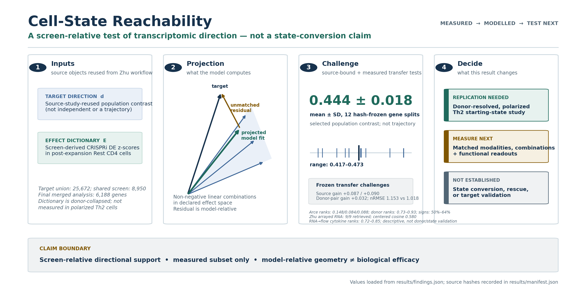

# Cell-State Reachability

**Does a measured perturbation dictionary contain directional support for a target
transcriptomic change under a declared non-negative linear-combination model?**

This repository provides a strict numerical core, a systemic synthetic stress harness,
a hash-bound retrospective reconstruction, donor-pair and cross-study transfer stress
tests, and a source-selected arrayed RNA/protein follow-up. It does not predict state
conversion, prescribe an intervention, or validate a target.



## Current evidence

The primary case study starts from donor-collapsed `Rest` CRISPRi effects from primary
human CD4 cells and adds a published-eligibility donor-pair sensitivity. Its target is a
source-study-reused, selectively constructed cross-sectional
population contrast oriented toward the reported Th1 centroid; it is neither independent
nor a trajectory.

| Source-bound result | Interpretation |
|---|---|
| **0.444 ± 0.018** (range 0.417–0.473) | Mean ± SD over 12 lexicographically frozen random-gene splits; split variation, not donor uncertainty. |
| **25,672 → 11,616 → 7,960 → 6,188 genes** | Target union → shared sources → concordant signs → screen-measured registered target. |
| **+0.087 / +0.090 logFC cosine** | Ota→Höllbacher / reverse mean improvement over the better of a mean ray and best single atom across six correlated splits. Directional only: normalized RMSE does not improve. |
| **Donor-pair +0.032 cosine; nRMSE 1.153 vs 1.018** | Median run-balanced gain over a training-selected frozen best single across 24 correlated challenges. Only 75% improve in cosine and 1/24 in magnitude; released eligibility and four fixed donors preclude leakage-free or population claims. |
| **Arce Spearman 0.148 / 0.084 / 0.088** | Cross-study CRISPRi-transcript to CRISPR-KO CD25 ranking alignment in resting Teff / stimulated Teff / resting Treg; modest and context dependent. |
| **Selected-panel donor A-vs-B target-rank concordance 0.73–0.93; four-stratum sign agreement 50–64%** | Authors' preselected 28-regulator panel, exactly two donors/two guides; descriptive supplied-score concordance with guide heterogeneity, not genome-wide or donor validation. |
| **9/9 perturbations retrieved; median centered profile cosine 0.580** | Source-selected Stim8hr screen effects versus arrayed bulk RNA across 8,967 coordinates after masking every panel target gene. Six follow-up donor labels add IL-10/IL-21 flow consistency (Spearman 0.72–0.85 versus bulk RNA), but selection and uneven donor coverage preclude held-out-discovery or population claims. |

The systemic harness independently checks NNLS solutions, provenance and axis faults,
group leakage, exact uncertainty around familywise error, common-response confounding,
random-gene optimism, and sign-selection inflation.

The formerly displayed **0.446 ± 0.010** and **p = 1/61** were retired. Their deleted
pipeline depended on an unhashed `inputs.npz` whose gene order was not preserved, so the
multisplit table and shuffles cannot be source-reconstructed. The separately archived
fixed split (0.448154) does reproduce within `3e-10`; it is retained only as provenance in
the source report, not as the headline.

The utility is constrained, inspectable geometry and falsifiable transfer tests—not
predictive superiority. See [findings](docs/FINDINGS.md), [methods](docs/METHODS.md),
[technical validation](docs/VALIDATION_REPORT.md), and the
[expert-reviewed execution plan](docs/SCIENTIFIC_VALIDATION_PLAN.md).

## Run the maintained surface

```bash
python -m pip install -r requirements.txt
./reproduce.sh
```

The small reproduction path runs the numerical tests, demo, systemic harness check, and
artifact-lineage validation. External scientific data are gitignored. With the registered
inputs available:

```bash
python -m pip install -r requirements-external.txt
python scripts/run_source_reconstruction.py --check results/source_reconstruction.json
python scripts/run_arce_external_validation.py --check
python scripts/run_zhu_arrayed_validation.py --check
python scripts/run_donor_pair_transfer.py --check
```

Acquisition, hashes, licenses, and claim ceilings are in [data/README.md](data/README.md).

```python
import numpy as np
from reachability import project_cone

effects = np.eye(4)  # perturbations × genes
target = np.array([1.0, 0.0, -1.0, 0.0])
result = project_cone(effects, target)

print(result.geometry_status)  # outside_model_cone
print(result.cosine, result.kkt_violation)
```

The public API emits projection geometry, KKT diagnostics, a model-relative separator,
and held-out scores. It intentionally emits no biological verdict, recipe, dose, or
candidate ranking.

## Repository map

| Path | Role |
|---|---|
| [`reachability.py`](reachability.py) | Projection-only numerical core |
| [`validation.py`](validation.py) | Oracle, label/provenance, grouped-split, and multiplicity contracts |
| [`scripts/run_validation_harness.py`](scripts/run_validation_harness.py) | Deterministic systemic synthetic stress harness |
| [`scripts/run_source_reconstruction.py`](scripts/run_source_reconstruction.py) | Full-file-hash-bound target and cross-source reconstruction |
| [`scripts/run_arce_external_validation.py`](scripts/run_arce_external_validation.py) | Independent CD25 transfer plus donor/guide supplied-score robustness |
| [`scripts/run_zhu_arrayed_validation.py`](scripts/run_zhu_arrayed_validation.py) | Source-selected arrayed bulk-RNA and donor-normalized cytokine follow-up |
| [`scripts/run_donor_pair_transfer.py`](scripts/run_donor_pair_transfer.py) | Frozen-weight target-source plus complementary donor-pair transfer sensitivity |
| [`results/findings.json`](results/findings.json) | Canonical machine-readable findings |
| [`docs/SCIENTIFIC_VALIDATION_PLAN.md`](docs/SCIENTIFIC_VALIDATION_PLAN.md) | Ordered statistical, ML, and biological execution program |

## Hard boundaries

- The aggregate primary effects are donor-collapsed; donor-pair modalities are
  published-eligibility-selected two-donor summaries; all random-gene splits are correlated.
- The target was constructed from sources reused by the source study.
- Source-transfer baselines are limited; directional gains do not imply magnitude accuracy.
- Arce S1 is aggregate; S14 adds two-donor/two-guide robustness for an incompletely
  specified supplied score, not donor-population or functional validation.
- The Zhu arrayed panel contains nine source-selected perturbations with unequal coverage
  across six follow-up donors; it is cross-platform replication, not held-out discovery.
- Established polarized Th2 cells, donor/guide holdout, direct combinations, matched
  CRISPRa, chromatin, durability, fitness, and functional state conversion remain untested.

## License

MIT. Source-data licenses and citation requirements are recorded separately in
[data/README.md](data/README.md).
