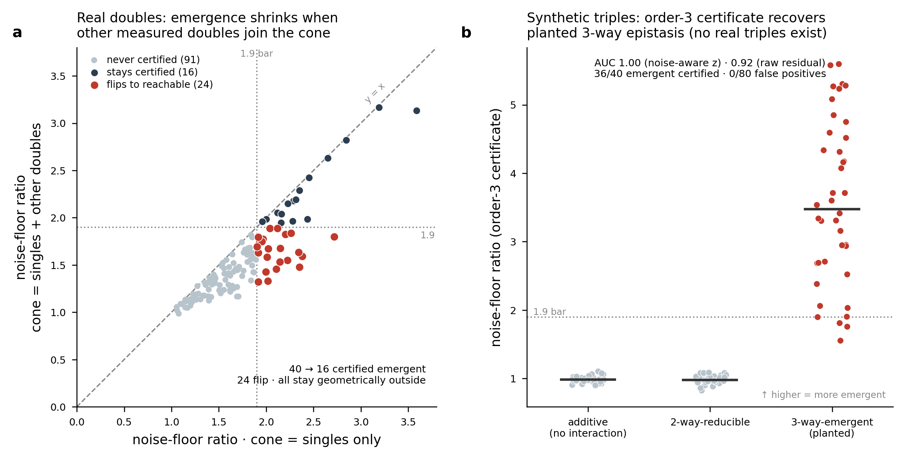

# Findings

Canonical human-readable findings for CombiCone. Every number here is
single-sourced from [`results/findings.json`](../results/findings.json)
(machine-readable, canonical) and the frozen metric JSON under `docs/phase2/`
and `docs/phase3/`; methods are in [`METHODS.md`](METHODS.md), and what is
certified vs. evaluated is in [`VALIDATION_REPORT.md`](VALIDATION_REPORT.md).
This document absorbs the former `docs/phase2/{cross_screen_analysis,
kway_note,screenloop_note}.md` and `docs/phase3/{acquisition_note,
certificate_dossier}.md`.

**Tiers.** `[MAIN]` combinatorial triage/certification is the headline;
`[TRANSFER]` cross-screen/cross-modality; `[EXTENSION]` library coverage;
`[PROVING GROUND / STRESS]` the retained single-target reachability work,
including its negative results (a feature: the tool surfaces its own limits).

## Claim boundary

Retrospective, donor-collapsed, model-relative directional evidence — not
calibrated biological reachability, state conversion, target validation, donor
generalization, predictive superiority, prospective library design, or
intervention efficacy. Combinatorial emergence is model-relative unreachability
from the supplied single-gene cone, not biological impossibility or validated
synergy. Prospective triage is a modest rank enrichment, not a solved
prediction. The cone's *raw* ranking is not superior to a learned additive
baseline (Spearman 0.98); only the noise-aware verdict escapes the effect-size
confound.

---

## 1. [MAIN] The certificate recovers synergy and survives a noise test

**Norman combinatorial CRISPRa** (distributed file label `cell_type=A549`;
canonical Norman 2019 is K562 — reported as file-label A549, no cell-line claim
made): **105 single-gene atoms, 131 measured doubles**, every double with both
constituent singles measured.

- **All 131 doubles fall outside the single-gene cone** (fail-closed
  certificate): every combination gets a model-relative separator; the cone never
  silently "reaches" a target it cannot represent.
- **The raw unreachable fraction is signal-to-noise confounded**: Spearman
  **−0.56** vs. effect magnitude, and only **26.7%** of doubles clear their own
  split-half noise floor. Low-magnitude doubles show inflated normalized
  residuals from measurement noise — the trap the noise test exists to catch.
- **The noise-injection null removes the confound**: `emergence_z` vs. magnitude
  Spearman **+0.14**. Two bars: **129/131** clear bar (a) `p<0.05`; **35/131**
  also clear bar (b) `1.9×` floor. (Under the shared symmetric cross-screen
  pipeline the same two bars read **128/131** and **40/131** — a documented
  configuration difference, not an error: bar (a) is near-saturated either way
  and the bar-(b) count is jittery near the 1.9× threshold; see
  [`METHODS.md`](METHODS.md) §2.)
- **Emergence recovers classic synergy independent of effect size**: unreachable
  fraction vs. classic non-additivity `‖D−(a+b)‖/‖D‖` Spearman **0.736**;
  **partial Spearman 0.62** (0.6244, standard three-correlation estimator,
  recomputed from `combicone_substrate.npz`) controlling for magnitude.
- **Strongest certified pairs are known biology** (a positive control, not a
  discovery): SET+CEBPE (z=62, 3.5× floor), IRF1+SET (z=49), MAPK1+PRTG (z=38),
  and the textbook DUSP9+MAPK1 phosphatase-on-substrate synergy (z=20).
  **KIF18B+KIF2C** is the one raw-top headliner that fails significance (z=1.6,
  p=0.055) — the noise bar demoting a magnitude artifact. BCL2L11+BAK1 passes
  bar (a) weakly (z=2.9, p=0.005) but not bar (b).

---

## 2. [MAIN] Prospective triage works from singles only — and is modest

The training-free `−cos` score enriches the top picks without any measurement:

- top-20 precision **2.38×** base rate against the raw label (12 hits, 0.60);
- **1.39×** against the noise-robust label (7 hits, 0.35).

A ridge fitted on a labeled pilot reaches LOO-CV Spearman **0.435**
(permutation p=0.002), top-20 enrichment ~2.4× against the noise-robust label —
reported as a ceiling; the headline needs no training. **Do not oversell**: this
is a useful pre-screen (rank which unmeasured combinations to run before spending
a well), not a solved problem, and it is retrospective on the 131 measured
doubles, not a forward hit rate.

---

## 3. [MAIN] Honest head-to-head: the certificate is the differentiator, not raw ranking

The cone's *raw* residual ranking is **not** magically better than simpler
alternatives: it correlates **0.977** with a learned ridge-onto-singles residual
and 0.74 with the classic additive non-additivity score. A self-contained
learned MLP ties the trivial additive baseline on blind held-out prediction
(cosine **0.896** vs **0.897**; MLP wins 49.6% of doubles); the cone's in-sample
0.937 requires seeing the measurement, not a forecast.

**What CombiCone adds is the certificate, not raw ranking accuracy.** Every *raw*
ranker is magnitude-confounded (Spearman −0.47…−0.59: cone_raw −0.56,
nonadditivity −0.533, ridge_resid −0.589, ols2_resid −0.473); **only the
noise-aware `cone_z` escapes** (+0.14). That is the differentiator a screen can
trust. This reproduces the 2025–2026 finding that the accuracy race is the wrong
race — a screening team buys *feasibility*, and feasibility comes with a
certificate.

---

## 4. [TRANSFER] The geometry transfers to an orthogonal second screen

**CaRPool-seq (Wessels 2023, GSE213957)** — Cas13d RNA-targeting knockdown in
THP-1, orthogonal to Norman on *every* axis (direction up vs down, target DNA vs
RNA, effector dCas9-activator vs Cas13d, cell context). 28 single atoms, 158
measured doubles.

- **The SNR/magnitude confound is universal, and the fix works in both**: raw
  residual vs magnitude Spearman −0.56 Norman / **−0.82 CaRPool**; noise-aware z
  vs magnitude +0.13 / +0.12 (both n.s.). Reporting the raw residual is a trap in
  every screen; the noise-aware z is the honest statistic in every screen.
- **The two-bar certificate transfers**: bar (a) 128/131 (98%) Norman /
  158/158 (100%) CaRPool; bar (b) 40/131 (31%) / **76/158 (48%)** under the
  shared symmetric pipeline. CaRPool shows *more* certified emergence — a
  biological difference the certificate surfaces, not smooths.
- **Triage: rank signal transfers, magnitude-controlled part is
  screen-specific**: `−cos` vs raw label Spearman +0.47 Norman / +0.64 CaRPool
  (~2.2× enrichment both); vs the noise-robust z label **+0.37 (survives)**
  Norman / **+0.08 (n.s.)** CaRPool. Honest reading: the **certificate**, not the
  prospective score, is the defensible cross-screen capability.

---

## 5. [TRANSFER] Single-gene geometry transfers to CRISPRi (Replogle)

The same engine runs unchanged on the **Replogle K562 essential-gene CRISPRi**
library (loss-of-function, 1087 single-gene atoms): a leave-one-out reachability
spectrum ranks proteasome/splicing factors as the most unique directions and
ribosomal/prohibitin modules as the most reachable, and the cheap acquisition
certificate predicts realized coverage (Spearman **0.75**). Replogle has no
measured doubles, so this is a **geometry-transfer demonstration, not a second
double-emergence benchmark** — and the SNR confound is present in CRISPRi too
(ρ −0.69), so the noise test is required in both modalities.

The frozen three-dataset coverage audit (single-sourced from the cross-dataset
validation report) is reproduced verbatim below; `scripts/validate_findings.py`
regenerates this exact block from the canonical ledger and fails closed on any drift:

<!-- BEGIN VALIDATED LIBRARY COVERAGE SUMMARY -->
| Audit | Cone mean cosine | Strict membership | Cosine ≥0.5 | Simple comparator | Certificate vs realized gain |
|---|---:|---:|---:|---|---|
| Zhu CD4 CRISPRi | 0.436 | 0/150 | 32/150 | Best atom: 0.241; 0/150 | ρ=0.861; top-1 differs |
| Norman K562 CRISPRa | 0.958 | 0/131 | 131/131 | Constituent sum: 0.914; two-atom cone: 0.924 | ρ=0.921; top-1 differs |
| Replogle K562 CRISPRi | 0.776 | 0/150 | 143/150 | Best atom: 0.674; 116/150 | ρ=0.873; top-1 differs |

| 12-split sensitivity | Cone cosine median [range] | Cosine ≥0.5 median [range] | Strict-positive splits | Cone − best atom | Signed span − cone |
|---|---:|---:|---:|---:|---:|
| Zhu CD4 CRISPRi | 0.427 [0.409, 0.443] | 0.200 [0.150, 0.283] | 0/12 | +0.188 | +0.084 |
| Norman K562 CRISPRa | 0.865 [0.807, 0.878] | 0.983 [0.900, 1.000] | 0/12 | +0.106 | +0.033 |
| Replogle K562 CRISPRi | 0.774 [0.745, 0.807] | 0.950 [0.900, 0.967] | 0/12 | +0.095 | +0.063 |

Strict membership is absent from every reference catalog and every sensitivity split, so a
soft directional bar cannot be renamed reachability. The cone beats best-single and
common-response rays in all 36 splits, while the signed span is uniformly better: useful
alignment exists, but non-negativity is a real capacity constraint. Rank correlations are
strong, yet certificate and realized top candidates disagree in 3/3 audits. Norman's
0.958 reference uses all 152 single rows; its 0.865 sensitivity median uses 40 measured
canonical-gene representatives and is the appropriate partition-robustness result. Even in
the reference design, constituent-only baselines already clear the soft bar for 131/131
doubles, so the full cone adds alignment rather than establishing a biological manifold.
<!-- END VALIDATED LIBRARY COVERAGE SUMMARY -->

---

## 6. [MAIN] The certificate designs the next library — not just the next well

Put the certificate inside a screening campaign (`screenloop.py`) and two
questions separate cleanly:

- **Acquisition (an honest tie).** The certificate-adaptive residual does *not*
  beat the cheap training-free `−cos` triage at choosing what to measure next:
  wells to 90% discovery — Norman random ~120, magnitude 104, **triage 96**,
  certificate-adaptive 120; CaRPool all policies tie at 144 (base rate 48%, little
  to triage). Consistent with the finding that the cone's value is not ranking
  accuracy.
- **Library augmentation (the capability no forward predictor has).**
  Aggregating the separators of the combinations a library fails to reach yields
  the axis the library is *missing*; ranking candidates against it **recovers a
  held-out single-gene at median rank 1** — Norman separator top-1 **0.981**
  (of 105), CaRPool **1.000** (of 28), vs 0.547 / 0.280 for a naive
  "average-the-combos" baseline and ≈0.01 for random.

The recovery survives three controls: a **permutation null** (p = 5×10⁻⁴,
z = 72 Norman / 27 CaRPool); a **magnitude-only ranker** that recovers nothing
(top-1 0.019 / 0.000); and the decisive **dominance-vs-advantage** control —
the separator's edge over the naive baseline *grows* as the held-out atom is
*less* dominant in its own combinations (Spearman ρ = −0.63 Norman / −0.78
CaRPool), so the geometry, not the magnitude, does the work.

---

## 7. [EXTENSION] Prospective acquisition recommender

`acquisition.py` replayed over Norman (131 doubles, enrichment at 20 combinations
acquired ≈ 15% of the screen): on the **raw** label the recommender front-loads
discoveries at ~2× random (greedy 1.96×, diversified 1.81×); on the **strict
two-bar** label the lift is modest (greedy 1.31×) and the diversified strategy
falls below random in the first ~20 picks — diversity trades early exploitation
for batch spread, the correct behavior for a campaign that cannot afford a
redundant batch, but not a free lunch. `diversity_weight` is the exploit↔explore
knob.

---

## 8. [MAIN] Order-k generalization

Enlarging the reference cone 105→235 atoms (singles → singles + the other 130
doubles) shrinks certified doubles **40→16** (24 flip from certified-emergent to
reachable, 60% shrinkage; 0 newly certified — monotone, verified residual
strictly non-increasing for all 131). All 131 stay geometrically outside both
cones; the shrinkage is effect-size driven (median floor_ratio 2.15→1.81 among
the originally-certified 40). **Certified emergence is a property of the cone you
certify against and is not robust to cone enrichment** — which is why
higher-order screens need order-aware certification.

Synthetic planted-epistasis triples (K=14 singles, 91 doubles, 120 triples in
three planted classes): order-3 noise-aware z **AUC 1.000** (raw residual 0.925);
two-bar **36/40 planted-emergent certified, 0/80 additive/reducible false
positives**. The 4 misses are the four smallest planted terms
(‖Tt‖ = 1.50–1.92), correctly declined at the noise floor. **Synthetic only** —
a code-path and discrimination validation, never evidence about real biological
3-way epistasis (Norman measures zero triples).

---

## 9. [MAIN] Adversarial honesty harness

`scripts/run_validation_harness.py`: **6 data-free scenarios PASS**, reproducing
common-response inflation, random-gene optimism, and sign-selection inflation; a
maxT multiplicity check gives an exact one-sided 95% upper bound **0.0668** over
24 false families / 500 trials under a fixed gate.

---

## 10. [PROVING GROUND / STRESS] Single-target reachability (retained, demoted)

These real genome-scale results show the discipline holds; they are no longer
the headline, and their negatives are a feature. Full claim ceilings per
benchmark are in [`SCIENTIFIC_VALIDATION_PLAN.md`](SCIENTIFIC_VALIDATION_PLAN.md)
and [`../data/README.md`](../data/README.md).

- **Source-bound directional alignment** is variable across gene splits: 12-split
  held-out cosine **0.444 ± 0.018** (range 0.417–0.473); split variability only,
  not donor uncertainty.
- **Cross-source transfer is directional, not magnitude-accurate**: Ota→Höllbacker
  cone cosine 0.255, cosine gain over the test-selected better baseline +0.087,
  normalized RMSE 1.185 (worse than the single baseline 1.003); Höllbacker→Ota
  cosine 0.290, gain +0.090.
- **Donor-pair transfer** retains weak direction but fails magnitude: across 24
  run-balanced challenges median cosine gain **+0.032** (positive in 75%) but
  normalized RMSE worse (1.153 vs 1.018, positive in only 4%).
- **Released guide-rank transfer is a negative**: same-source median cosine falls
  0.251 → **−0.019** under reciprocal guide-rank transfer (median paired change
  −0.291); positive gain over the training-selected best single in 3/12 rows,
  RMSE gain 0/12. Physical sgRNA IDs are not embedded in the H5MU and the exact
  rank-to-ID crosswalk is not hash-verified, so this is not leakage-safe
  physical-guide generalization.
- **Independent Arce transfer** is modest and context-dependent: S1 Spearman
  0.148 (Resting Teff) / 0.084 / 0.088; S14 supplied-score donor robustness
  0.73–0.93 within the authors' 28-regulator panel.
- **Zhu arrayed follow-up** is transcriptomically specific: bulk-RNA retrieval
  top-1 = 1.0 (9/9), panel-centered median cosine 0.580; IL-10/IL-21 RNA→flow
  Spearman 0.717–0.850 across six follow-up donor labels.
- **Schmidt two-donor functional screens**: whole-universe same-reagent donor
  Spearman 0.135–0.332, modality+library agreement near zero (0.020–0.036);
  conditional on the training donor's top-200 effects, same-screen held-donor
  signed Spearman 0.887, joint donor+context 0.749, joint donor+modality/library
  0.300. A correlated descriptive stress test, not an isolated-axis estimate.
- **Goudy triple** is a bounded negative: execution PASS, but the declared
  geometric model FAILS (component cone median cosine 0.095, strict membership
  0/4) and biology is INCONCLUSIVE — single-vs-triple status is perfectly
  confounded with experiment, control type, and guide burden.
- **Library coverage** (Zhu/Norman/Replogle): strict inside-cone membership is
  **zero** in every catalog and all 12 sensitivity splits; the cone beats
  best-single and common-response rays in every split; certificate scores
  correlate with realized mean-cosine gains (Spearman 0.861–0.921) but match the
  realized top atom in 0/3 audits. Retrospective; no candidate is unmeasured.

---

## What remains unknown / open requirements

Leakage-safe pseudobulk donor- and guide-held-out evaluation; module/pathway
holdouts and calibrated structured nulls; nested PCA/ridge/capacity-matched
baselines; same-experiment, guide-burden- and control-matched measured in-domain
combinations; paired CRISPRi/CRISPRa dictionaries; independent whole-state
protein/chromatin/function/fitness/durability readouts; prospective
established-state validation. See
[`SCIENTIFIC_VALIDATION_PLAN.md`](SCIENTIFIC_VALIDATION_PLAN.md).
