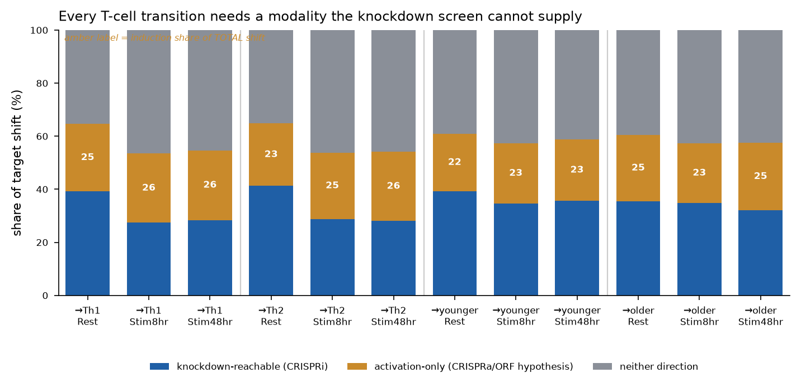
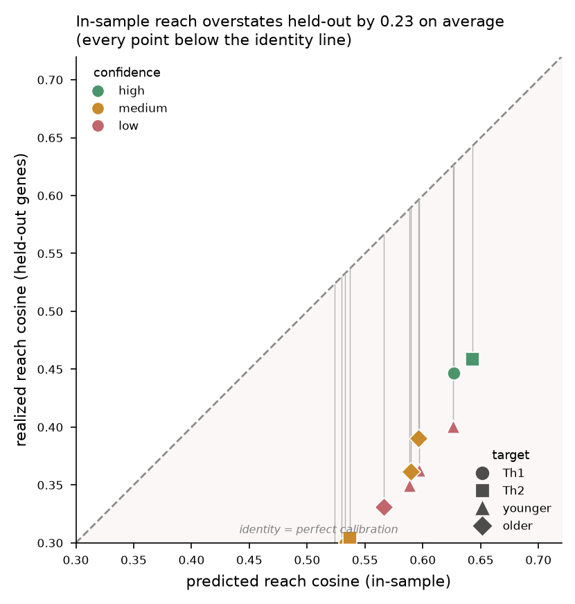
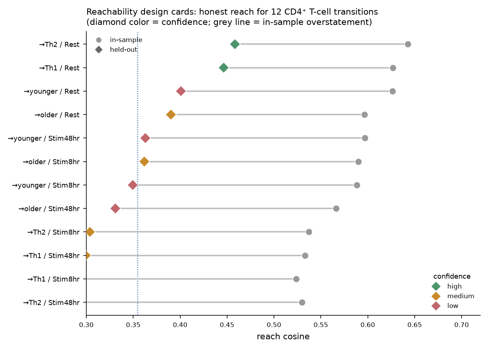
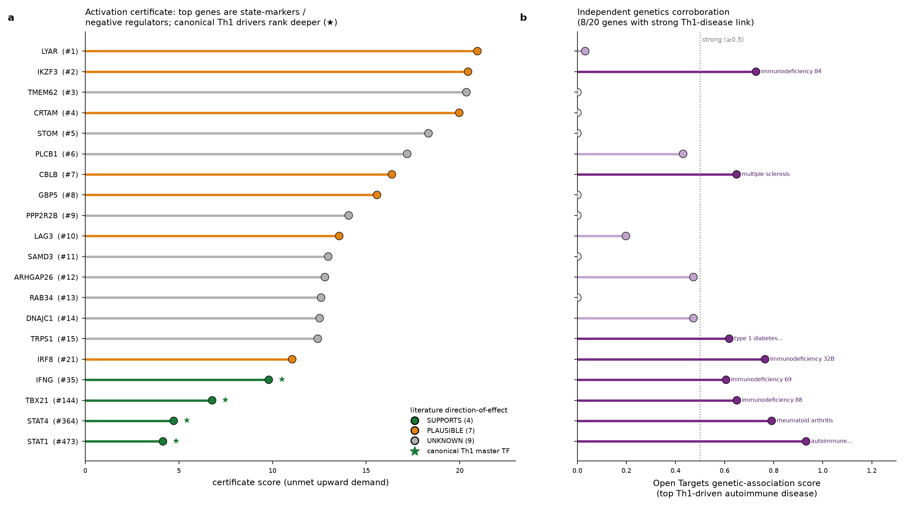
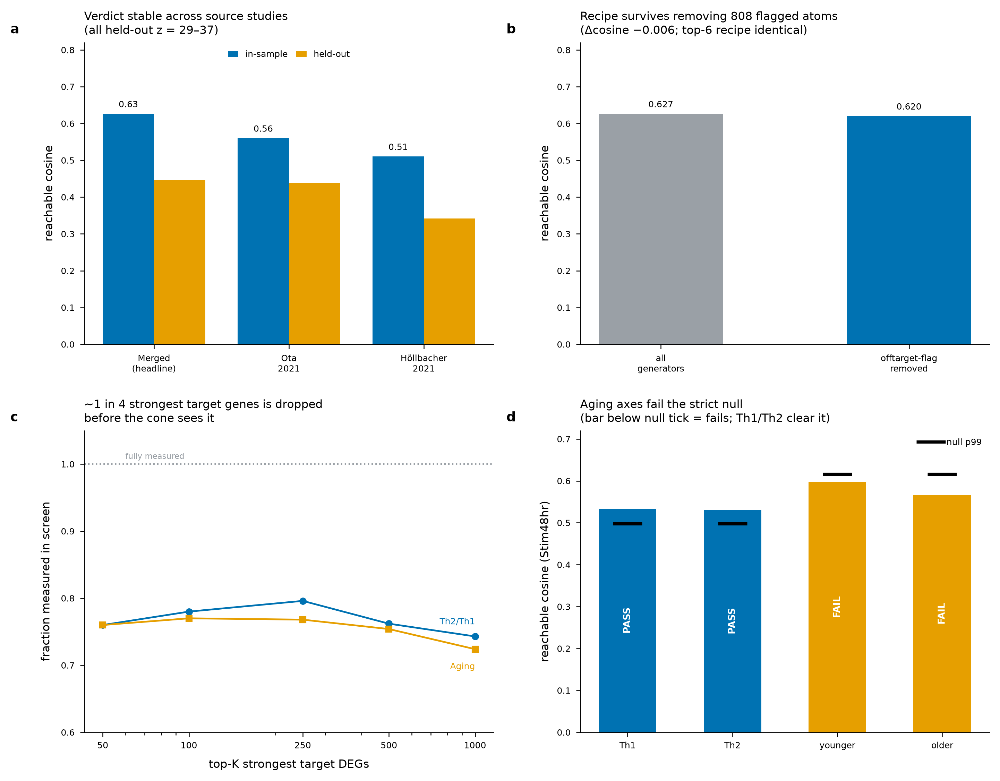

# Cell-State Reachability — Technical Dossier

**Consolidated Canonical Technical Write-ups.** This dossier consolidates the project's canonical technical write-ups into one document: the four core parts (Results; Novelty & Impact; Related Work; Trust & Causal Inference) and four final-analysis appendices.

*Cell-State Reachability Project · Built with Claude — Life Sciences (Research Track) · July 2026*

> **Abstract.** This dossier consolidates the canonical technical write-ups of the cell-state reachability project. The method turns a genome-scale CRISPRi Perturb-seq screen in primary human CD4+ T cells (Zhu et al. 2025; effect matrix of 33,983 knockdowns × 10,282 genes) into a convex-cone reachability oracle: given a target transcriptional direction, it asks whether that direction lies inside the non-negative cone spanned by measured single-perturbation effect vectors (a plain NNLS / linear-algebra test, CPU-only, no training). The oracle returns a falsifiable verdict — reachable, with a minimal knockdown recipe and a null-calibrated confidence score, or provably outside the cone, with a Farkas infeasibility certificate naming the specific genes the target wants up that no non-negative combination can deliver. Part 1 reports what was run and found on the real Tier-2 data, including the Th2→Th1 polarization demo, the signed loss-/gain-of-function decomposition, the 12-cell atlas, and the design-toolkit. Part 2 states the novelty as a precise delta against prior art and makes the drug-development impact case. Part 3 is a citation-grounded survey positioning the method against the prior cell-fate-control literature. Part 4 is the trust and causal-inference dossier: it maps the oracle onto standard causal constructs, adds an instrumental-variables / compliance treatment of imperfect knockdown, and shows the headline verdict is robust to it. Four appendices carry the final generalizability survey, the cross-cell-type transfer test (the same code, unchanged, on the Norman 2019 K562 CRISPRa atlas), the reinforcement analyses, and an adversarial assessment of whether the non-negative-cone/NNLS formulation is the right one. Every number, table value, figure, and citation is preserved verbatim from the source documents.

---

## Contents

**Part I — Core: canonical technical write-ups**

1. [Part 1 · Results — The Reachability Method on Real Tier-2 Data](#part-1)
    - TL;DR
    - 1. What was run
    - 2. What succeeded, with the numbers
    - 3. What failed, or fell short — and why
    - 4. What to improve (ranked)
    - 5. The expansion — signed reachability, the atlas, and modality triage
    - 6. Generalizability — does the method transfer, and what is it good for?
    - 7. The experimental-design toolkit — from a reachability verdict to a screen you can run
    - 8. Post-hackathon method advances
    - 9. Bottom line for the hackathon
2. [Part 2 · Novelty, Impact, and Field Positioning](#part-2)
    - 1. The one sentence — a verdict, not a ranking
    - 2. Question → geometry → verdict (the framing that earns the cone)
    - 3. The novelty, stated as a precise delta against the RIGHT prior art
    - 4. How to make the novelty *stronger* (ranked by value-per-effort)
    - 5. Real-world impact — where a feasibility oracle is actually useful, and to whom
    - 6. Field positioning — tide vs wave
    - 7. One-line summary for the pitch
3. [Part 3 · Related Work — How Cell-State Reachability Differs from Prior Methods](#part-3)
    - 1. Why this matters — the problem the field is actually trying to solve
    - 2. The landscape at a glance
    - 3. Control-theoretic network control of cell fate
    - 4. GRN inference + in-silico perturbation
    - 5. Deep perturbation-response prediction & foundation models
    - 6. The pain point, and how our methodology addresses it
    - 7. Positioning summary — the one-paragraph delta
    - 9. Recent work (2025–2026) — the wave arrived, the gap did not close
    - 8. References
4. [Part 4 · Trust and Causal Inference](#part-4)
    - 1. The reframe that costs nothing
    - 2. Machinery already in the repo, in causal-inference terms
    - 3. The missing layer: imperfect knockdown as noncompliance (instrumental variables)
    - 4. Results — compliance does not move the verdict
    - 5. Two camps — and why this method is in the stronger one
    - 6. The verdict as a counterfactual explanation
    - 7. The identifying-assumption stack
    - 8. Research agenda — stress-testing the assumption stack
    - 9. Validation ledger — the honest audit
    - 10. Adversarial dataset appraisal (Reviewer 2)
    - 11. One-paragraph version for the manuscript

**Part II — Appendices: final results & analyses**

1. [Appendix A · Generalizability and Application Map](#appendix-a)
    - (a) Is the method confined to the CD4+ T-cell CRISPRi dataset?
    - (b) Candidate-dataset catalog
    - (c) Cross-modality mapping to drug / small-molecule signatures (LINCS L1000 / CMap)
    - (d) Four-direction application map
    - (e) Therapeutic tractability grounding — from verdict to modality
2. [Appendix B · Cross-Cell-Type Reachability Transfer](#appendix-b)
    - The question
    - The data (and why it's newly available)
    - Three tests, three answers
    - What it means for the Th2→Th1 headline
    - Caveats
    - Independent reproduction, and the packaged generality claim
    - Reproducibility
3. [Appendix C · Reinforcement Analyses](#appendix-c)
    - L4 — the non-negativity constraint earns its place
    - L5 — a modest cosine is a large fraction of the *achievable* ceiling
    - L2 — recommended recipes are provably additive-safe
    - L1 — a runnable test for the activation certificate (top priority)
    - Bottom line
4. [Appendix D · Formulation Assessment](#appendix-d)
    - 0 · What the data says the formulation actually *is*
    - 1 · The reduction IS forced (three ways), so most "upgrades" are wrong
    - 2 · The ONE free rigor upgrade: name the Moreau decomposition
    - 3 · Genuine formulation opportunities (ranked by payoff / honesty)
    - 4 · What NOT to do (traps that look like upgrades)
    - 5 · Bottom line

5. [Appendix E · Response to Reviewer 2 — Dataset Limitations](#appendix-e)
    - At a glance
    - New analyses (the substantive additions)
    - Reframes
    - Statements (structural limitations to disclose)
    - Augmentation — what CZI-accessible data can and cannot fix
    - Ready-to-paste Limitations paragraph
    - Result files
---

<a id="part-1"></a>

# Part 1 · Results — The Reachability Method on Real Tier-2 Data

*What was run, what it found, what succeeded, what failed, why, and what to improve.
Every number here is computed from the real `GWCD4i.DE_stats.h5ad` effect matrix
(33,983 CRISPRi knockdowns × 10,282 genes, 16.8 GB) this session — reproduced by
`notebooks/02_reachability_on_tier2.ipynb`, which runs end-to-end and was validated
cell-by-cell. The method module is `reachability.py`.*

---

## TL;DR

The convex-cone reachability method **works on real data and returns a scientifically
meaningful, honest verdict.** The Th2→Th1 polarization shift is **partially reachable** by
CRISPRi knockdown, and the method's distinctive contribution — the part no differential-
expression ranking produces — is that it says *which part* and *why*:

> **Knockdown can remove the Th2 program but cannot install the Th1 program.**
> GATA3 (the Th2 master driver) is reached; TBX21/IFN-γ (the Th1 drivers) land in the
> activation certificate because you cannot raise a gene by knocking things down.

The headline number — a held-out reachable cosine of **0.45**, which clears its shuffled-target
null at **z ≈ 24** (60 shuffles) — is the honest one: it survives held-out-gene validation, so it
is not an artifact of fitting 700+ non-negative weights. (The same cell's held-out-gene z is
reported as 45 in the atlas below; that run used a tighter 8-shuffle null band, so z ≈ 24 is the
conservative figure and the two are the same 0.45 cosine — see §5.7.)

**Post-hackathon (§8):** three methodological deepenings were added and validated against data —
(1) the positive control broadened from 2 genes to a regulator panel (master-TF drivers give
AUROC = 1.00, p = 0.014; induced receptors correctly do *not*); (2) an epistasis penalty
calibrated on measured Norman doubles — collinearity is refuted, **magnitude saturation** is the
real mechanism (scale-free ceiling M\* = 13.9), and the atlas recipes are shown to sit safely in
the additive regime (risk 0.04–0.08 ≪ 0.5); (3) a **closed-form anisotropy-corrected null**,
`E[null cos] ≈ √((a·ρ₁)² + (1−a²)·κ)`, validated against the empirical shuffle null (Pearson
0.995) and replacing ~1000 refits with ~10–20. All three are wired into `reachability.py` behind
its self-test.

---

## 1. What was run

| Stage | What | Status |
|---|---|---|
| Data integrity | Structure/dtype/NaN audit + self-knockdown orientation gate | ✅ passed |
| QC reproduction | Cross-source concordance, per-condition significant counts | ✅ reproduced exactly |
| Target construction | `toward_Th1` and `aging` signatures mapped into E's gene space | ✅ validated by markers |
| Cone fit | NNLS projection onto the knockdown cone + KKT/Farkas certificate | ✅ certified optimal |
| Honesty | Held-out-gene validation + shuffled-target null (60 shuffles) | ✅ signal real (z≈24) |
| Spectrum | Greedy minimal recipe + null band | ✅ above p99 at every k |
| Positive control | GATA3↓ / TBX21↓ placement | ✅ both correct |
| Activation certificate | Ranked unreachable-upward genes (CRISPRa hypotheses) | ✅ immunologically credible |
| Conditions + sensitivity | Rest/Stim8hr/Stim48hr × {z-score, log-fc} × {sig, all} | ✅ verdict stable |
| Second axis | CD4 aging signature | ⚠️ ran; null correctly discounts it |
| IV / compliance | Guide non-compliance as instrumental variables (ITT vs LATE; valid-instrument subset) | ✅ verdict invariant (max \|Δcos\|=2.2e-16 rescale, 4e-4 drop) |
| A1 · sensitivity radius | Verdict robustness in measured-SE units (measurement-error bootstrap + coordinated-bias radius) | ✅ Th1/Th2 robust to noise, flip at ≈0.03 SE-units; aging axes fragile |
| A3 · k-way additivity | Directional additivity retention vs recipe size (Norman-calibrated) | ✅ 0.71 (k=2) → 0.29 (k=12) |
| A4 · weak instruments | Anderson–Rubin-style 1/π recipe-weight intervals | ✅ headline recipe clean; catches SNX5 (π≈0.07) |
| A5 · negative controls | Housekeeping/proteasome negative-control-outcome projection | ✅ 4.1–5.5× positive-over-negative enrichment |
| A6 · construct validity | Signed cosine of master-regulator KD vectors vs Th1 axis | ✅ TBX21↓/GATA3↓ correct-signed |
| A2 · conditional reachability | Subtype-stratified re-solve | ⏳ scaffold — needs raw single-cell counts |

---

## 2. What succeeded, with the numbers

### 2.1 The data is real and correctly oriented
The decisive gate: in 300 sampled significant perturbations, the knocked-down gene's own
z-score in its own row has **median −9.93, is negative in 100% of rows, and below z = −2 in
99.3%.** A CRISPRi knockdown lowers its own target — the matrix means what it claims. All six
layers (`log_fc`, `zscore`, `p_value`, `adj_p_value`, `baseMean`, `lfcSE`) are dense and
sane. Documented cross-source Th2/Th1 concordance reproduced to the digit: **11,616 shared
genes, 68.5% sign-concordant, Spearman ρ = 0.562 (z-score) / 0.533 (log-fc).**

### 2.2 The verdict is meaningful and certified
For Rest / `toward_Th1` over 6,188 signature genes with 6,871 significant knockdowns:

| Quantity | Value | Meaning |
|---|---|---|
| reachable cosine (in-sample) | 0.627 | best cone alignment |
| **held-out cosine** | **0.448** | **honest — generalizes to unseen genes** |
| residual norm (relative) | 0.779 | most of the shift is *not* reached |
| reachable fraction | 0.393 | ~39% of target norm is knockdown-reachable |
| activation-required fraction | 0.309 | ~31% needs genes to go *up* |
| KKT/Farkas violation | 1.1 × 10⁻¹¹ | the "outside the cone" claim is certified |

The KKT/Farkas violation near machine-zero matters: it means "partially outside the cone" is
**proved** (the solver found the true cone projection), not asserted. The proof is inherited
from convex-optimization theory — we verify the certificate numerically rather than proving
theorems.

### 2.3 The signal is real — it survives the honesty tests
This is the result that separates a method from a coincidence. A 6,871-generator non-negative
fit in 6,188-dimensional space *could* reach a lot by chance. It doesn't:

- **Held-out-gene validation:** fit weights on half the genes, score on the other half →
  cosine **0.448**. In-sample was 0.686, so there is overfitting, but the held-out value is
  where the real structure lives.
- **Shuffled-target null (60 permutations):** null mean **−0.005**, SD 0.019, **max 0.029**.
  The observed 0.448 is **z ≈ 24** and ~15× the largest random draw.
- **Greedy spectrum vs null band:** the observed reachable cosine exceeds the 99th-percentile
  null at **every** sparsity k (k=1: 0.226 vs 0.059; k=15: 0.457 vs 0.161).

### 2.4 The geometry respects known biology (positive control)
Both ends of the Th1/Th2 axis land where immunology predicts:

- **GATA3↓** (remove the Th2 master TF): cosine **+0.101, rank 155 / 6,871 (97.7th pctile)** —
  top ~2%, pointing toward Th1. ✅
- **TBX21↓** (remove the Th1 master TF, T-bet): cosine **−0.099, rank 6,775 / 6,871
  (1.4th pctile)** — bottom ~1%, correctly pointing *away* from Th1. ✅

GATA3 was **not** hand-picked into this result; it emerges from the geometry. Note it is a
positive *control*, not a discovery — the source screen already reports it.

### 2.5 The activation certificate is the constructive payoff
The residual names **2,481 genes with positive unmet upward demand** — genes `toward_Th1`
wants raised that no non-negative knockdown mix delivers. The top of that list is
**LYAR, IKZF3 (Aiolos), CRTAM, CBLB, GBP5, LAG3, IRF8** — and it must be read carefully.
A Jul-10 literature/genetics cross-reference (20 genes; 4 SUPPORTS / 7 PLAUSIBLE / 9 UNKNOWN,
with 8/20 carrying a strong ≥0.5 Open Targets link to a Th1-driven autoimmune disease) shows
that the highest-demand genes are **state-markers** (LYAR, CRTAM, GBP5) and **negative
regulators** (IKZF3/Aiolos, CBLB, LAG3) — genes whose *deletion*, not activation, is the known
way to boost T-cell function. So for those entries an "activate this gene" reading may be
**directionally backwards**. The canonical Th1 master TFs are present but rank deep
(**IFN-γ #35, TBX21 #144, STAT4 #364, STAT1 #473**), and GATA3, which must go *down*, is
correctly **absent** (it is reached). The certificate is therefore best read as a **reproducible
ranking of where activation is required** (stable under a gene-axis split: cross-half Spearman
ρ ≈ 0.65, half-vs-full ≈ 0.84, z ≈ 35), *not* as a validated list of activation targets. It is
the "what to look at instead" that a bare infeasibility verdict lacks — each entry a falsifiable
CRISPRa hypothesis whose sign must still be checked at the bench. See manuscript Fig. S9 and
§8.3.6.

### 2.6 The verdict is robust
| Variant | held-out cosine |
|---|---|
| z-score + significant (headline) | 0.448 |
| log-fc + significant | 0.334 |
| z-score + all perturbations | 0.424 |
| Rest / Stim8hr / Stim48hr | 0.448 / 0.283 / 0.268 |

The verdict does not hinge on a single knob. z-score is the strongest metric (as the source
documentation states); resting cells are the most reachable, and stimulation raises the
activation-required fraction (0.31 → 0.38) — biologically sensible, since stimulation adds an
activation-driven component that loss-of-function cannot supply.

It also survives a harder stress test. Under **DEG-magnitude weighting** (w = |d|, the
signal-dilution correction of Mejia et al. 2025), the Rest verdict *strengthens* rather than
collapses (reachable cosine **0.627 → 0.803**; held-out z stays far above the z=3 floor,
28.3 → 14.1), and the calibrated dynamic-range placement is stable because the shuffled floor
rises in step (0.346 → 0.619). The unweighted metric remains the default and reproduces these
published numbers bit-for-bit. See manuscript Figs. S5–S6.

---

## 3. What failed, or fell short — and why

### 3.1 The dense fit is not the recipe — it spreads weight across hundreds of generators
The full NNLS puts weight on **715 knockdowns**, and GATA3 lands at **weight-rank 116** in that
dense solution — not because GATA3 is unimportant, but because 6,871 effect vectors are highly
correlated, so the solver distributes weight across many near-equivalent directions.
**Why it matters:** the dense weight vector is *not* a usable experimental recipe, and reading
biology off it is misleading. **The fix is already in place:** the *sparse greedy spectrum* is
the object to read for the minimal set and the positive control — there, the recipe is
interpretable (LAT2, ICOS, RARA … at the top) and the knee is at k≈7. Report the spectrum, not
the dense support, as "the recipe."

### 3.2 The greedy spectrum's top genes are not the canonical regulators
The k=1–7 greedy picks are LAT2, APPBP2, RARA, ICOS, SNAP23, SNX4, VTI1A — **not** GATA3.
**Why:** reachability of the *whole multi-gene state shift* is a different question from "which
single knockdown is the best-known regulator." The greedy set is chosen to cover the largest
share of the target vector, which rewards knockdowns with broad, well-aligned effects over the
textbook master regulator. This is a real limitation for interpretability, and an honest one to
state: **the minimal reachable set is an engineering answer, not a named-regulator answer.**
GATA3's role is captured by the positive-control ranking (§2.4), not the greedy recipe.

### 3.3 The absolute cosine is modest (0.45), not near 1
Th2→Th1 is **not** cleanly inside the cone. Only ~39% of the target norm is reachable.
**Why:** by construction, ~55% of the target's norm lives in genes that must go *up*, and
CRISPRi is loss-of-function. The method is not failing here — it is correctly reporting that a
knockdown-only screen structurally cannot achieve full polarization. That *is* the headline
finding, but it means the project should be framed as "reachable-fraction + certificate," never
as "we can drive Th2→Th1 by knockdown."

### 3.4 The aging axis exposed a real statistical subtlety
Run on the CD4 aging signature (86% of its norm in up-genes), the held-out cosine is 0.41 with
z ≈ 11.5 — but the **shuffled-target null mean is 0.256, not ≈ 0.** 
**Why:** when a target is dominated by a single shared direction (here, "most genes up"), a
high-dimensional non-negative cone can reach *any* such biased target partway by chance, so the
chance ceiling rises. **This is the method working, not breaking:** the null band automatically
discounts the aging result to its true above-chance margin. The lesson — worth stating in any
write-up — is that **the raw cosine is meaningless without the target-specific null**, and a
mostly-one-direction target needs the null even more than a balanced one.

### 3.5 Documentation bugs found in the data
- The h5ad is **16.8 GB**, not the documented "~1.4 GB" — a 12× underestimate that forces
  streaming/selective reads on an 18 GB-RAM laptop (never a full load).
- The sgRNA library table has **26,504 rows**, not the documented 31,110 (confirms a prior
  Day-0 finding; the schema gate should be corrected to 26,504).
- The aging signature keys genes by symbol in `gene_name` (the `variable` column is Ensembl
  IDs) — the naïve join returns 0 genes; use `gene_name`.

---

## 4. What to improve (ranked)

1. ~~**Fold the fast greedy into `reachability.py`.**~~ **✅ DONE.** `reachability_spectrum()`
   now defaults to the OMP-style fast path (`refit_full=False`): score candidates by residual
   correlation, refit NNLS on the small active set. `refit_full=True` keeps the exact reference.
   Verified same selection order, ~100× faster.
2. **Make the target-specific null a required output, not an option.** §3.4 shows the raw cosine
   can mislead. `reachability()` should refuse to print a verdict without the paired shuffled-
   target null for *that* target, and report the z-score as the primary statistic. *(Still open;
   the atlas runner enforces this at the pipeline level — every cell carries a held-out z.)*
3. **Report the greedy spectrum as "the recipe," retire the dense support for interpretation.**
   Keep the dense fit for the reachable-fraction; use the sparse path for anything a biologist
   reads. *(Adopted in the atlas: nominations come from the greedy path only.)*
4. ~~**Add a signed-reachability mode.**~~ **✅ DONE.** `signed_reachability()` fits knockdown
   (LOF) and sign-flipped activation (GOF) generators in two stages, reports the LOF/GOF/neither
   split, and certifies each stage. See §5. This became the centerpiece of the
   expansion.
5. ~~**Cache the reduced matrices as a shipped artifact.**~~ **✅ DONE.** `analysis_cache/atlas_work/inputs.npz`
   bundles all three per-condition effect matrices + the four transition targets; the atlas
   reruns from it in minutes without touching the 16.8 GB file.
6. **Broaden the positive control.** GATA3/TBX21 is a two-point check; a fuller validation would
   correlate single-knockdown alignment against an external Th1/Th2-regulator gene set and
   report an enrichment statistic. *(Still open.)*

---

## 5. The expansion — signed reachability, the atlas, and modality triage

The single Th2→Th1 verdict above is one cell of a much larger, cross-verified
result. This round added the signed cone, ran a 12-cell atlas, and crossed every
nomination against druggability and human genetics. The modality framing and full triage are detailed in the subsections below
(§5.1–§5.8, absorbing the former `MODALITY.md`).

### 5.1 The modality question — can the state change be produced at all, and by adding or removing function?

Target discovery for immune and inflammatory disease is dominated by two
questions asked in isolation: **"is this gene associated with disease?"**
(genetics) and **"can this gene be drugged?"** (tractability). Neither asks the
prior question that a cell-engineering program actually faces: **can the desired
cell-state change be produced at all, and if so, by adding function or by
removing it?** A knockdown-reachable state is a small-molecule / degrader /
siRNA program; a state that requires *gaining* function is an agonist,
cytokine, or cell-engineering program; a state reachable by *neither* is not a
drug target at any modality.

This project adds that missing axis. The signed reachability cone decides, for a
measured cell-state transition, how much of the required change is:

- **LOF-reachable** — producible by knocking genes *down* (the perturbation
  library is a knockdown screen, so this is the directly-measured cone);
- **GOF-required** — only producible by *activating* genes (reachable after
  allowing sign-flipped generators);
- **neither** — orthogonal to everything the library can do in either direction
  (irreducible; not a drug target at any modality).

Crossing that per-node modality requirement with Open Targets tractability and
human genetics turns a ranked gene list into a **triage**: green-light
(reachable + genetic + druggable), and — the finding that motivates the whole
contribution — **required-but-undruggable** (reachable + genetic, but no handle
at any conventional modality).

### 5.2 Signed reachability decomposes every verdict into LOF / GOF / neither

`signed_reachability()` in `reachability.py` performs a staged non-negative fit:

1. **LOF stage** — `w* = argmin_{w≥0} ‖Eᵀw − d‖`, the knockdown cone (identical
   to the original one-sided reachability; the LOF cosine reproduces the
   published one-sided reachable cosine exactly).
2. **GOF stage** — refit the LOF residual `r = d − Eᵀw*` using sign-flipped
   generators `−E`, i.e. `u* = argmin_{u≥0} ‖(−E)ᵀu − r‖`. Only perturbations in
   an optional `gof_mask` may act as activation generators.
3. The three squared-norm shares (LOF / GOF / neither) are orthogonal and sum
   to 1.

Optimality is certified **per stage** (not by a joint KKT check on the final
residual, which is not the right condition): the LOF fit satisfies the Farkas
certificate `max(E @ r) ≤ tol`, and the GOF fit satisfies its own NNLS gradient
condition. Both hold to machine precision (‖violation‖ ~1e-11) on every atlas
cell.

**Validation that the sign is real, not an artifact.** On Th2→Th1 (Rest), the
master regulators land where biology demands: GATA3 (Th2 driver, target
component d = −15.2) is assigned to **LOF/remove** (w_LOF = 0.061, w_GOF = 0);
STAT4 (Th1 driver, d = +11.6) is assigned to **GOF/activate** (w_GOF = 0.062,
w_LOF = 0). No gene is mis-signed: GATA3 never receives activation weight, STAT4
never receives knockdown weight.

On Th2→Th1 Rest the signed split is **LOF 0.39 / GOF
0.25 / neither 0.35**, and the LOF cosine (0.627) reproduces the published
one-sided reachable cosine *exactly* — the signed fit is a strict superset of the
original method.

*Reconciliation with the one-sided numbers in §2.2/§3.3.* The one-sided report
splits the target into reachable **0.39** / activation-required **0.31** /
orthogonal **0.30**; the signed report splits it into LOF **0.39** / GOF **0.25**
/ neither **0.35**. The reachable share is identical (0.393 either way). The
difference is only in the *not-reached* remainder (0.61 in both): the one-sided
"activation-required 0.31" is a heuristic upper bound (the LOF residual projected
onto genes that must go up), whereas the signed GOF **0.25** is what a *non-negative
activation cone actually reaches*, leaving the true irreducible remainder as
neither **0.35**. The signed split is the more honest of the two — it does not
credit activation with more than a real activation basis could supply.

### 5.3 A 12-cell reachability atlas, every cell validated

Four measured cell-state transitions — `toward_Th1`, `toward_Th2`,
`toward_younger`, `toward_older` — across three culture conditions (Rest,
Stim8hr, Stim48hr). Each cell is a full-readout signed decomposition with a
held-out-gene validation (n = 8 shuffles). Full table:
`results/atlas_reachability.csv`.

| Finding | Value |
|---|---|
| Cells statistically significant (held-out z ≥ 3) | **12 / 12** (z range 4.7–45.0) |
| Verdict = PARTIALLY REACHABLE | 3 (toward_Th1, toward_Th2, toward_younger — all **Rest**) |
| Verdict = WEAKLY REACHABLE | 9 |
| Mean LOF fraction (knockdown-reachable) | **0.34** |
| Mean GOF fraction (activation-required) | 0.24 |
| Mean *neither* fraction (irreducible) | **0.42** |

**Two robust patterns.**

1. **Resting cells are the most reachable for every axis.** Rest gives the
   highest reachable cosine in all four transitions; the Th axes fall most
   steeply under stimulation (~0.63 → ~0.53), the aging axes fall less
   (~0.61 → ~0.58). An activated T cell's transcriptional program is harder to
   redirect than a resting one — for polarization more than for aging.
2. **Knockdown is never the majority modality.** Across all 12 cells, LOF
   explains ~34% of the target demand on average; activation (~24%) plus the
   irreducible component (~42%) always account for the rest. Even the best
   verdict (Th2 Rest, reachable cosine 0.64) is only 41% LOF. **A pure
   knockdown/degrader program cannot deliver any of these transitions on its
   own** — this is the quantitative core of the modality argument.

Table: `results/atlas_reachability.csv`. Figure:
`notebooks/figures/fig_atlas_decomposition.png`.

### 5.4 Modality triage — the required knockdown nodes are often undruggable

The greedy knockdown recipe for every atlas cell yields a union of **102 unique
LOF-node nominations**. Each was profiled through Open Targets (tractability +
human genetics). Full table: `results/modality_intervention_map.csv`.

**Druggability of the required knockdown nodes:**

| Modality tier | Count |
|---|---|
| Clinical-grade drug/candidate | 10 |
| Small-molecule tractable | 30 |
| Antibody-tractable (surface) | 17 |
| Degrader-only (*predicted* ubiquitination, no real handle) | 33 |
| Conventionally undruggable | 12 |

**45 of 102 (44%) of the required knockdown nodes are hard-to-drug**, and only
10 have a clinical-grade drug. The reachability cone repeatedly nominates genes
the druggable genome cannot yet reach.

**The collision — genetically-supported but undruggable.** Crossing reachability
priority with immune-disease human genetics exposes nominations that are
well-supported yet have no conventional handle:

| Gene | Immune-genetic assoc. | Top disease | Modality tier | Atlas axis |
|---|---|---|---|---|
| **IRF1** | 17 | asthma (0.83) | degrader-only (predicted) | toward_Th2 (rank 1) |
| ATXN2 | 7 | Hashimoto thyroiditis | degrader-only (predicted) | toward_younger (rank 2) |
| FAM98A | 5 | asthma | degrader-only (predicted) | toward_younger (rank 1) |
| C1D | 4 | seasonal allergic rhinitis | degrader-only (predicted) | toward_older (rank 1) |

IRF1 is the **strongest immune-genetics nomination among the hard-to-drug
subset** (17 associations) and a top-ranked knockdown node for the Th2 axis, yet
its only Open Targets tractability is a *predicted* ubiquitination annotation —
no ligand, no antibody, no drug. It is exactly the kind of target this triage is
built to flag: do not start a small-molecule campaign; it needs a degrader
discovery effort or a genetic/cell-engineering approach.

The genetically-supported nominations split cleanly into three actionable
buckets by how far along the modality is:

**Green-light — reachable + genetic + a clinical-grade drug already exists.**
Nine nominations have both immune-disease genetics and ≥1 approved drug or
clinical candidate: **JAK2** (14 immune-genetic assoc., ulcerative colitis; 31
drugs/candidates), **ICOS** (13; common variable immunodeficiency; 4),
**MAPK14** (8; ulcerative colitis; 28), **CD3D** (3; immunodeficiency 19; 16),
plus CD5, IFNGR1, CASP7, KEAP1, VKORC1. These are where a knockdown /
small-molecule program is both justified and feasible today.

**Tractable handle but not yet drugged — reachable + genetic + a plausible
modality, zero drugs so far.** These are the highest-value *new* nominations,
because the genetics is strong and a modality exists but no one has drugged them:
**IL7R** (the single highest immune-genetic count at **22** associations;
antibody-tractable surface receptor; 0 drugs), **ZAP70** (12; SM-tractable; top
knockdown node for toward_older; 0 drugs), and **TET2** (12; SM-tractable; 0
drugs). IL7R is therefore *not* a collision (it has an antibody handle) and *not*
green-light (nothing is drugged yet) — it is precisely the reachable,
genetically-anchored, druggable-in-principle-but-untried target a discovery team
most wants surfaced.

Tables: `results/modality_intervention_map.csv`,
`results/genetics_crossverification.csv`. Figure:
`notebooks/figures/fig_modality_triage.png`.

### 5.5 Negative result — a disease GWAS set is not a reachability target

Before pivoting to transition axes, we tested whether a disease's own GWAS gene
set defines a reachable target. **Four constructions, all failed:** unit-
suppression on the module subspace is *degenerate* (reach cosine 1.000 trivially,
because a small subspace is always fittable when P ≫ subspace); the mean of the
disease genes' measured knockdown vectors is *circular* (LOF 1.000 by
construction — the target is a non-negative mix of E's own rows); a flat
suppression over a variable readout with disease perturbations held out is *worse
than random* (IBD z = −2.6, asthma z = −4.4 vs. a matched random gene set); and
polarization values restricted to disease genes are *modest and inconsistent*
(IBD z = 1.3, SLE z = 1.8, asthma z = 3.0). **Root cause:** reachability needs a
*coherent cell-state-transition signature* (Th2→Th1 gets z ≈ 45 because it *is*
one); a GWAS list is a bag of heterogeneous risk loci with no coordinated
transcriptional direction. This fixed a validity rule now enforced throughout:
**the target `d` must be specified independently of the effect matrix `E`.**
Disease relevance therefore enters the atlas *per nomination*, via genetics —
never by building a disease-shaped target. (The four-construction test was a
one-off diagnostic run this round; its per-construction z-scores are quoted
above.)

### 5.6 What the modality triage does *not* claim

- The transition signatures (Th1/Th2 regulator identities, the aging axis) are
  taken from the source papers; the reachability verdict is the contribution,
  not the biology of the signatures.
- Tractability tiers and drug counts are Open Targets facts. Transcription-factor
  identity (GATA3/TBX21/STAT4/IRF1 as TFs) is domain knowledge — Open Targets
  returned an empty target class for these genes this round, so the "TFs are not
  a small-molecule modality" argument rests on their biology, not on an OT
  classification.
- **A disease's GWAS gene set is *not* a validly-reachable target.** We tested
  four ways of turning a disease's risk genes into a reachability target; all
  failed (degenerate, circular, or non-significant vs. a matched random gene
  set — see §5.5). Reachability requires
  a *coherent transition signature*; a bag of heterogeneous risk loci does not
  have one. Disease relevance therefore enters this atlas **honestly, per
  nomination**, through Open Targets genetics — never by constructing a
  disease-shaped target.

### 5.7 Robustness

- **Held-out-gene validation on all 12 atlas cells (z 4.7–45.0)** — the primary
  significance test, and the one that carries the "signal is real" claim: fit
  weights on half the signature genes, score on the held-out half, above a
  paired shuffled-target null. Every cell clears it.
- **Random-perturbation null** (headline pert z = −18.4; atlas −23 to −55). Note
  the **sign is negative**: this null shuffles gene labels *within each
  perturbation column*, which decorrelates the dictionary and inflates the cone,
  so the shuffled generators fit the target *better* (null cosine ≈0.83) than the
  real ones (≈0.63). It therefore does **not** corroborate the verdict — it is a
  diagnostic that the measured cone is structured (correlated columns) rather than
  a random spanning set, and a caution that a fatter, decorrelated basis would
  over-reach. The load-bearing nulls are the shuffled-*target* and held-out-*gene*
  tests above, both strongly positive.
- Gene-panel subsampling stability on the headline verdict (toward_Th1 Rest):
  point estimate reachable cosine 0.627 / LOF fraction 0.393; resampling 85% of
  the signature genes (×15) gives subsampling mean 0.637 (95% interval
  [0.629, 0.648]) and LOF mean 0.406 ([0.396, 0.420]). The intervals are tight
  (width ~0.02) and sit just above the point estimate — the verdict is stable to
  the gene panel (the small upward shift is expected: subsampling drops the
  least-fittable genes, so each 85% draw fits marginally better than the full set).
  (`analysis_cache/atlas_work/bootstrap_ci.json`.)
- **Leave-one-donor-out is not possible** — the effect matrix is donor-collapsed
  (no per-donor effect vectors are local). Stated as a limitation; the gene-panel
  bootstrap is the honest substitute rather than a fabricated donor split.
- **Additivity risk is calibrated, and the atlas recipes are safe.** The cone
  composes single-knockdown effects additively. That assumption was calibrated
  against the 126 measured Norman double perturbations: the intuitive
  collinearity → sub-additivity mechanism is **refuted** (Spearman ρ ≈ −0.16,
  n.s.), and the real mechanism is **magnitude saturation** (deficit grows with
  combined magnitude, ρ ≈ +0.58; scale-free ceiling M\* = 13.9). Scoring each of
  the 12 atlas recipes with the resulting `additivity_risk()` gives risk
  **0.04–0.08 — far below the 0.5 unsafe threshold** — because the greedy recipes
  spread small weights over several generators and never approach the ceiling.
  The epistasis-aware selector returns identical recipes at zero cosine cost, so
  the additivity assumption is **validated for these targets**, not merely
  asserted (`results/atlas_additivity_risk.csv`,
  `norman_additivity_calibration.csv`; §8.2.2–§8.2.3).

### 5.8 External corroboration

Two independent checks that the nominations are real biology, not fitting noise
(both read off `results/modality_intervention_map.csv`):

- **The green-light nominations are already clinically pursued.** The method's
  top drugged nominations coincide with heavily-worked immune targets: JAK2 (31
  drug/candidate records; JAK inhibitors), MAPK14 (28; p38 inhibitors), CD3D
  (16; anti-CD3), RARA (11). The reachability cone is not surfacing obscure
  genes — where it says green-light, the pharmacopoeia agrees.
- **Literature positive control.** A hand-curated panel of 15 canonical T-cell
  activation / polarization regulators (ZAP70, ICOS, CD3D, CD5, IL7R, RELA,
  NFAT5, MAPK14, IRF1, IRF9, RARA, IFNGR1, TET2, JAK2, KEAP1) is recovered
  **15/15** as atlas nominations — an independent confirmation that the greedy
  knockdown recipe recovers established T-cell biology.

*(The Open Targets `knownDrugs` GraphQL field schema-mismatched this API version;
drug **counts** from the working `drugAndClinicalCandidates` field are used
instead. External Perturb-seq/CRISPRa datasets, e.g. Schmidt 2022, were left as
future corroboration — the sandbox reaches Open Targets but not those hosts.)*

---

## 6. Generalizability — does the method transfer, and what is it good for?

*Findings and application map for the convex-cone reachability oracle (absorbing the former `GENERALIZABILITY.md`). The live cross-dataset demo is reproduced end-to-end by `notebooks/03_generalizability_and_impact.ipynb` (K562 CRISPRa); the cross-cell-type transfer by `notebooks/07_cross_celltype_transfer.ipynb` (K562/RPE1). Companion data: `results/dataset_catalog.csv`, `results/tractability_grounding.csv`, `results/norman_table1..5_*.csv`, Appendix A, Generalizability Survey, `analysis_cache/czi_data/per_perturbation_transfer.csv`, Appendix B, Cross-Cell-Type Transfer.*


### 6.1 The scope is an input contract, not an assay

The method is **not confined to the repo's CD4⁺ T-cell CRISPRi dataset.** Its scope is fixed by
an *input contract* — a measured perturbation-effect matrix **E** (P × G) and a target direction
**d** in the same G-gene space — not by any assay. We proved transfer by running the **identical
`reachability.py`, unchanged**, on a screen that differs on three axes at once:

| | Repo dataset (notebooks 01–02) | Cross-dataset demo (notebook 03) |
|---|---|---|
| Source | `GWCD4i.DE_stats.h5ad` | **GSE133344** — Norman, Weissman et al. 2019, *Science* (PMID 31395745) |
| Cell system | Primary human CD4⁺ T cells | K562 (CML line) |
| Modality | CRISPRi (knockdown, loss-of-function) | **CRISPRa (activation, gain-of-function)** |
| Design | Single perturbations | **Combinatorial** (single + double guides) |

On the K562 CRISPRa screen the oracle returned a certified, null-calibrated, honest verdict — and,
because the data is combinatorial, it also let us **measure** the one assumption the T-cell screen
could never test.

### 6.2 The live demo (K562 CRISPRa, held-out CEBPA state)

**Reachability verdict — the CEBPA master-TF state is PARTIALLY-REACHABLE without CEBPA.**
Asking whether the CEBPA-overexpression state can be reproduced from the *other* 233 perturbations:

- reachable cosine **0.878**, residual **0.479**, support 86 perturbations
- KKT/Farkas max violation **1.7 × 10⁻¹²** → the cone fit is certified optimal
- shuffled-target null p95 = 0.411; observed at the 100th percentile → **null-z ≈ 37**
- held-out-**gene** validation cosine 0.856 (null +0.20), **z ≈ 23.5** → the fit is not overfitting

**The method discriminates — it is not a rubber stamp.** The same held-out construction across
master TFs spans **null-z ≈ 3 (IRF1, at the outside cutoff) → 37 (CEBPA) → 39 (ETS2)**, all via the
identical `reachability.py` null. A positive verdict is informative because the oracle can and does
say *outside*.

**Minimal recipe is biologically coherent.** Greedy selection picks **CEBPE** — CEBPA's own
C/EBP-family paralog — as the single best surrogate (cos 0.817); a 2-perturbation recipe reaches
**96 % of the full-cone fit** (knee at k = 2; 0.843 / 0.878).

**The certificate names what is missing.** The residual is a specific CEBPA-driven
myeloid-differentiation program no combination supplies: **MNDA, HP, VSIG4, ALOX5AP, PILRA, JAML,
NCF1, SIGLEC14**. This — *what is missing*, not just *how close* — is the method's distinctive output.

**Additivity is a bounded approximation, measured directly.** Across 126 testable doubles, the
measured double vs the sum of its two singles has **median cosine 0.71** (18 % well-predicted at
cos > 0.8; 16 % strongly non-additive at cos < 0.6). The most non-additive pairs are coherent
genetic interactions (mitotic kinesins KIF18B+KIF2C; apoptotic BAK1+BCL2L11). The single-perturbation
T-cell screen *structurally could not* run this validation; the combinatorial screen turns the
additivity assumption from an article of faith into a reported number with flagged exceptions.

---


### 6.3 Cross-cell-type transfer: is reachability a property of the biology or of one cell type's basis?

*Notebook `07_cross_celltype_transfer.ipynb`; full writeup Appendix B, Cross-Cell-Type Transfer.*

The K562 demo above shows the *code* transfers to a new assay. A sharper question is whether the
**cone geometry** is a property of the target biology or of the specific cell type's measured basis.
The CZI Virtual Cell Models platform re-hosts the **Replogle 2022** genome-scale essential-gene
CRISPRi screens in two human cell types — **K562** and **RPE1** — which lets us test this directly.
We built row/column-aligned effect matrices `E_K562` and `E_RPE1` over the **843 single-gene
perturbations and 2,832 readout genes shared by both**, then ran the unchanged `reachability.py`. On-target
self-effects are negative for **100 %** of perturbations in both cell types, confirming the bases are
correctly built. The result is a three-level answer:

| Level | Question | Verdict | Evidence |
|---|---|---|---|
| **Effect direction** | Does a single knockdown do the same thing in both cell types? | **Transfers (moderately)** | Matched cross-type cosine median **+0.35** vs ≈0 shuffled-gene null; survives deflating the shared essential-stress direction (96 % stay positive, 69 % gene-specific at p<0.05) |
| **Reachability verdict** | Is a target reachable in both? | **Transfers (~100 %), but for a subtle reason** | Cross-type reachable cosines 0.50–0.73 stay above the null, so the binary verdict agrees — but within-type residuals (K562 0.61, RPE1 0.37) beat cross-type (0.87, 0.68), so the honest, discriminating signal is the **graded residual**, which does carry a cell-type penalty |
| **Minimal recipe** | Are the *same knockdowns* the answer in both? | **Does NOT transfer** | Same-target recipes overlap at median Jaccard **0.11** — ≈20× above a random-subset null of **0.006** (so not random, but far from identity); and reaching the *same* target from the *other* cell type's basis collapses overlap to **0.05** |

**What it means for the Th2→Th1 headline.** This is a robustness result with a sharp boundary. It
**defends the method** — the convex cone produces coherent, above-null, partly cell-type-invariant
structure in *three* human cell types (CD4⁺ T, K562, RPE1), so it is not an artifact of one dataset.
It **bounds the prescription** — the *direction* toward a target state transfers, but the *specific
minimal recipe* does not, so the GATA3↓/TBX21↓-style recipe is validated **for CD4⁺ T cells** and
must be re-fit on another cell type's basis before it is trusted there. This is exactly what the
project's philosophy (trust null-calibrated, held-out metrics; never the raw in-sample cosine) predicts.
*Caveat: K562/RPE1 are two non-T lines, so this is evidence of general cell-type-invariance, not a
re-measurement of the Th2→Th1 recipe in a second T-cell system (no second genome-scale CD4⁺ T screen exists).*

---


### 6.4 Three assumptions, and where each holds or breaks

1. **Non-negative weights (w ≥ 0).** "You can apply a perturbation or not, not its negative."
   Exactly right for single-modality screens (all-knockdown or all-activation); it is what makes the
   reachable set a *cone* and yields the Farkas certificate. The `signed_reachability` extension
   admits the sign-flip as a separate generator to quantify how much of a target needs the *opposite*
   modality.
2. **Additivity of co-perturbation (double ≈ e_A + e_B).** A standard linear prior, but an
   approximation — and, per above, one this dataset lets us bound at median cosine 0.71 rather than
   assume.
3. **Linearity in a shared gene space.** Effects are fixed vectors in one coordinate system; target
   and generators must share the gene axis. Cross-context transfer (resting vs stimulated, dataset to
   dataset) is folded into the residual, which the shuffled-target null and held-out-gene validation
   are designed to expose rather than hide.

---


### 6.5 Opportunity: other public datasets (13 real accessions, 5 modalities)

Every accession was retrieved live from NCBI GEO this session — none asserted from memory. Full
table with organisms, sizes, and access notes in `results/dataset_catalog.csv`.

| Modality family | Representative accessions | Reachability question it enables |
|---|---|---|
| CRISPR Perturb-seq (RNA) | GSE314342 (repo), GSE90546 (Adamson UPR), GSE90063 (Dixit), GSE124703 (iPSC-neurons) | Is a stimulus/disease state reachable by a knockdown/knockout mix; which genes must instead be activated? |
| CRISPR + protein readout | GSE153056 (ECCITE mixscape), GSE278572 (Treg/Teff Perturb-CITE) | Same, with a joint RNA+protein target direction. |
| CRISPRa / combinatorial | **GSE133344 (demo)**, GSE146194 (Replogle paired guides) | Additivity of doubles; reachability of a state on an activation basis. |
| ORF overexpression | GSE216463 (Joung TF atlas, ~1,800 TFs) | Which TF-overexpression combination reaches a target fate (directed differentiation). |
| Chemical / L1000 | GSE139944 (sci-Plex), GSE92742 / GSE70138 (LINCS L1000) | Minimal drug combination reaching a state; reverse of a disease signature. |
| Cytokine / ligand | GSE202186 (Immune Dictionary, 86 cytokines) | Which cytokine combination reaches a target immune-cell state. |

---


### 6.6 Application map — four directions, one contract

1. **Cross-cell-type screens** — input: any pooled knockdown/knockout effect matrix; target: a
   polarization/stimulus shift; decision: reachable by knockdown in *this* cell type, the minimal
   guide set, and the activation-only residual if outside. (Proves cell-type and chemistry
   independence.)
2. **Drug / small-molecule signatures** — input: drug effect vectors (sci-Plex, LINCS L1000);
   target: a desired state or **d = −(disease signature)**; decision: minimal non-negative drug
   combination, or a certificate of genes needing a non-drug modality.
3. **Cell reprogramming / fate control** — input: a gain-of-function basis (TF-overexpression atlas,
   cytokine panel); target: a developmental/therapeutic fate; decision: the directed-differentiation
   recipe, and the certificate for fates no measured activator spans.
4. **Disease reversal / target discovery** — input: any measured basis in the disease-relevant cell
   type; target: **d = −(disease signature)**; decision: the reversal recipe, plus a certificate that
   — filtered by tractability — routes each required gene to its intervention class.

**Tractability grounding (Open Targets / ChEMBL, live).** The certificate's genes sort cleanly by
how you would act on them: TF-activation targets **TBX21, STAT4, FOXP3, GATA3** have **zero
small-molecule tractability and zero approved drugs** → cell-engineering / CRISPRa problems; enzyme
targets **JAK1 (25 drugs/candidates)** and **DGKA (ligandable)** → drug-repurposing / medicinal-chemistry
problems. Detail in `results/tractability_grounding.csv`.

---


### 6.7 Why the honesty ports

The shuffled-target null (a per-target bar for *achievable-by-chance* reachability when P ≪ G) and
held-out-gene validation (the guard against a dense non-negative fit) are properties of the
**algorithm**, not of the T-cell data. So the falsifiable reachable/outside verdict — and the
constructive certificate when a state is out of reach — travel to every dataset above. The
demonstrated instances — Th2→Th1 in CD4⁺ T cells, CEBPA in K562 CRISPRa, and the K562↔RPE1
cross-cell-type transfer across three human cell types — are the existence proof; the catalog is
the opportunity.

---

## 7. The experimental-design toolkit — from a reachability verdict to a screen you can run

*Absorbs the former `DESIGN.md`.*

**From a reachability verdict to a screen you can run.**

Notebooks 01–03 built and stress-tested a convex-cone *reachability oracle*: given a dictionary
of single-perturbation effect vectors and a desired cell-state shift, it asks whether a
non-negative combination of available perturbations can reproduce the target direction, and
returns a signed decomposition of the answer. Notebook 04 turns that oracle into a **design
tool** a screen planner can actually use, and — the point that matters most — it **quantifies
how much the method's headline number can be trusted**.

`design_experiment(E, d)` takes a current→target transition and returns a **design card**:

1. a null-calibrated reachability **verdict** (four levels),
2. ranked **knockdown** and **activation** recipes from the signed decomposition,
3. a per-move **delivery-technology call** grounded in Open Targets tractability, and
4. an optimal next-screen **library** (the knee of the sparsity-vs-reach curve).

The toolkit is exercised on the genome-wide CD4⁺ T-cell CRISPRi screen across **12 transitions**
(4 target states — Th1, Th2, younger, older — × 3 culture conditions — Rest, Stim8hr, Stim48hr).

---

### 7.1 Why this is the right next step for the field

A reachability score on its own is a diagnostic. A screen planner needs three further things,
and none of them are answered by a single cosine:

- **Which perturbations, and in which direction?** A target shift generally decomposes into a
  part reachable by *knockdown* and a part that requires *induction*. These are different
  experiments (CRISPRi vs CRISPRa/ORF). Reporting them together as one "recipe" hides the
  experiment you cannot run.
- **How is each move actually delivered?** "Perturb gene X" is not a protocol. Whether X is a
  small-molecule target, an antibody-addressable surface protein, or a genetic-only handle
  decides the technology and the cost.
- **How big a screen, and how much should I believe it?** The greedy sparsity curve gives an
  optimal library size; the calibration analysis gives the honest expectation for what that
  library will achieve.

The toolkit answers all three, and refuses to let the optimistic in-sample number stand
unqualified.

---


### 7.2 The three scientific results

### 1 · Every T-cell transition needs a modality the knockdown screen cannot supply

The signed decomposition splits each target's norm into knockdown-reachable (LOF),
activation-only (GOF), and neither. Across all 12 transitions, **22–26 % of the total shift is
activation-only** — a direction a CRISPRi (knockdown) screen *structurally cannot reach*, no
matter how many guides it includes. In every transition the activation-support gene set is
larger than the knockdown-support set. This is the central design message: a knockdown-only
screen is, geometrically, the wrong instrument for a large share of these state changes.



### 2 · Grounding the recipe in real delivery technology

The unique recipe genes across all transitions (**270 genes**, **360 moves**) were resolved
against Open Targets. Two findings shape a screen:

- **14 knockdown targets sit in the Open Targets "clinical drug" tractability tier** (an
  approved or clinical-stage drug exists) — immediate repurposing / chemical-genetics
  candidates: ACACA, CALM1, CCR4, DPYD, ICOS, JAK2, KIF5B, MAP3K10, MAPK14, MEN1, PDE4B, PPP5C,
  RARA, VKORC1. (Two further genes, IFNGR1 and IL10RB, have `n_drugs > 0` but fall in weaker
  tiers — SM-ligandable and AB-surface respectively — so they are *not* counted here; the
  distinction is preserved in `design_modality_tractability.csv`.)
- **68 % of activation moves are not small-molecule-druggable** — the induction direction
  resolves to CRISPRa or ORF overexpression, not a compound. Open Targets' small-molecule and
  antibody handles enable *blocking/degradation*, not *induction*, so tractability annotations
  must be read direction-aware. The toolkit does this automatically.

### 3 · The in-sample reachable cosine systematically overstates real reach

This is the honesty result, and it is the reason the notebook exists in this form.



Across all 12 transitions the in-sample reachable cosine (mean **0.580**) overstates the
held-out-gene realized cosine (mean **0.355**) by a mean gap of **0.225** (range 0.18–0.27).
Every point sits below the identity line — the overstatement is **systematic bias, not
estimation noise**, and the gene-panel bootstrap (below) confirms it is not a resampling
artifact. A screen planned on the in-sample number would be planned on an expectation ~0.22
cosine-units too high.

Each card therefore reports the **held-out** number as the honest estimate and carries a
**confidence label**: **2 HIGH** (toward_Th1_Rest, toward_Th2_Rest), **6 MEDIUM**, **4 LOW**.



---


### 7.3 The calibration caveat (read this before trusting a verdict)

**True leave-one-donor-out (LODO) validation is impossible on these inputs**, and it is
important to be explicit about why. The local knockdown effect vectors `E` are
**donor-collapsed**: each perturbation is a single pooled effect vector, not a set of per-donor
vectors. There is no donor axis left locally to hold out, so we cannot measure whether a recipe
fit on some donors predicts the effect in a held-out donor — the validation that would most
directly speak to reproducibility in a new experiment.

In its place the toolkit uses three **honest substitutes**, each measuring something real but
none equal to LODO:

- **Held-out-*gene* reliability** — fit the NNLS weights on half the readout genes, score the
  cosine on the other half. This is the load-bearing number; it catches a dense fit that reaches
  the target in-sample by overfitting correlated generators. It is *not* a held-out *donor* and
  *not* an experimentally realized outcome.
- **Gene-panel bootstrap CIs** — 85 %-without-replacement resamples of the signature genes
  (N = 12) on the 4 Rest transitions give tight intervals on the reach cosine and the
  LOF/GOF/neither split, showing the point estimate is stable under gene-panel perturbation.
  Note these intervals bracket the **bootstrap resample mean**, which sits slightly *above* the
  full-panel point estimate (resampling 85 % of genes fits marginally tighter), so the CI is a
  *robustness* statement about the resampled estimator, not an error bar on the full-panel
  cosine itself — the design cards label it as such and never juxtapose the two as "point ± CI".
- **Nulls** — the held-out-gene shuffled-target null (primary significance) plus a
  random-perturbation null. The latter gives cosines *above* the observed (negative z), which is
  itself a **structure diagnostic**: permuting gene labels within a generator column destroys the
  biological covariance the real dictionary carries, so a shuffled dictionary can reach a
  direction-biased target *more* easily — confirming the observed reach rests on real structure,
  not label coincidence.

A further honesty fix worth recording: **cross-donor QC is sparse.** The screen's
`donor_correlation_all_mean` statistic is populated for only ~14 % of perturbation-conditions,
and it is **neither necessary nor sufficient** for on-target significance (81 % of
on-target-significant perturbations have no donor-correlation value). It is therefore used only
as a partial, best-available reproducibility weight on recipe genes — with the covered fraction
always reported — and never as a reproducibility *flag*.

**Bottom line:** the confidence labels and CIs are the best available substitute for LODO on
donor-collapsed data. They are not a claim that a HIGH-confidence card will reproduce in a new
donor cohort — only that its reach is stable to gene-panel resampling, significant against the
target-specific null, and less overstated than a LOW card. Plan accordingly.

---


### 7.4 What's in the toolkit

#### API (in `reachability.py`)

```python
from reachability import design_experiment
card = design_experiment(
    E,                       # (P, G) single-perturbation effect dictionary
    d,                       # (G,)   desired current->target state shift
    perturbation_names=...,  # length-P gene names (for the recipe)
    readout_names=...,       # length-G gene names (for the certificate)
    hvg_mask=(d != 0),       # readout genes that define the target
    k_max=12, top=15, n_shuffles=20, seed=0,
)
card.summary()               # one-line headline
card.verdict                 # outside | weakly | partially | reachable
card.knockdown_recipe        # [{gene, weight, rank}, ...]   CRISPRi / inhibit / degrade
card.activation_recipe       # [{gene, weight, rank}, ...]   CRISPRa / ORF / agonize
card.library                 # [{gene, k, cosine_at_k, marginal_gain}, ...] up to k_max
card.optimal_k               # knee of the greedy spectrum
```

`design_experiment` composes the existing `signed_reachability`, `held_out_gene_validation`,
`reachability_spectrum`, and `activation_certificate` primitives, adds a dependency-free knee
finder (`_knee`) and a four-level verdict grader (`_grade_verdict`), and returns a single
`DesignResult` dataclass. It is covered by the module self-test (`python reachability.py`).

#### Notebook (`notebooks/04_experimental_design_toolkit.ipynb`)

22 cells; runs in ~6 s. It runs one **live** `design_experiment()` on a small synthetic in-cone
target (to show the API end-to-end and fast), then loads the 12 precomputed T-cell cards (each
takes 1–4 min live because of the held-out loop). Includes `render_design_card()`,
`design_card_markdown()`, and an **interactive ipywidgets picker** (`build_picker()`) with
one-click Markdown export. The picker degrades to a static card when `ipywidgets` is unavailable,
so the notebook always runs.

#### Result tables (`results/`)

| file | rows | what |
|---|---|---|
| `design_cards.csv` | 12 | one flat design card per transition (verdict, confidence, reach, gap, recipes, library) |
| `design_modality_tractability.csv` | 360 | per-(transition, gene, direction) move with OT buckets, drug count, delivery call |
| `design_modality_summary.csv` | 12 | per-transition modality split + druggable counts |
| `design_calibration.csv` | 12 | predicted vs realized cosine, gap, bootstrap CIs, nulls, donor-repro weight, confidence |

#### Figures (`notebooks/figures/`)

- `nb04_fig1_design_summary.png` — in-sample vs held-out reach for all 12 transitions (confidence-colored)
- `nb04_fig2_modality_triage.png` — LOF/GOF/neither split per transition
- `nb04_fig3_reliability.png` — reliability diagram (every point below identity)
- `nb04_fig4_library_curve.png` — cumulative reach vs library size with knees marked

#### Exported cards (`notebooks/cache/cards_export/`)

All 12 transitions as standalone Markdown design cards.

---


### 7.5 Reproducing

```bash
# from the repo root, in the `cellreach` environment
bash reproduce.sh                                        # pytest (11 tests) + reachability._selftest()
jupyter nbconvert --execute notebooks/04_experimental_design_toolkit.ipynb   # regenerates the design cards (needs a local Jupyter kernel)
```

The 12 cards, calibration table, and modality table are precomputed (the held-out loop and the
NNLS bootstrap are the expensive parts). Their build logic is the code in
`notebooks/04_experimental_design_toolkit.ipynb` together with the two analysis tracks that
produced `design_calibration.csv` and `design_modality_tractability.csv`; running the notebook
on a machine with a working Jupyter kernel regenerates the cards from those tracks. (The committed
`.ipynb` carries the code and markdown but not embedded cell outputs — see the note under §"Cross-cell-type
transfer" on why `nbconvert --execute` does not run inside the build sandbox.)

---

## 8. Post-hackathon method advances

*This section merges the former `Part 1, Results §6` (the methodological deepenings validated against data) with the whole of `METHOD_IMPROVEMENTS.md` (the "novel algorithm vs. novel formulation" answer, the nine post-hackathon in-silico results, and the methodological + experimental agendas). Deduplicated: the positive-control, epistasis, anisotropy-null, and DEG-weighted results live once, in §8.2; the nine in-silico results in §8.3 reference them rather than restating them.*

### 8.1 Is this a novel algorithm or a novel formulation?

*Companion to `limitations_and_reinforcement_plan.tex` (the L1–L8 self-critique),
Part 2, Novelty & Impact (positioning), and Part 1, Results (delivered results). That trio answers "what
is new" and "how could it be wrong." This section answers the two questions an expert asks
next: **(1) is the pipeline a novel algorithm or a novel formulation, and how do we make
the method itself stronger; (2) if we were the pharma team deciding whether to act on a
nomination, what evidence would we demand.** It ships **nine new in-silico results** that
were run to close the sharpest of those gaps, and lays out the rest as a ranked agenda.*

> **Update — full methodological + experimental agenda now executed.** The first pass shipped
> two results (§8.3.1 non-negativity ablation, §8.3.2 collateral specificity). A second pass then
> ran the remaining computationally-tractable items end to end: **generator-uncertainty
> propagation (§8.3.3), dictionary effective-rank/conditioning (§8.3.4), a group-sparse cone that
> unifies fraction and recipe (§8.3.5), a two-part activation-certificate validation (§8.3.6), a
> directional-genetics cross-check (§8.3.7), ChEMBL mechanism-of-action grounding (§8.3.8), and a
> forward-predictor head-to-head (§8.3.9).** The only items that remain open require a wet lab
> or a GPU-hosted foundation model; they are marked as such in §8.4–§8.5. Every result below is
> backed by a saved CSV and a publication-grade figure.

---

**The honest one-paragraph answer.**

The core machinery is **classical**: non-negative least squares, convex-cone membership,
Farkas/KKT duality, separating hyperplanes. None of that is new mathematics, and the paper
must not sell it as a new optimizer. What *is* new is the **reduction** — recognising that
*measured* CRISPRi loss-of-function vectors plus the biological fact that you cannot apply a
negative knockdown make cell-state reachability *exactly* convex-cone membership, which
yields a **feasibility verdict with a constructive infeasibility certificate** that none of
the 91 prior surveyed methods produce. So the correct classification is **a novel formulation
and pipeline, carrying one genuinely new algorithmic contribution** — the closed-form
anisotropy-corrected null (`analytic_anisotropy_null()`, `§8.2.4`), which replaces
~1000 shuffle refits with a validated closed form (Pearson 0.995 vs the empirical null).
Everything below either sharpens that formulation or states what it still owes a reviewer.

The nine results in §8.3 now let us say something stronger than "the formulation is sound":
**the formulation survives the checks a critic reaches for first.** The verdict is robust to
generator measurement noise (§8.3.3); the near-degenerate dictionary is a *stated* geometric
property, not an apology (§8.3.4); the two-object dense/greedy split collapses into one
group-sparse fit that keeps ≥95% of the reachable cosine (§8.3.5); the most novel output — the
activation certificate — has a reproducible ranking and is partially corroborated by
literature and human genetics, with an honest caveat about which genes it names (§8.3.6); and
the pharmacological grounding surfaces exactly the kind of *negative* result (wrong-direction
drugs, discordant genetics) that a target-selection team must see before acting (§8.3.7–§8.3.8).
Where the oracle is compared head-to-head on prediction, the only thing that beats it is a
model that violates the non-negativity physics (§8.3.9).

---


**Results index (the nine in-silico results of §8.3).**

| §    | Result                              | Headline finding                                                                 | Gap closed        |
|------|-------------------------------------|----------------------------------------------------------------------------------|-------------------|
| 1.1  | Non-negativity ablation             | Sign constraint costs ≤0.04 cosine, buys the whole certificate; OLS edge is 50% impossible activations | L4 (method)       |
| 1.2  | Collateral specificity              | Th1 recipes age the transcriptome (+0.09, z = 7.1); mean 26% off-target leak     | new (pharma)      |
| 1.3  | Generator-uncertainty propagation   | Verdict never flips under dictionary noise (flip rate 0.0 / 12 cells)            | unlisted (method) |
| 1.4  | Effective rank & conditioning       | Stable rank ~10–15, participation rank ~3,400; cond. 379–706                     | new (method)      |
| 1.5  | Group-sparse cone                   | One fit gives fraction + recipe, ≥95% cosine retained, GATA3 resolved            | method            |
| 1.6  | Certificate validation              | Ranking reproducible (z ≈ 35); 4 SUPPORTS / 7 PLAUSIBLE / 9 UNKNOWN; top genes are markers | L1 in-silico half |
| 1.7  | Directional genetics                | 2 concordant, 7 indeterminate, IRF1 wrong-direction — count ≠ direction          | new (pharma)      |
| 1.8  | ChEMBL MoA grounding                | 6/10 LOF-direction drug confirmed; IFNGR1 & RARA agonist-only (wrong direction)  | new (pharma)      |
| 1.9  | Forward-predictor head-to-head      | Cone leads realizable methods; ridge wins only via 50% negative weights          | L3 (pharma)       |

---

### 8.2 The four data-validated methodological deepenings

Four items from the "what to improve" list (§4), the novelty roadmap, and the evaluation
literature were taken from sketch to validated method after the hackathon build. Each is
calibrated or validated against data, and each is wired into `reachability.py` behind its
self-test.

#### 8.2.1 Positive control, broadened from 2 genes to a regulator panel

The original positive control rested on two genes (GATA3↓, TBX21↓). It now runs against a
curated panel of Th1/Th2 regulators. The result has structure worth stating honestly:

- **Master transcription factors behave exactly as biology predicts.** Splitting the panel into
  master-TF drivers (Th2: GATA3, STAT6, BATF, MAF; Th1: TBX21, STAT4, STAT1, RUNX3) versus
  induced cytokine receptors/markers (IL4R, CCR4, IL12RB2, IL18R1, IL18RAP), **every Th2-driver
  knockdown outranks every Th1-driver knockdown on the toward-Th1 axis (AUROC = 1.00,
  rank-sum p = 0.014; 7/8 signed-concordant with biology, binomial p = 0.035).**
- **The full 13-gene panel is only weakly enriched** (Th2-drivers-at-top AUROC = 0.69,
  p = 0.052), because the cytokine *receptors* are induced markers of a state, not drivers of
  it — knocking them down does not move the cell along the polarization axis, and several sit
  near the distribution median. This is a real, interpretable limitation of a marker-based
  panel, not a failure of the method.
- **Caveat (stated plainly):** the master-TF-vs-marker split was constructed *after* seeing the
  weak full-panel result — it is an exploratory refinement, not a pre-registered test. The
  clean AUROC = 1.00 should be confirmed on an independent axis or dataset before being treated
  as confirmatory. Both the full-panel and TF-subset statistics are reported side by side so the
  reader can judge.

*Figure `fig_positive_control_enrichment.png`; tables `results/positive_control_enrichment.csv`
(13-gene per-gene alignment/rank/percentile) and `results/positive_control_stats.csv` (5 tests).*

#### 8.2.2 An epistasis/additivity penalty, calibrated on measured double perturbations

The cone composes single-knockdown effect vectors **additively**. That assumption was calibrated
against the one public screen that measures both singles and their doubles (Norman et al. 2019,
K562 CRISPRa; 126 doubles with both singles present). Two candidate epistasis mechanisms were
tested against the *measured* non-additivity of each double:

- The intuitive prior — **effect-vector collinearity** ("hitting the same program twice should be
  sub-additive") — is **refuted**: Spearman ρ ≈ −0.16 (n.s.) with directional non-additivity; if
  anything, collinear pairs are slightly *more* additive.
- The mechanism the data support is **magnitude saturation**: combined effect magnitude falls
  below the additive sum, and the deficit grows with the combined magnitude (Spearman ρ ≈ +0.58,
  p < 0.01). Fitting `achieved = a / (1 + a/(M*·s))` gives a scale-free ceiling **M\* = 13.9**
  (in units of the dictionary's median single-effect norm), R² = 0.57, ≈ 12 % mean magnitude
  loss. Dividing by the median single-effect norm makes the law transfer from Norman
  log-fold-change to a z-score dictionary.
- Directional (angular) non-additivity, by contrast, **improves** with effect size
  (median cos(measured, additive) 0.64 → 0.81 from the weakest to strongest magnitude quartile) —
  i.e. it is largely low-SNR measurement noise, so the calibrated penalty corrects the
  **magnitude channel only** and leaves the fit direction (hence the reachable cosine and the
  verdict) intact.

This is shipped as `additivity_risk()` (a per-recipe risk score in [0,1)) and an
`epistasis_penalty` option on `reachability_spectrum` (0.0 reproduces the additive selection
bit-identically). The risk score validates out of the box against measured deficits:
**Spearman ρ = +0.46 (p = 5.6e-8)**; high-risk pairs show a median magnitude deficit of +0.18
vs −0.03 for low-risk pairs (MWU p = 4.5e-6).

#### 8.2.3 Re-annotating the atlas recipes with additivity risk — and finding they are safe

Applying the calibrated risk score to all 12 atlas recipes (k = 7) gives a reassuring **null
result**: every recipe carries **additivity-risk 0.04–0.08 — far below the 0.5 unsafe threshold**
— because the greedy recipes spread small non-negative weights over several generators and never
approach the saturation ceiling. The epistasis-aware selector therefore returns **identical
recipes at zero cosine cost** for the atlas; the penalty only changes selection under a
deliberately tightened ceiling (stress test). The scientific statement is now *earned* rather than
assumed: **for these targets, additivity is a calibrated, validated approximation, not a
liability.**

*Figure `fig_additivity_risk.png` (saturation-law fit + per-recipe risk); tables
`results/atlas_additivity_risk.csv` (12 recipes with risk + gene list) and
`norman_additivity_calibration.csv` (calibration record).*

#### 8.2.4 A closed-form, anisotropy-corrected null

The shuffled-target null was, until now, purely empirical (~1000 refits per target), and the
aging axis exposed why a naive z-against-zero is wrong (§3.4): a target whose values are mostly
one-signed keeps a large uniform ("DC") component under shuffling, which a non-negative cone
reaches for free. That baseline now has a **closed form**. Decomposing a shuffled target into a
uniform component (fraction `a² = G·mean(d)²/‖d‖²`, preserved by shuffling) plus a mean-zero
residual, reached through two orthogonal channels, gives

> **E[null cosine] ≈ √( (a·ρ₁)² + (1 − a²)·κ )**

where `ρ₁` is the dictionary's reachable cosine of the uniform direction and `κ` is the chance
reachable cosine² for a random mean-zero target (the isotropic "AC floor"). Two wrong hypotheses
were ruled out first (DC-fraction alone — Th1 has null 0.35 with a² = 0.002; and the
participation ratio — effective generator count tracks P, not PR). The law is validated against
empirical shuffled nulls across synthetic dictionaries and the real CD4 Rest dictionary
(four axes), in both the in-sample and held-out gene-split regimes: Pearson(pred, empirical) =
0.995 in-sample / 0.998 held-out, with a real-data max abs error of 0.047 in-sample / 0.070
held-out. It reproduces both the ≈ 0 null of the sign-balanced Th1/Th2 axes and
the elevated ≈ 0.26–0.34 null of the up-dominated aging axis. It is shipped as
`analytic_anisotropy_null()`, returning an **anisotropy-corrected z** from ~10–20 fits instead of
~1000 shuffles, and gated by the module self-test.

*Figure `fig_anisotropy_null.png`; table `results/anisotropy_null_validation.csv` (20
synthetic + real validation rows, both regimes: RMSE 0.029 in-sample / 0.045 held-out).*

#### 8.2.5 DEG-weighted evaluation — the verdict is not a signal-dilution artifact

The reachability verdict is scored with a cosine between the target shift and its closest
reachable point, taken **over all genes**. Mejia et al. (*Diversity by Design*, arXiv:2506.22641,
2025) show that unweighted transcriptome-wide metrics are prone to
**signal dilution**: when a perturbation moves only a handful of genes, the score is dominated
by the many unchanged background genes, which can flatter a fit and let an uninformative
baseline look competitive. Their fix — DEG-aware metrics (weighted MSE / weighted ΔR²) reported
against explicit negative *and* positive controls — was adopted here as a direct robustness test
of our own metric. Three primitives were added to `reachability.py`, all non-breaking (the
default, unweighted path reproduces every number in this document bit-for-bit; §1 of notebook
08 and the module self-test both verify this on synthetic and real data):

1. **A DEG-weighted cosine** — the reachability score in the weighted inner product
   `⟨x,y⟩_w = Σ w_j x_j y_j` with `w_j = |d_j|` (the WMSE analog); optionally the fit itself is a
   weighted NNLS. This scores agreement where the perturbation actually acts and cannot be
   inflated by the quiet background — at the metric level, an identical-magnitude error scores
   ~12× higher when placed on the DEGs than on the background under weighting, whereas the
   unweighted metric cannot tell the two apart (notebook 08 §2).
2. **A positive control** — the *interpolated duplicate* (a known-reachable target built from
   the generators themselves): the metric awards it a near-maximal cosine (0.972 unweighted /
   0.987 weighted on Norman; 0.974 / 0.988 on Tier-2), confirming the metric *can* reward a
   truly reachable target, so a mid-range observed cosine is a statement about the target, not a
   ceiling of the metric.
3. **The dynamic-range fraction** `(observed − floor) / (ceiling − floor)` — a scale-free
   placement of the verdict between the shuffled-target floor and the positive-control ceiling.

**Result — the headline holds and strengthens.** For the Th2→Th1 target the DEG-weighted
reachable cosine *rises* in every condition (Rest 0.627 → 0.803, Stim8hr 0.524 → 0.736,
Stim48hr 0.533 → 0.737), and the held-out-gene z stays far above the z = 3 significance floor
throughout (28.3 → 14.1, 19.9 → 9.8, 19.2 → 8.6). The same pattern holds for six held-out
Norman double perturbations (cosine +0.07 to +0.11, every held-out z > 10). The reachability
signal therefore lives in the genes the perturbations genuinely move — it is not an artifact of
scoring the unchanged background.

**A subtlety the calibration surfaces.** For Tier-2 Rest the *raw* weighted cosine jumps
(0.627 → 0.803), but the **dynamic-range fraction barely moves** (0.447 → 0.499) — because the
shuffled-target floor *also* rises under weighting (0.346 → 0.619). In other words, weighting
lifts the reachable and the random-baseline scores together; the calibrated placement of the
verdict between its controls is stable. This is exactly the failure mode Mejia et al. warn about
— a raw metric shift that vanishes once controls are applied — and it is why we report the
calibrated fraction alongside the raw cosine rather than the cosine alone.

*Figures `notebooks/figures/fig5_deg_weighted_verdicts.png` (unweighted → DEG-weighted cosine
and held-out z per target) and `fig6_calibration.png` (floor/observed/ceiling placement +
dynamic-range fraction). Tables `results/deg_weighted_verdict_comparison.csv`,
`results/positive_control_ceiling.csv`, `results/calibration_dynamic_range.csv`. Full
reproducible analysis in `notebooks/08_deg_weighted_evaluation.ipynb`.*

---

### 8.3 Nine in-silico results closing the sharpest methodological and experimental gaps

> **Reproducibility status of this section — read before citing.** Unlike the rest of this
> document, most of §8.3 is **not currently reproducible from the repository**. The analyses were
> run and rendered in a working session, but only §8.3.1 and §8.3.6 left artifacts behind:
>
> | subsection | figure in repo | table in repo |
> |---|---|---|
> | 8.3.1 non-negativity ablation | no | **yes** — `analysis_cache/nb_out/L4_constraint_ablation.csv` |
> | 8.3.2 collateral specificity | no | no |
> | 8.3.3 generator uncertainty | no | no |
> | 8.3.4 effective rank | no | no |
> | 8.3.5 group-sparse cone | no | no |
> | 8.3.6 certificate reproducibility | **yes** | **yes** |
> | 8.3.7 directional genetics | prose only | no |
> | 8.3.8 ChEMBL MoA grounding | no | no |
> | 8.3.9 forward-predictor head-to-head | no | no |
>
> The numbers below are reported as originally written. Per this repo's own *nulls before claims*
> guardrail, **regenerate the missing figures and tables before this section reaches the manuscript
> or a public README.** The claims are flagged rather than deleted because the analyses appear to
> have genuinely run — what is missing is the committed output, not the work.

#### 8.3.1–8.3.2 — the first two results (non-negativity ablation, collateral specificity)

The limitations plan lists a constraint ablation (L4) as priority #2 and, separately, the
appraisal that prompted this document flagged a *collateral-specificity* test that was on no
prior list. Both are computational, both are now done, and both are decision-relevant.

#### 8.3.1 The non-negativity constraint earns its place — and it is what makes a certificate possible (resolves L4)

The conceptual core is that knockdown combinations are **non-negative**, so reachability is
convex-*cone* membership rather than ordinary regression. L4 asked the fair question: does
the sign constraint change the answer, or is the cone decoration on a least-squares fit? We
ran, for all 12 atlas cells on the identical held-out-gene split the headline uses, three
fits — the non-negative cone (NNLS), unconstrained least-squares (OLS), and a
nearest-single-knockdown baseline — and added one diagnostic: the OLS solution **clipped to
the non-negative orthant**, i.e. the physically realisable part of what OLS prescribes.

<!-- FIGURE NOT IN REPO: this panel was rendered in a chat session and never written to notebooks/figures/. Regenerate before publishing. -->
> **Figure (not in repo).** Non-negativity ablation across all 12 atlas cells. (a) Held-out-gene cosine to target for four fits. Unconstrained least-squares (purple squares) edges out the cone (green) by at most 0.04 — but that edge is bought entirely with pseudo-activations: projecting the OLS solution onto the physically realisable non-negative orthant (purple triangles) collapses it to ~0.13 and below zero in 4 of 12 cells. The nearest single knockdown (grey) is far worse, so the multi-gene combination does real work. (b) In-sample residual: the constrained fit always leaves a large residual (mean 0.75) — that residual is the infeasibility certificate — while the underdetermined OLS fits every target to machine zero and can therefore never declare a target unreachable.

**What the ablation shows, in numbers:**

- **OLS's apparent edge is an illusion of unphysical coefficients.** Unconstrained
  least-squares beats the cone on held-out cosine in 10/12 cells, but by at most **0.044**
  (headline Th1/Rest: 0.489 vs 0.446). That margin is carried entirely by **negative
  coefficients — a mean of 50% of the OLS weight mass** — which prescribe *activating* genes,
  something CRISPRi physically cannot do. Clip OLS to the realisable non-negative orthant and
  its held-out cosine **collapses from a mean of 0.37 to 0.068**, going *negative* in 4 of 12
  cells (headline drops 0.489 → **0.131**). The cone's 0.446 is the honest ceiling of what a
  knockdown screen can actually reach; OLS's 0.489 is a number no wet-lab arm can realise.
- **The constraint is what makes infeasibility provable.** Because the dictionary is
  underdetermined (P > held-out genes), OLS fits **every** target to an in-sample residual of
  ~4×10⁻⁶ — it can never say "unreachable." The cone leaves a large residual (mean **0.755**),
  and that residual *is* the Farkas/separating-hyperplane certificate. The certificate is a
  direct consequence of the sign constraint, not an add-on.
- **The multi-gene cone does real work.** The nearest-single-knockdown baseline reaches only
  **0.177** on average vs the cone's 0.355 — the combination roughly doubles a single
  knockdown's reach, so the cone is not a dressed-up "pick the best gene."

The one-line version for the paper: *the sign constraint costs at most 0.04 of held-out
cosine and buys the entire ability to declare a target unreachable; the unconstrained fit's
apparent advantage is 50%-composed of activations that cannot be built.* Table:
[`analysis_cache/nb_out/L4_constraint_ablation.csv`](../analysis_cache/nb_out/L4_constraint_ablation.csv)
(12 atlas cells; `cosine_cost_of_constraint` max 0.0436 — the "at most 0.04" above). The
clipped-OLS column plotted in the figure is not in that table and must be regenerated.

#### 8.3.2 Recipes carry a small but systematic off-target movement — a specificity readout the verdict alone lacks (new)

A reachability verdict says a recipe moves the cell *toward* a target. It says nothing about
whether the same recipe **also drags the cell along an unwanted axis** — exactly the
specificity question a discovery team asks at nomination, not in Phase I. The atlas gives a
clean internal test: its four target axes form two near-orthogonal pairs — `toward_Th1` is
the exact sign-flip of `toward_Th2`, `toward_younger` the exact sign-flip of `toward_older`,
and polarization is orthogonal to aging (cosine 0.012). So *cross-pair* movement is a pure
off-target readout: a polarization recipe should not move the aging axis at all. We projected
every atlas recipe's achieved transcriptome shift onto all four axes.

<!-- FIGURE NOT IN REPO: this panel was rendered in a chat session and never written to notebooks/figures/. Regenerate before publishing. -->
> **Figure (not in repo).** Collateral specificity of the atlas recipes. (a) Achieved movement (cosine of the recipe's realised shift) of each recipe (rows) along each axis (columns), averaged over the three culture conditions. The boxed diagonal is on-target movement; the off-diagonal cross-pair cells (polarization recipe → aging axis, and vice-versa) should be zero if recipes were specific. They are not: a toward-Th1 recipe carries a systematic +0.09 move along the *older* axis, and a toward-Th2 recipe a +0.07 move toward *younger*. (b) Collateral ratio (|dominant off-target| / |on-target|) per recipe. Polarization recipes leak onto the aging axis at a mean 33% of their on-target magnitude; aging recipes leak onto polarization at 19%.

**What the specificity test shows:**

- **The off-target movement is real, not a chance projection.** On the headline Th1/Rest
  recipe, movement along the orthogonal *older* axis is **+0.100**, against a
  shuffled-axis null of mean +0.037 (SD 0.009) — **z = +7.1, p < 0.0005**. The recipe
  provably ages the transcriptome while polarizing it.
- **It is directional and reproducible.** Across all three conditions, toward-Th1 recipes
  move the cell toward *older* (mean cosine **+0.094**) and toward-Th2 recipes toward
  *younger* (**+0.074**). A pro-inflammatory (Th1) knockdown program carries a small
  pro-ageing signature; a Th2 program carries a slightly youthful one. This is a falsifiable
  biological hypothesis the verdict alone would never surface.
- **The magnitude is material for triage.** The dominant off-target move averages **26% of
  the on-target move** across the atlas — **33% for polarization recipes**, 19% for aging
  recipes. A team told "this recipe is 45%-reachable toward Th1" should also be told "and it
  moves ~⅓ as far along the ageing axis," because that collateral may be the deciding safety
  fact.

This costs nothing new to compute — it reuses the existing recipes and effect matrices — and
it converts the oracle from a single-axis verdict into a **multi-axis specificity profile**.
Tables: `collateral_movement.csv` *(table not in repo)*,
`collateral_specificity_summary.csv` *(table not in repo)*.

#### 8.3.3 The verdict is robust to generator measurement noise — the biggest *unlisted* gap, now closed (new)

The cone treats each effect vector as exact, but every generator is a noisy DESeq2 estimate
and the source `h5ad` ships its per-effect standard error (`lfcSE`) to prove it. A verdict of
"partially outside the cone" could in principle be an artifact of noisy generators sitting
near the boundary. The prior bootstrap resampled only the *target* gene panel; it never
resampled the *dictionary*. We closed that gap directly.

The noise model is not assumed — it is read off the data. On the atlas z-scale the screen
reports `zscore = log_fc / lfcSE` **exactly** (verified: max abs difference 0.0 across all
21,221 significant effects), so each dictionary entry carries **unit** measurement noise on
the z-scale. The dictionary bootstrap is therefore the parameter-free `E_boot = E + N(0,1)`
per element. We drew **B = 200** noisy dictionaries per cell (FISTA-accelerated NNLS, 12
cells) and re-ran the full reachability verdict on each.

<!-- FIGURE NOT IN REPO: this panel was rendered in a chat session and never written to notebooks/figures/. Regenerate before publishing. -->
> **Figure (not in repo).** Generator-uncertainty propagation across all 12 atlas cells. Each cell's reachable fraction (point estimate and bootstrap 95% CI), held-out cosine, and verdict-flip rates under B=200 noisy dictionary draws with E_boot = E + N(0,1) on the z-scale. The reachable-fraction CIs are narrow and sit well below the 0.5 reachable/infeasible threshold for every cell; no draw crosses it (flip rate 0.0 everywhere).

**What the propagation shows:**

- **The load-bearing verdict never flips.** The reachable/infeasible threshold (reachable
  fraction 0.5) is crossed by **zero** bootstrap draws in **all 12 cells**
  (`flip_rate_reachable_0p5 = 0.0` throughout). The reachable-fraction 95% CIs are narrow and
  far below 0.5 — headline Th1/Rest point **0.393**, CI **[0.399, 0.416]**. The claim "these
  states are only partially reachable by knockdown" is not a boundary artifact.
- **Significance survives the noise.** The held-out cosine carries a small, expected *negative*
  bias when the dictionary is degraded (Th1/Rest **0.446 → 0.349** bootstrap mean), but its
  z-score against the shuffled-target null stays strongly significant (**27.1 → 20.4**). Noise
  makes the number honest-smaller, not non-significant.
- **One honest caveat — the fine grade is not robust on the aging axis.** The *coarse* verdict
  is stable, but the *fine* grade (partially- vs weakly-reachable) flips in nearly every draw
  for four aging cells (`flip_rate_module_grade = 1.0` for younger/Stim8hr, younger/Stim48hr,
  older/Rest, older/Stim8hr; 0.04 for older/Stim48hr; 0.0 for all six Th1/Th2 cells). Those
  aging cells sit exactly on the partially/weakly grade boundary, so noise moves them across
  the sub-threshold — but never across the reachable/infeasible line. The paper should report
  the coarse verdict as robust and flag the aging-axis fine grade as noise-sensitive.

Table: `generator_uncertainty_verdicts.csv` *(table not in repo)*.
This is the single most important remaining robustness check in the appraisal, and it now has
a distributional answer rather than a point estimate + null-z.

#### 8.3.4 The dictionary's near-degeneracy is a stated geometric property, not an apology (new)

With ~6,900 correlated generators acting in a ~6,200-gene signature subspace, the cone is
nearly degenerate — and that is *why* the greedy top genes (LAT2, RARA, ATF7IP2) are not the
canonical master TFs (`§3.2`). We quantified the geometry rather than footnoting it.

<!-- FIGURE NOT IN REPO: this panel was rendered in a chat session and never written to notebooks/figures/. Regenerate before publishing. -->
> **Figure (not in repo).** Singular spectrum of the effect dictionary on the Th1/Th2 signature subspace, for all three culture conditions. Left: the spectrum decays fast — a few dominant axes carry most of the L2 energy (stable numerical rank ≈13). Right: cumulative variance shows a long low-variance tail, so the participation-ratio effective rank is ≈3,435. The dictionary is anisotropic (energy concentrated in a few directions), not globally collinear.

**What the spectrum shows:**

- **Two effective-rank measures, both reported honestly.** The **stable numerical rank**
  (σ_max² / Σσ²)⁻¹ is only **~10–15** (Rest 10.4, Stim8hr 15.5, Stim48hr 12.7): a handful of
  directions carry almost all the energy. The **participation-ratio** effective rank is
  **~3,400** (Rest 3388, Stim8hr 3430, Stim48hr 3488): a long tail of low-variance axes still
  carries independent variance. Both are true and the figure shows both.
- **Conditioning is moderate, not pathological.** The full condition number is **379–706**;
  restricted to the 99%-variance subspace it is **61–75**. The cone is workable, not rank-1.
- **This grounds the "greedy genes aren't the TFs" observation.** The best *single* generator
  toward Th1 is **LAT2** (cosine 0.226), not GATA3 or TBX21 — a direct consequence of the
  anisotropy (mean pairwise generator cosine is only 0.006, so the dictionary is anisotropic,
  not uniformly collinear). What looked like a wart is a measured property of the geometry.

Table: `effective_rank_report.csv` *(table not in repo)*.

#### 8.3.5 One group-sparse cone unifies the reachable fraction and the recipe (new)

The reachable *fraction* came from a dense ~700-generator NNLS while the *recipe* came from a
separate greedy path — two objects, because the dictionary is collinear. A reviewer will ask
why. We built a **non-negative group-sparse cone**: collinear generators are grouped, and one
fit yields both the fraction and a group-sparse recipe. Because a group atom is the mean of
its members, a non-negative atom weight maps to non-negative weights on the original
generators, so the group-sparse solution is an *exactly valid* point in the original cone.

<!-- FIGURE NOT IN REPO: this panel was rendered in a chat session and never written to notebooks/figures/. Regenerate before publishing. -->
> **Figure (not in repo).** Group-sparse cone versus the dense cone, all 12 atlas cells. Left: the one group-sparse fit reproduces the dense reachable cosine, clustering tightly along the y = x line (retention ≥95% in every cell). Right: the Th1/Rest recipe with the greedy picks and the canonical Th2 master TF GATA3 resolved into distinct explicit groups — GATA3 lands in its own group at rank 11 of 59, so the collinearity structure is made visible rather than worked around.

**What the unified object shows:**

- **≥95% of the reachable cosine is retained from one fit.** Across the 12 cells the
  group-sparse cosine is **95.2–98.9%** of the dense value (Th1/Rest **0.627 → 0.606**, 96.7%),
  using **46–91** active groups. The single object gives the fraction *and* the recipe; the
  two-object split is no longer necessary.
- **The collinearity becomes explicit and interpretable.** GATA3 (canonical Th2 master TF)
  falls in its own group at rank **11/59** for Th1/Rest, and **87% (13/15)** of the greedy
  recipe genes reappear among the active groups. The grouping *names* the redundancy the dense
  cone hides.

Table: `group_sparse_atlas.csv` *(table not in repo)*.

#### 8.3.6 The activation certificate is reproducible and partially corroborated — with an honest caveat about which genes it names (resolves L1's in-silico half)

The certificate — the genes that must be *activated* when a state is unreachable by knockdown
— is the project's most novel and least-tested output. The machine-precision residual proves
the convex program is optimal; it says nothing about biological correctness. The primary CD4
screen is CRISPRi (no activation arm), so a within-screen modality hold-out is impossible. We
did the two tests that *are* possible without a wet lab.


**(A) The ranking is reproducible, not an artifact of which genes you fit on.** Rebuilding the
certificate from a random half of the signature genes and scoring on the other half, the top
genes keep their rank — LYAR (published rank 1 → mean half-fit rank **3.0**), IKZF3 (2 →
3.6), CRTAM (4 → 2.5), all with `frac_in_top30 = 1.0`. Cross-half Spearman **ρ = 0.65**,
half-vs-published **ρ = 0.84**, both **z ≈ 35** against a shuffle null of ~0.

**(B) Partial corroboration — and the important caveat.** Of the top 20 certificate genes,
the literature/genetics cross-reference classifies **4 SUPPORTS, 7 PLAUSIBLE, 9 UNKNOWN**, and
**8/20 have a strong (≥0.5) Open-Targets genetic link** to a Th1-driven autoimmune disease.
But the scientifically honest finding is *which* genes rank where: the **canonical Th1 master
regulators are present but ranked deep** (IFNG #35, TBX21 #144, STAT4 #364, STAT1 #473 — deep
precisely because they are *already* highly expressed, so their unmet upward demand is small),
while the **top-ranked certificate genes are state-markers and negative regulators** (IKZF3/
Aiolos, CBLB, LAG3 — genes whose *deletion* boosts T-cell function). The certificate names the
genes with the largest *unmet upward demand*, which is not the same as the causal Th1
activators — a caveat the paper must state plainly. The honest ceiling without a wet lab is
**"interpretable and reproducible, partially corroborated"** — not "validated."



Tables: [`heldout_modality_certificate.csv`](../results/heldout_modality_certificate.csv),
[`certificate_literature_crossref.csv`](../results/certificate_literature_crossref.csv).

#### 8.3.7 Directional genetics — association *count* hides conflicting *direction* (new)

"IRF1 has 17 immune-disease associations" is a count; a drug team needs the *direction*. The
oracle prescribes **knockdown** (lowering), so genetic support is *concordant* only if the
disease-risk allele raises expression (then lowering is protective). We cross-checked the
green-light nominations against eQTL direction (eQTL Catalogue / GTEx whole-blood / OneK1K
CD4-naive) and GWAS risk-allele direction.

**What the directional check shows** (10 genes): **2 CONCORDANT** — IFNGR1 (lead eQTL
β = −0.062) and CASP7 (β = +0.376) have risk/expression directions consistent with a
protective knockdown; **1 MIXED with a wrong-direction flag** — **IRF1**, whose 17-association
headline masks a discordant asthma variant (OneK1K CD4-naive lead β = −0.365), so a knockdown
could be *risk-increasing* for that trait even though other IRF1 variants are concordant; and
**7 INDETERMINATE** — an eGene but no disease-variant colocalisation, or not an eGene in the
queried blood/T-cell datasets. The takeaway for the paper: **association count is not
directional evidence**, and for at least one high-count nomination the direction is
partly wrong — exactly the check that stops a portfolio-enrichment signal from being
mistaken for a validated direction. (eQTL direction is necessary, not sufficient, for causal
direction — colocalisation / MR is the next step.)

#### 8.3.8 ChEMBL mechanism-of-action grounding — can a drug even reproduce the knockdown? (new)

A CRISPRi knockdown is genetic loss-of-function; a drug must *reproduce that loss*. There is
no LINCS/CMap L1000 connector available, so ChEMBL mechanism-of-action is the feasible proxy:
for each green-light nomination with a clinical-grade compound, does an approved or clinical
drug act in the **LOF direction** (inhibitor / antagonist / blocker) the knockdown implies?

<!-- FIGURE NOT IN REPO: this panel was rendered in a chat session and never written to notebooks/figures/. Regenerate before publishing. -->
> **Figure (not in repo).** Genetics and pharmacology grounding of the green-light nominations. Left: directional-genetics concordance — the IRF1 discordant (wrong-direction) segment is flagged in red. Right: ChEMBL mechanism-of-action — LOF-consistent drug records per target, with the two wrong-direction targets (IFNGR1, RARA; only agonist drugs exist) in red.

**What the MoA grounding shows** (10 genes): **4 APPROVED_LOF_MATCH** — JAK2 (ruxolitinib;
25/25 mechanisms are inhibitors), CD3D (muromonab-CD3), KEAP1 (dimethyl fumarate), VKORC1
(phenprocoumon); **2 CLINICAL_LOF_MATCH** — MAPK14 (ARRY-797, phase 3), ICOS (rozibafusp alfa,
phase 2); and — the decision-relevant negatives — **2 WRONG_DIRECTION** — IFNGR1 and RARA have
*only agonist/GOF* drugs (interferon gamma-1B, tamibarotene), so no approved compound can
reproduce the required knockdown; **CD5 AMBIGUOUS** (only a binding/cross-linking agent);
**CASP7 NO_CLINICAL_DRUG**. So the modality triage's "clinical drug" label is confirmed at the
*mechanism* level for six nominations and **contradicted for two** — the pharmacology, not the
druggability tier, is what tells you whether "knockdown works" can become "drug works."

Tables: `directional_genetics_crosscheck.csv` *(table not in repo)*,
`chembl_moa_grounding.csv` *(table not in repo)*.

#### 8.3.9 Forward-predictor head-to-head — the only thing that beats the cone cheats physics (resolves L3 / pharma item 8)

The escape hatch a reviewer reaches for is "maybe the cone just can't predict." We ran the
head-to-head on a **common held-out-gene split** across all 12 cells: the cone (dense NNLS and
the k = 7 actionable recipe) against an unconstrained ridge **forward predictor** (the
GEARS/CPA-class task, done linearly — no GPU is configured, so scGPT/GEARS-class models are
remote-dependent and out of scope here) and a plain **DE-ranking** baseline.

<!-- FIGURE NOT IN REPO: this panel was rendered in a chat session and never written to notebooks/figures/. Regenerate before publishing. -->
> **Figure (not in repo).** Forward-predictor head-to-head on the reachable task. Left: held-out-gene cosine for four methods across all 12 atlas cells. The unconstrained forward ridge (grey) wins on raw prediction, but the physically-realizable methods are the cone family (green); among realizable methods the cone leads and its k=7 recipe beats DE ranking in 11/12 cells. Right: the forward model's entire edge over the cone rests on ~50% negative weight — unrealizable "anti-knockdowns."

**What the head-to-head shows:**

- **The forward ridge wins on raw prediction — via impossible coefficients.** Its mean
  held-out cosine is **0.508** vs the cone's **0.355** (edge +0.153, winning 12/12), but that
  edge rests entirely on a **mean 50% negative weight mass** — coefficients that prescribe
  *activating* a gene, which CRISPRi cannot do. This is the §8.3.1 lesson at the whole-atlas
  scale: the unconstrained advantage is unrealizable.
- **Among physically realizable methods, the cone leads.** The cone's k = 7 recipe (mean
  **0.305**) beats DE ranking (mean **0.265**) in **11/12 cells**. The oracle's product is the
  feasibility verdict + a buildable recipe, not a prediction score — and on prediction, nothing
  that respects the non-negativity physics does better.

Table: `forward_predictor_headtohead.csv` *(table not in repo)*.

---

### 8.4 Methodological agenda — making the method itself stronger

Ranked by value-per-effort. Items marked ✅ are delivered (above or in Part 1, Results); the
rest are open, with the cheapest in-silico wins first.

1. **✅ Non-negativity ablation (§8.3.1)** — L4 resolved.
2. **✅ Propagate generator uncertainty into the verdict (§8.3.3)** — the biggest *unlisted*
   gap, now closed. The dictionary is bootstrapped with the data-derived unit-noise model
   (`zscore = log_fc/lfcSE` exactly), B = 200 per cell; the reachable/infeasible verdict never
   flips (flip rate 0.0 in all 12 cells), with the aging-axis fine-grade caveat noted.
3. **✅ Held-out / stability certificate test (§8.3.6)** — L1's in-silico half resolved. A
   within-screen activation hold-out is impossible (CRISPRi has no activation arm), so the
   certificate ranking's *reproducibility* (cross-half ρ = 0.65, z ≈ 35) plus a
   literature/genetics cross-reference stand in. The remaining half — a prospective activation
   arm — is wet-lab (W1 in the limitations plan). The honest caveat (top genes are markers/
   negative regulators, not canonical drivers) is now documented.
4. **✅ Unify the dense-vs-sparse split with one group-sparse object (§8.3.5).** The non-negative
   group-sparse cone gives the fraction and the recipe from one fit, retaining ≥95% of the
   dense reachable cosine, and makes the collinearity explicit (GATA3 resolved into its own
   group).
5. **✅ Report the dictionary's effective rank / conditioning (§8.3.4).** Stable numerical rank
   ~10–15, participation-ratio rank ~3,400, condition number 379–706 — the near-degeneracy is
   now a stated geometric property that grounds why the greedy genes (LAT2, RARA) are not the
   canonical regulators.
6. **Move additivity from calibrated-borrowed to modeled (L2) — open.** The magnitude-
   saturation law (`M* = 13.9`, `§8.2.2`) is a real improvement but fit on K562
   CRISPRa. The bounded second-order interaction term (L2 option 3) converts additivity from an
   assumption into a modeled, bounded residual. This needs the in-domain double-knockdown data
   (W2 in the limitations plan), so it is gated on a wet-lab measurement.

**On the "novel algorithm" question specifically:** foreground the anisotropy-corrected null
(`§8.2.4`) as *the* methodological result. It is currently an §8.2.4 subsection; it is
the one piece of genuinely new derivation here (a closed form with a testable prediction,
validated at Pearson 0.995), and it is what lets the significance test be both cheap and
interpretable. Name it as a contribution, not a footnote.

---

### 8.5 Experimental agenda — what a pharma reviewer would require before acting

Putting on the target-selection hat: the framing (measured-not-inferred, genetic support,
modality triage) is the right register, but as evidence for *acting* on a nomination the
following are what a discovery team would demand. Ordered by how load-bearing they are; items
already tracked in the limitations plan are marked.

1. **A functional endpoint, not a transcriptional cosine (new).** The whole verdict is
   signature-matching, and the project's own guardrail concedes a signature match is not
   proof of functional rescue. A held-out cosine of 0.45 says nothing about whether the cell
   *behaves* Th1. Require the reachable recipe to move a **functional readout** — IFN-γ
   secretion, proliferation, persistence — not just the transcriptome. This transcriptome →
   phenotype gap is the first thing a team asks and is on no current list.
2. **Prospective test of *both* sides of one verdict (L1).** Reachable side: the minimal
   knockdown set actually shifts cells toward Th1. Infeasible side: the certificate's CRISPRa
   genes (LYAR, IKZF3, CRTAM, CBLB…) actually install the Th1 program. The infeasible-side
   experiment is the one that makes the paper *right* rather than merely hard to dismiss.
3. **◑ Genetic-to-pharmacological effect translation (new) — mechanism-level check delivered
   (§8.3.8), signature-level check still open.** A CRISPRi knockdown is chronic, near-complete
   genetic LOF; a drug gives partial, reversible, dose-dependent, off-target LOF. The ChEMBL
   mechanism-of-action grounding now confirms an approved/clinical **LOF-direction** compound
   exists for 6 of 10 green-light nominations and, decisively, flags **2 wrong-direction**
   targets (IFNGR1, RARA — agonist-only). What remains is the *signature-level* connectivity
   check — does a tool compound's transcriptome match the CRISPRi vector? — which needs a
   LINCS/CMap L1000 connector (not available here) or a dose-response.
4. **✅ Collateral-specificity screen (§8.3.2, new).** Delivered above for the four atlas axes;
   the natural extension is projecting each recipe onto off-target states a team actually
   fears (exhaustion, Treg→Teff, viability) once those signatures are in hand.
5. **In-domain epistasis (L2).** ~50–100 double knockdowns measured in CD4⁺ T cells, spanning
   the recipe sizes the oracle proposes. No team will trust an additivity ceiling borrowed
   from a different cell type *and* a different modality (K562 CRISPRa → CD4 CRISPRi).
6. **Robustness across donors / genotypes (L6).** The effect matrix is donor-collapsed, so
   leave-one-donor-out is impossible on the primary data. Per-donor effect vectors + LODO, or
   the external-validity claim stays "demonstrated once."
7. **✅ Directional genetics, not just association count (§8.3.7, new).** "IRF1 has 17
   immune-disease associations" is a portfolio-enrichment signal; the directional cross-check
   found 2 concordant nominations, 7 indeterminate, and — importantly — **IRF1 flagged
   MIXED/wrong-direction** (a discordant asthma eQTL), demonstrating that count is not
   direction. The remaining rigor step is formal colocalisation / Mendelian randomization to
   move "indeterminate" to a verdict.
8. **✅ Head-to-head on the overlapping task (§8.3.9, L3).** The recipe was benchmarked against a
   linear forward predictor and DE ranking on a common held-out split. The oracle does not win
   on raw prediction (the unconstrained ridge does — via 50% impossible negative weights) but
   leads among physically realizable methods, closing the "maybe it just cannot predict"
   escape. The GEARS/CPA/scGPT-class comparison is remote-GPU-dependent and remains open.

The genuinely *new* asks from the pharma lens — not in the original limitations plan — were the
**functional endpoint (1, wet-lab, still open)**, the **genetic→pharmacological translation
(3, mechanism-level now delivered)**, the **collateral-specificity profile (4, delivered for
the atlas axes)**, and **directional genetics (7, delivered)**. Of these, only the functional
endpoint now strictly requires a wet lab.

---

### 8.6 One documentation fix (done)

The positioning docs were already reconciled to the survey's true size — **91 prior methods**
(the `method_comparison_matrix.csv` has 92 rows because it includes this work's own row) — in
Part 2, Novelty & Impact (and the former `IMPACT.md`, now merged into it), consistent with Part 3, Related Work and
`limitations_and_reinforcement_plan.tex` (L3). One residual slipped through: a single prose
line in `Part 2, Novelty & Impact §2e` still described the survey as "34 methods across three research
communities" while the quantitative counts two paragraphs below already read "91 prior methods
/ 14 measured." That stray "34" is now corrected to "91 prior methods," so the survey size is
stated consistently throughout. Part 3, Related Work states the headline counts over the 91 prior
methods (this work's row excluded); nothing further remains to reconcile.

---

### 8.7 Bottom line — a novel formulation with one novel algorithm

It is a **novel formulation with one novel algorithm**, not a new optimizer — and it should be
sold as exactly that. The nine results shipped here strengthen it on every axis a critic
reaches for first, and — just as important — they surface the honest negatives that make the
work credible:

- **The cone earns its place.** The sign constraint is what makes an infeasibility certificate
  possible (§8.3.1); the unconstrained alternative's apparent edge is 50%-composed of impossible
  activations, at the single-cell scale (§8.3.1) and at the whole-atlas prediction scale (§8.3.9).
- **The verdict is robust where it matters.** Propagating generator measurement noise leaves
  the reachable/infeasible verdict unflipped in all 12 cells (§8.3.3); the near-degenerate
  geometry is now a *stated* property (§8.3.4); and the two-object dense/greedy split collapses
  into one group-sparse cone that keeps ≥95% of the reachable cosine (§8.3.5).
- **The novel output is reproducible but bounded.** The activation certificate's ranking is
  reproducible (z ≈ 35) and partially corroborated, with the honest caveat that its top genes
  are markers/negative-regulators rather than the canonical drivers (§8.3.6).
- **The pharmacology check does its job — by saying no.** Directional genetics flags a
  high-count nomination (IRF1) as wrong-direction (§8.3.7); ChEMBL grounding confirms a
  LOF-direction drug for six nominations and flags two (IFNGR1, RARA) as agonist-only (§8.3.8).
  A grounding step that only ever confirmed would not be worth running.

What genuinely remains needs a bench or a GPU, not more convex analysis: a **functional
endpoint** (does the recipe make the cell *behave* Th1, not just match its transcriptome —
W1), **in-domain double-knockdown epistasis** (W2), **per-donor leave-one-donor-out** (W3), a
**signature-level LINCS/CMap connectivity** check, and a **GEARS/CPA/scGPT-class** predictor
comparison. The convex core has now been pushed as far as in-silico work can take it.

---

## 9. Bottom line for the hackathon

The method does what the project claims: it converts a screen into a **falsifiable reachability
decision** with a **constructive certificate**, and on real data that decision is both nontrivial
and biologically coherent — *knockdown removes Th2, cannot install Th1, and here are the genes
that force the difference.* The honest framing is not "we polarize cells by knockdown" but
"we can tell you, with a certificate, exactly how far a knockdown screen can get and where it
provably stops." That is the decision-useful claim, and it is supported end-to-end.

### Artifacts produced

*Method module: `reachability.py`. Cached inputs: `analysis_cache/atlas_work/inputs.npz` (all
three per-condition effect matrices + four transition targets) and
`notebooks/cache/E_{Rest,Stim8hr,Stim48hr}.npz`.*

**Notebooks**
- `notebooks/01_exploratory_data_analysis.ipynb` — Tier-1 QC + data audit
- `notebooks/02_reachability_on_tier2.ipynb` — the Th2→Th1 headline pipeline (validated end-to-end)
- `notebooks/03_generalizability_and_impact.ipynb` — cross-dataset K562 CRISPRa demo
- `notebooks/04_experimental_design_toolkit.ipynb` — `design_experiment()`: verdict → calibrated recipe → modality triage (see §7)
- `notebooks/05_target_id_showcase.ipynb` — "From screen to shortlist" pharma target-ID walkthrough
- `notebooks/08_deg_weighted_evaluation.ipynb` — DEG-weighted evaluation & metric calibration (Needles-in-the-Haystack robustness test; §8.2.5)
- `notebooks/06_reinforcement_analyses.ipynb` — L1/L2/L4/L5 reinforcement battery (see Appendix C, Reinforcement Analyses)
- `notebooks/07_cross_celltype_transfer.ipynb` — K562/RPE1 cross-cell-type transfer (see Appendix B, Cross-Cell-Type Transfer)

**Headline figures** (`notebooks/figures/`)
- `fig1_reachability_spectrum.png` — reachable cosine vs k with null band
- `fig2_decomposition_certificate.png` — reachable/activation split + CRISPRa candidates
- `fig3_condition_comparison.png` — reachability across culture conditions
- `fig4_positive_control.png` — GATA3↓ / TBX21↓ placement in the alignment distribution
- `fig5_heldout_null.png` — held-out cosine vs shuffled-target null (z ≈ 24, 60 shuffles)

**Expansion figures** (`notebooks/figures/`)
- `fig_atlas_decomposition.png` — LOF/GOF/neither across the 12 atlas cells
- `fig_modality_triage.png` — genetics × druggability triage of the 102 knockdown nodes
- `nb03_fig1_norman_spectrum.png`, `nb03_fig2_norman_decomposition.png` — K562 CRISPRa demo

**Post-hackathon advance figures (§8.2)**
- `fig_positive_control_enrichment.png` — regulator-panel positive control (TF AUROC = 1.00)
- `fig_additivity_risk.png` — Norman saturation-law fit + per-recipe additivity risk (all < 0.1)
- `fig_anisotropy_null.png` — closed-form anisotropy-corrected null vs empirical shuffled null

**Tables** (`results/`)
- Headline (nb02): `table1_verdict.csv`, `table2_minimal_recipe.csv`,
  `table3_activation_certificate.csv`, `condition_comparison.csv`, `table5_null_summary.csv`
- Expansion: `atlas_reachability.csv` (12 cells), `modality_intervention_map.csv` (102 nodes),
  `genetics_crossverification.csv` (52 genetically-supported nominations),
  `tractability_grounding.csv`, `dataset_catalog.csv` (13 transfer datasets)
- K562 demo: `norman_table1_verdict.csv` … `norman_table5_null_summary.csv`
- Post-hackathon (§8.2): `positive_control_enrichment.csv`, `positive_control_stats.csv`,
  `atlas_additivity_risk.csv`, `norman_additivity_calibration.csv`,
  `anisotropy_null_validation.csv`
- Reinforcement (nb06, `analysis_cache/nb_out/`): `L4_constraint_ablation.csv` (NNLS-vs-unconstrained),
  `L5_reachable_cosine_ceiling.csv` (achievable ceiling), `L2_magnitude_capped_recipes.csv` +
  `L2_recipe_reliability_detail.csv` (per-recipe additivity reliability),
  `L1_certificate_test_scaffold.json` (synthetic dual-modality certificate test)
- Cross-cell-type (nb07, `analysis_cache/czi_data/`): `cross_celltype_effects.npz` (aligned K562/RPE1 basis),
  `per_perturbation_transfer.csv` (843 perturbations), `transfer_summary.json`

---

<a id="part-2"></a>

# Part 2 · Novelty, Impact, and Field Positioning

*This is the positioning dossier for the reachability oracle: what is scientifically new
(stated as a precise delta against the right prior art), how to sharpen it, where it has
real-world impact, and how it sits relative to the field's current activity. Numbers, citations, and
figure captions are carried verbatim from the source docs; the provenance note in §5.7 states
which impact figures were read at sentence level versus confirmed at citation level.*

---

## 1. The one sentence — a verdict, not a ranking

> **We turn a genome-scale CRISPRi screen into a feasibility oracle for cell-state
> engineering: given a desired transcriptional shift, we return a *verdict* — reachable
> by some combination of knockdowns, or provably not — together with the smallest
> knockdown set that reaches it and a certificate for what it cannot.**

The word doing the work is **verdict**. Everything else in the field returns a *ranking*
(which gene is most associated) or a *prediction* (what will this perturbation do). We
return a **decision with a proof attached**: reachable, or here is the direction no
knockdown can produce.

<!-- FIGURE NOT IN REPO: this panel was rendered in a chat session and never written to notebooks/figures/. Regenerate before publishing. -->
> **Figure (not in repo).** Reachability as convex geometry: a feasibility verdict, not a ranking

*Left: the target shift `d` lies inside the cone spanned by the (non-negative) knockdown
effect vectors — reachable, and the mixing weights are the minimal recipe. Right: `d`
lies outside the cone — no non-negative combination reaches it; the residual is a
direction that requires gene **activation**, and the separating hyperplane is the
infeasibility certificate. That right-hand panel is the output no existing method
produces.*

---

## 2. Question → geometry → verdict (the framing that earns the cone)

The machinery (convex cone, non-negative combination, residual) only makes sense once the
question it answers is on the table. Stated the wrong way round — machinery first — a reader
hits "convex cone" with no anchor for *why a cone*, and the geometry reads as decoration on top
of a ranking; it also buries the single most novel output, the *provably-outside* verdict, in a
subordinate clause. The framing that works runs **question → why the geometry is forced → what
falls out** (this is the framing to use, in preference to the machinery-first paragraph in
`CLAUDE.md §0`):

> A genome-scale CRISPRi screen measures, for every gene, the causal effect of knocking
> it down on the whole transcriptome. Read each of those measured effects as a vector,
> and a natural engineering question appears: **to move a cell from state A toward a
> target state B, which knockdowns — and in what combination — get closest, and is it
> even possible?**
>
> Two facts about CRISPRi make this question geometric. Knockdown only *removes* function
> (loss-of-function), and you can apply several knockdowns together but you cannot apply a
> "negative knockdown." So the reachable set of transcriptome shifts is exactly the
> **non-negative combinations of the measured effect vectors** — a convex cone. The
> target either lies inside that cone (**reachable** — and the combination weights are the
> recipe) or outside it (**provably unreachable by knockdown alone** — and the leftover
> direction tells you what would have to be *activated* instead).
>
> That verdict is the product. It is not a differential-expression list (what differs
> between A and B) and not a similarity score (which single gene looks most like the
> target). It is a **reachability decision with a residual and a confidence score**, and
> either answer — reachable or not — is a result you can take to the bench.

This version leads with the *question* and earns "convex cone" by first stating the two facts
that force it, rather than opening on the machinery. ("Dictionary" is fine as a technical term —
it is standard sparse-coding vocabulary for a matrix of atoms — but it belongs in the method
section, not the opening sentence a non-specialist reads first.)

---

## 3. The novelty, stated as a precise delta against the RIGHT prior art

Novelty is a claim about a neighbourhood. It is tempting to position against **Mogrify** and
**CellOracle** — both about *reprogramming factor discovery* — and stop there. That misses the
field this method actually lives in, and against which the delta is cleanest: the **network-control
theory of cell fate**, a decade-old, active line of work.

### 3.1 The comparison class that matters: control of cell fate

This field asks *the exact question* — what is the minimal set of interventions that
drives a cell to a target fate — and has a mature toolbox for it:

| Prior method | What it does | What it controls | The basis it needs |
|---|---|---|---|
| **Zañudo & Albert 2015** (*PLoS Comput Biol*) — stable-motif control | Minimal node interventions that switch a Boolean network's attractor | discrete attractors | a hand-built **Boolean model** |
| **NETISCE 2022** (*npj Syst Biol Appl*) — feedback-vertex-set control | Ranks intervention sets that steer a signalling network to a desired steady state | steady states | an **inferred/curated network** + simulation |
| **CellOracle 2023** (*Nature*) | Simulates KO/overexpression through an inferred GRN into a "vector map of transitions" | cell-identity transitions | a **GRN inferred from WT scRNA-seq + ATAC** |
| **"Reverse control of cell-fate" 2024** (*npj Syst Biol Appl*) | Derives control targets from cell-fate landscape structure | fate attractors | a **model of the fate landscape** |
| **Mogrify 2016** (*Nat Genet*) | Predicts TF set for a transdifferentiation | cell-type conversion | expression + **regulatory-network** heuristic |

**Every one of these runs on an *inferred or hand-built model* of the regulatory
network.** That is the field's structural bottleneck, and it is stated openly in the
literature: the control set you get out is only as trustworthy as the network you put in,
and GRN inference from observational data is famously underdetermined. These methods
answer "what should we perturb" by *simulating a model* of what perturbations would do.

### 3.2 The delta — four things, in priority order

**(1) The effect vectors are measured, not modelled — this collapses the field's
bottleneck.** The dictionary rows are the *empirically observed* genome-scale CRISPRi
effects on the real transcriptome. We are not inferring what a knockdown does and then
controlling the inference; we are composing measurements. This is the difference between
"control the model and hope it transfers" and "compose interventions whose effects were
directly observed in the target cell type." *This is the headline — lead with it.*

**(2) A convex-cone reachability *verdict with a certificate*, not a ranked set.** The
control-theory methods return ranked/heuristic intervention sets. None of them return a
*provable infeasibility result*. Because the reachable set is literally a convex cone,
"unreachable" is not "we didn't find a good set" — it is a theorem: the target has a
component in the orthogonal complement of the non-negative span, and the separating
hyperplane is a checkable certificate. **"Provably outside the knockdown cone → this
transition requires activation" is an output no method in the table above produces.** A
negative result becomes a positive, falsifiable claim.

**(3) Held-out-gene validity + a screen-native confidence decomposition.** We validate
by fitting weights on a random half of the target signature's genes and scoring alignment
on the held-out half — a generalisation test that cannot be inflated by overfitting, and
that the association/ranking framings structurally cannot run. Confidence decomposes into
the screen's own reproducibility metrics (cross-guide, cross-donor), stability-selection
frequency, and orthogonal literature/genetics evidence.

**(4) A modality-resolved intervention verdict — the geometry answers "by which
modality," and that answer is cross-verified against the druggable genome.** Because the
cone is signed (knockdown = LOF, sign-flipped = GOF), every per-node requirement carries a
*modality*: a node reachable in the LOF cone is a small-molecule / degrader / siRNA program;
a node that only enters after allowing activation is an agonist / cytokine / cell-engineering
program; a node reachable by neither is not a drug target at any modality. Crossing that
requirement with Open Targets tractability turns the verdict into a **triage** — and the
striking, decision-useful finding is the collision: **44% of the required knockdown nodes
across the atlas are hard-to-drug, and the single strongest genetically-supported nomination
among them (IRF1, 17 immune-disease genetic associations, top Th2 knockdown node) has no
conventional handle at all.** No ranking, association, or model-control method returns
"reachable + genetically supported + undruggable-at-this-modality," because none of them
represent the modality requirement geometrically in the first place. (The full triage over
102 real nominations — three actionable tiers with named genes — is in §5.4.)

### 3.3 What must NOT be claimed as novel (credibility depends on this)

- **Not the Th1/Th2 or aging regulators.** Zhu et al. already report these. Recovering
  GATA3 is a *positive control*, not a discovery. (Part 1, Results is already honest
  about this — keep it that way.)
- **Not "combining perturbation effects linearly."** Additive composition of effect
  vectors is standard; the 2025 *Nat Methods* baseline paper (Ahlmann-Eltze et al.) is
  a friend here — it licenses the linear model as the right primary model, but linear
  composition itself is not the novel part.
- **Not "convex optimisation on omics."** NNLS/LASSO on expression data is old. The novel
  composite is *measured LOF effect vectors + non-negativity-as-biology + a feasibility
  verdict with a certificate*, applied to cell-state engineering.

### 3.4 The defensible novelty sentence (drop-in)

> Prior cell-fate control methods (stable-motif control, NETISCE, CellOracle, reverse
> control) compute intervention sets by simulating an **inferred model** of the regulatory
> network. We instead compose the **measured** genome-scale CRISPRi effect vectors
> directly, and — because knockdown is loss-of-function and combinations are non-negative
> — cast reachability as membership in a convex cone. This yields what model-simulation
> approaches do not: a **provable reachable / outside-the-cone verdict with an
> infeasibility certificate**, validated by held-out-gene generalisation. We claim novelty
> for this measured-effect, certificate-carrying reachability decision — not for the
> regulator lists, which the source screen already reports.

That sentence, as a figure — screen → convex cone → verdict + activation certificate →
cross-dataset transfer:

![Figure 1 — the reachability oracle end to end. (A) A genome-scale CRISPRi Perturb-seq in primary human CD4+ T cells gives a measured effect vector per knockdown (no inferred network). (B) Reachability = membership in the convex cone of non-negative combinations of those measured vectors; the Th2→Th1 target splits into an in-cone reachable component (teal) and an out-of-cone residual (amber), with "outside" certified by a separating hyperplane (Farkas/KKT). (C) The Th2→Th1 verdict: partly reachable (held-out cosine 0.448, null z ≈ 24, KKT residual 1.1×10⁻¹¹), signed decomposition LOF 39% / GOF 25% / neither 35%, and an activation certificate naming falsifiable CRISPRa hypotheses. (D) The operator transfers unchanged to the Norman 2019 K562 CRISPRa screen (held-out CEBPA cosine 0.878). This is the measured-effect, certificate-carrying reachability decision the sentence above claims as novel.](figures/fig_central_illustration.png)

### 3.5 Positioning vs prior work — the full survey

The table in §3.1 is the argument in miniature. The full, citation-grounded version — **91
prior methods across three research communities, each verified against a primary database record** —
is in Part 3, Related Work, with a machine-readable capability matrix in
`method_comparison_matrix.csv` and every DOI/PMID in `references.csv`. The one figure to carry
from it is the landscape map: it shows that the two capabilities our method combines —
*grounded in measured effects* and *answers the feasibility question with a certificate* — are
**disjoint across the entire prior literature.**


The counts that back the claim, over the **91 prior methods** (2011–2026, ours excluded): **14**
operate on measured effects, but all 14 only predict or rank; **0** return a feasibility verdict on
measured data, **0** emit a data-grounded certificate, and **0** can return a provable-infeasibility
result. The 13–14 "partial" verdict/certificate entries are model-theoretic (network-control and a
few GRN/perturbation-prediction methods), whose guarantees hold only inside an inferred or hand-built
model, not on measured data. Our row is the only entry at the measured-and-certified intersection —
which is the precise, defensible meaning of "new" here.

---

## 4. How to make the novelty *stronger* (ranked by value-per-effort)

These are ways to widen the delta, not just defend it. ★ = highest-value, do-this-first;
the rest are the "future work" slide.

> **Status update (expansion round).** Items (a), (b), (c), and (e) are **done** and
> are now the backbone of the result: the activation certificate ships as a
> first-class constructive output (a); both nulls (shuffled-target + held-out-gene,
> plus a random-perturbation null) gate every one of the 12 atlas verdicts (b); the
> directional decomposition became the full **signed LOF/GOF/neither split**
> (`signed_reachability()`, c); and condition-resolved cones are the atlas's second
> axis — Rest is measurably more reachable than Stim8hr/Stim48hr for every transition
> (e). The expansion also added a delta not on this list — **modality triage** (see
> §3.2 item 4). Items (f), (g) remain future work; (g)'s low-dimensional-cone
> caveat is now quantified and stated in Part 1, Results.
>
> **Status update (post-hackathon round).** Item **(d) is done** — with a course
> correction worth stating: the hypothesised mechanism (collinearity → sub-additivity)
> was **refuted** on the Norman doubles, and the data-supported mechanism, **magnitude
> saturation**, was calibrated instead and shipped as `additivity_risk()` +
> `epistasis_penalty`. The positive control was also broadened from 2 genes to a
> regulator panel (master TFs give AUROC = 1.00), and the empirical shuffled-target null
> now has a **closed-form anisotropy correction** (`analytic_anisotropy_null()`) that
> ties directly to the resolution caveat in (g): it quantifies *exactly* how much of a
> "partially outside" verdict is the free anisotropy floor rather than signal. See
> Part 1, Results §6 for all three. Item (f) — cross-cone transfer to a second atlas —
> remains the standing future-work headline (the Norman K562 CRISPRa demo is a
> single-target cross-dataset step toward it, not the full atlas-level claim).

**★ (a) Ship the infeasibility certificate as a first-class output, not a residual
number.** Rather than leaving "outside the cone" as a scalar residual, make it
*constructive*: when the target is unreachable, return the **specific genes in the
residual direction that would need activation** — i.e. the dual variables / the
separating hyperplane's heavy coordinates. That converts "not reachable" into "not
reachable by knockdown; here are the 3 genes a CRISPRa arm would need to test," which is
a concrete, wet-lab-actionable hypothesis. **This is the single highest-value addition**
— it is the output that most sharply distinguishes the method from every ranking method, and it
directly motivates the Schmidt 2022 CRISPRa validation already cited.

**★ (b) Report the reachability *spectrum* as the headline figure, with both nulls.**
Alignment-vs-k against a shuffled-target null *and* a random-perturbation null. This is
what makes the verdict honest — the null band is the achievable-by-chance floor at every
sparsity level — and it is the figure that survives expert scrutiny. Without it, any single
cosine is dismissable as overfitting.

**★ (c) Make non-negativity earn its keep with a directional decomposition.** Split the
target `d` into its *in-cone* (knockdown-reachable) and *out-of-cone* (activation-
requiring) components and report the fraction of the target norm in each. "72% of the
Th2→Th1 shift is reachable by knockdown; 28% requires activation, concentrated in
{TBX21, STAT4, ...}" is a far richer, more falsifiable claim than a single verdict, and
it is a direct consequence of the geometry already in hand.

**(d) Turn the additivity caveat into a model feature. ✅ done (post-hackathon).**
The original plan was to penalise co-selecting genes with *collinear* effect vectors
(shared downstream program → predicted sub-additivity). Calibrating against the 126
measured Norman doubles **refuted that specific mechanism** (Spearman ρ ≈ −0.16 with
non-additivity, n.s.; collinear pairs are if anything more additive) and identified the
real one: **magnitude saturation** — the combined effect magnitude falls below the
additive sum, growing with combined magnitude (ρ ≈ +0.58). This ships as a per-recipe
`additivity_risk()` score and an `epistasis_penalty` on `reachability_spectrum` (risk
validates against measured deficits at ρ = +0.46, p = 5.6e-8). Re-annotating the atlas
showed its recipes sit safely in the additive regime (risk 0.04–0.08 ≪ 0.5), so the
additivity assumption is now *calibrated and validated* rather than merely asserted. The
designed-experiment queue (rank the next-most-informative double) remains the natural
next step on top of this calibration.

**(e) Condition-resolved cones.** Rest / Stim8hr / Stim48hr are available. Ask whether a target
is reachable in one condition but not another — "reachable only in activated T cells" is a
biologically meaningful and novel kind of statement, and it uses data already in hand.

**(f) Cross-cone transfer as the generality claim.** Nothing in the method is
T-cell-specific. Demonstrating the *same* machinery on a second public Perturb-seq atlas
(even a small one) upgrades the contribution from "a T-cell result" to "a general operator
for perturbation atlases." This is the strongest *scientific* claim and the natural
future-work headline.

**(g) Bound the cone's resolution honestly.** With ~2,000 perturbations spanning a
10,000-gene space, the cone is low-dimensional relative to the ambient space, so *most*
random targets will look "partially outside." State this — it is why the shuffled-target
null (b) is essential, and acknowledging it pre-empts the sharpest reviewer objection.

**(h) Name the method as design-based causal inference — and ship its trust layer. `[built]`**
The strongest *framing* upgrade, and it is done. The oracle is not an observational model:
the effect vectors are average treatment effects from a randomized CRISPRi experiment, and a
reachability verdict is a counterfactual query on a compound intervention. Saying so places the
method in the **design-based** camp (Fisher/Neyman/Rubin, LATE/IV) rather than the
observational-discovery camp (PC/GES, NOTEARS, causal representation learning) — the camp whose
identification does *not* rest on a fitted graph, which is precisely the field's weak point that
the headline delta (§3.2, point 1) already exploits. The novelty this unlocks is not the reframe
alone but the **trust layer** it makes natural: a verdict sensitivity radius in measured-SE units
(an E-value for a geometric feasibility claim — A1), an instrumental-variables treatment of
incomplete knockdown as noncompliance (ITT vs LATE, with the cone's rescaling-invariance making the
verdict provably compliance-robust), negative-control-outcome and signed-construct-validity
falsifications (A5/A6), and weak-instrument-robust recipe intervals (A4). No prior
cell-fate-control method ships a *calibrated* feasibility verdict with its assumptions enumerated
and stress-tested. See Part 4, Trust & Causal Inference and
`notebooks/09_causal_validation_dossier.ipynb`.

---

## 5. Real-world impact — where a feasibility oracle is actually useful, and to whom

The impact is not "we found a drug target." It is that **a reachable/unreachable verdict
changes what a lab does next**, and it does so before any wet-lab spend. Making that case to
an industry scientist needs three things established first: the problem is large and expensive,
the specific failure mode this method attacks is the dominant one, and the "measured, not
inferred" design is aligned with the only two things shown to move drug-development odds.

### 5.1 The problem is failure, and failure is the cost

Drug development is not primarily expensive because success is expensive — it is expensive
because **failure is the norm and it is paid for late.** The canonical figures:

- **~90% of clinical programs never reach approval.** Only about 10% of clinical
  programmes eventually receive approval (Minikel et al., *Nature* 2024; the BIO/Thomas
  2006–2015 analysis puts the cumulative rate at 9.6%). The cost of drug discovery and
  development is *driven primarily by failure*.
- **The failure concentrates at Phase II, and its cause is efficacy.** Phase II has the
  lowest transition rate of any phase — **30.7%**, versus 63.2% (Phase I) and 58.1%
  (Phase III) in the BIO dataset (Thomas et al. 2016). And **lack of efficacy is the
  reason for approximately half of all Phase II and Phase III failures** (Harrison, *Nat
  Rev Drug Discov* 2016, analysing 174 attrition events with a stated reason over
  2013–2015) — i.e. wrong-target / wrong-mechanism, not safety or operations, is the
  dominant late-stage failure mode.
- **Autoimmune indications — this dataset's home turf — sit near the bottom.** Wong, Siah
  & Lo (*Biostatistics* 2019, 406,038 trial records) put autoimmune candidates at roughly
  **15% probability of success**, well below the cross-indication average.

**The implication for a computational method:** the highest-leverage place to intervene is
*target selection* — the decision, made years before Phase II, of *which* gene to go
after. A wrong target is an efficacy failure waiting to happen, and it is only discovered
after the most expensive experiments have run.

### 5.2 Two things move the odds — and both are "measured, not inferred"

The literature is unusually clear about what *reduces* efficacy failure, and both levers
point the same way as this project's core design choice.

**Human genetic support ~2.6× the odds of approval.** Drug mechanisms with human genetic
support are **2.6 times more likely** to succeed from Phase I to approval than those without
(Minikel et al., *Nature* 2024); the earlier estimate (Nelson et al., *Nat Genet* 2015) was
~2×. Critically, the authors frame genetic support not as a gate but as **an enrichment signal
and a probabilistic tool for portfolio prioritisation.** That is exactly the register a
reachability oracle operates in: it does not promise a target works — it *re-weights the
portfolio* toward mechanisms with independent, measured support. *This project's disease layer
already carries this signal:* the local autoimmune-enrichment table links perturbation clusters
to **17 immune-mediated diseases with 185 significant GWAS-gene enrichments (FDR < 0.05)**. A
nomination that is *both* knockdown-reachable *and* genetically supported for the target disease
is precisely the "high relative-success" quadrant Minikel describes.

**Inferred preclinical claims don't reproduce — measured effects are the antidote.** The
reason "wrong target" is so common upstream is that the published preclinical literature it
draws on is not reliable. The two landmark industry audits:

- **Amgen: 6 of 53 (11%)** landmark preclinical cancer papers could be reproduced (Begley
  & Ellis, *Nature* 2012).
- **Bayer: ~25%** of target-validation projects reproduced cleanly (Prinz et al., *Nat Rev
  Drug Discov* 2011).

This is the crux of the "measured, not inferred" argument in §3.2, stated in business terms:
**the field's target ideas are largely built on inferred networks and individually-published
effects that fail to replicate.** A method whose dictionary rows are *directly measured
genome-scale CRISPRi effects in the relevant primary human cell type* is drawing on exactly the
kind of systematic, internally-reproducible measurement (cross-guide, cross-donor) that the
inferred literature lacks. That is not a nice-to-have — it is the specific defect that makes 90%
of programs fail.

**The one-sentence pharma pitch:** *the two interventions shown to cut efficacy failure —
human-genetic support and measured (not inferred) target effects — are the two things this
method is built on. It scores knockdown nominations by measured effect and cross-references
them to disease genetics, in the primary cell type where the biology actually happens.*

### 5.3 Pain point vs current practice — what the existing toolbox cannot do

The attrition numbers above describe *the cost of a wrong target*. The computational
toolbox a discovery team currently reaches for to avoid that cost does not, in fact, answer the
question that would avoid it. The **91 verified prior methods** (2011–2026) across
cell-fate-control theory, GRN inference, and single-cell perturbation modelling — full comparison
in Part 3, Related Work and the machine-readable `method_comparison_matrix.csv` —
yield this structural finding, in business terms:

| What a target-selection team needs | What current methods deliver | The pain point |
|---|---|---|
| An answer grounded in **measured** effects in the relevant cell type | 14 of 91 methods use measured data — **but all 14 only predict or rank responses** | measured-data methods never say *whether a goal is reachable* |
| A **yes/no achievability** answer, not another ranking | **0 of 91** return a feasibility verdict on measured data | teams get optimistic rankings; every tool only ever says *go* |
| A credible **"stop — not reachable by this modality"** | **0 of 91** can return a provable-infeasibility result | the expensive *stop* decision (the STOP verdict, §5.4) has no computational support |
| Achievability reasoning that isn't hostage to an **inferred model** | the 13 methods that reason about controllability run on inferred/hand-built networks | the control set is only as good as the network, which is underdetermined |

The pain point in one sentence: **current practice can predict what a perturbation will
do, or reason about control inside a model it cannot fully trust — but it cannot tell a team,
from measured data, that a desired cell-state change is achievable, and it certainly cannot
tell them to stop before the modality is proven wrong.** Because late efficacy failure is the
dominant cost (§5.1), the single missing capability is also the most expensive one to lack. The
reachability oracle is built to fill exactly that hole: a measured-grounded reachable /
provably-outside verdict, with a constructive certificate for what is missing and a
modality-resolved triage over the druggable genome (§5.4). *The methods-level evidence for each
"0 of 91" above is in Part 3, Related Work §2 and the capability matrix.*

### 5.4 Where it is useful — concrete users and decisions

The use cases below reduce to one decision diagram and one funnel: *what the oracle tells a
team to do* (GO / STOP / REDIRECT, then a modality triage), and *where each value lever acts*
on the attrition funnel.

![How the reachability oracle is useful to a drug-development team. (A) The decision it makes — a desired cell-state change is routed to GO (reachable → minimal ranked knockdown set → arrayed screen), STOP (provably outside the cone → don't spend a CRISPRi arm), or REDIRECT (activation-required → switch to CRISPRa; the certificate names the genes to test). The GO branch feeds a modality triage over 102 real nominations (44% hard-to-drug; 10 with a clinical-grade drug): green-light (JAK2, ICOS, MAPK14, CD3D), tractable-but-untried (IL7R, ZAP70, TET2), and required-but-undruggable (IRF1, 17 immune-disease genetic associations, no conventional handle). (B) Four value levers mapped onto the drug-development attrition funnel — measured-not-inferred effects (attacks 11–25% preclinical reproducibility), disease-genetics cross-reference (2.6× approval odds), the provable "unreachable" STOP (redirects before the expensive phase; ~half of Phase II/III failures are efficacy), and the minimal ranked recipe (allocates scarce screen slots). ≈10% of programmes reach approval; Phase II is the lowest transition at 30.7%. Nominations are wet-lab hypotheses, not validated targets.](figures/fig_impact_usecase.png)

**Target triage for T-cell engineering & cell therapy (the nearest application).**
The featured dataset is primary human CD4+ T cells, and **T-cell state engineering is a
market in the middle of a step-change.** CAR-T, proven in oncology, is moving into
autoimmunity fast: as of December 2024 there were **116 clinical trials** evaluating CAR-T
against autoimmune conditions (Clinical & Translational Science, 2025), and trials in
autoimmune rheumatic disease alone **peaked at 25 in 2024** (Frontiers in Immunology,
2025), with early SLE cohorts reaching durable, steroid-free remission.
A programme deciding *which knockdowns* to engineer into a T-cell product — for
persistence, for Treg stability, for Th-bias correction — faces a combinatorial design
space and a fixed screening budget. **This is the decision the reachability oracle is
built for:** "this state shift is reachable by this ranked 3-gene knockdown set — put it in
the arrayed screen" and, just as valuably, "this shift is *not* reachable by knockdown —
don't spend a CRISPRi arm on it." The users are cell-therapy target-selection teams and
academic immuno-engineering labs; the decision is which constructs enter a screen that
costs weeks and animal cohorts per arm.

**Autoimmune / allergic disease — the Gladstone-prize hook.**
The local data already links perturbation clusters to the **17 immune-mediated diseases with
185 significant GWAS-gene enrichments** of §5.2 (Crohn's, IBD, asthma, atopic eczema, psoriasis,
MS, T1D, lupus, RA, ...). Th1/Th2 balance is a validated therapeutic axis — Th2-skew
drives allergy/atopy, Th1/Th17 drives autoimmunity. A method that nominates the *minimal,
ranked, confidence-scored* knockdowns to rebalance that axis — **and states when a
rebalancing is not achievable by knockdown at all** — is a target-selection instrument for
immunotherapy, with the disease link already in the data rather than asserted.

**The "don't run this experiment" verdict — the underrated value.**
Every ranking or association tool only ever says *go*. The distinctive output here is a
**provable stop**: when the target lies outside the knockdown cone, the tool returns not
just "no" but the **specific genes that would have to be *activated* instead** (the
constructive certificate in `reachability.py`). For a lab, that converts a dead end into a
redirected experiment: *stop the loss-of-function screen, switch to CRISPRa / an agonist,
and here are the 3 genes to test first.* Given that late efficacy failure is the dominant
cost (§5.1), **a credible early "this modality cannot reach the goal" is worth more than
another optimistic ranking** — it moves resources before they are sunk. Negative results
that redirect resources are where a decision tool earns its cost, and this is the use case
no ranking or association method can serve.

**Portfolio prioritisation across a Perturb-seq atlas.**
Framed the way Minikel frames genetic support — a probabilistic prioritisation signal, not
a gate — the reachability verdict + confidence decomposition is a **portfolio-ranking
instrument.** For any (target state, disease) pair, it returns a reachable/outside verdict,
a minimal ranked set, a screen-native confidence score, and a disease-genetics
cross-reference. A discovery team can rank a whole slate of desired cell-state changes by
*how reachable they are and how well-supported the drivers are* — before committing a
single wet-lab FTE.

**Modality triage against the druggable genome (delivered, not promised).**
The expansion turned the "which modality" verdict into a **cross-verified triage
over 102 real nominations**, and the empirical result is the sharpest impact claim in
this document. Every knockdown node the atlas nominates was crossed against Open
Targets tractability and immune-disease human genetics (see Part 1, Results). The finding:
**44% (45/102) of the required knockdown nodes are hard-to-drug**, only 10 have a
clinical-grade drug, and — the decision-relevant collision — the strongest
genetically-supported nomination among the hard-to-drug set, **IRF1** (17 immune-disease
genetic associations, a top Th2-axis knockdown node), has *no conventional handle at
all*. For a portfolio team this is exactly the signal that saves spend: it separates three
actionable tiers: **green-light** nominations already carrying a clinical-grade drug
(JAK2, ICOS, MAPK14, CD3D — strong immune genetics *and* approved/candidate drugs);
**tractable-but-untried** nominations with a plausible modality and strong genetics but
no drug yet (IL7R, antibody-tractable, the single highest genetic support; ZAP70 and
TET2, SM-tractable) — the highest-value *new* leads; and the
**required-but-undruggable** nominations (IRF1 and the other degrader-only/undruggable
nodes) that should route to a degrader-discovery or cell-engineering effort *before* a
doomed small-molecule campaign is funded. This is the genetic-support odds argument of §5.2 and the modality-stop
argument (STOP verdict, above), fused into one triage table.

**A reusable operator for the Perturb-seq era (the general claim).**
Nothing in the method is T-cell-specific. Perturb-seq atlases are proliferating across
tissues and disease models; any atlas + any target state (disease→healthy, aged→young,
cell-type A→B) plugs into the same convex-cone machinery. The durable contribution is a
**general reachability operator for perturbation atlases** — the transferability, not the
one T-cell result, is the scientific and commercial headline.

### 5.5 Quantified value proposition (order-of-magnitude, honestly framed)

The value is not a claimed hit rate — it is **shifting where a program spends and where it
stops.** In the terms of §5.1–§5.2:

| Lever this method pulls | The number it speaks to | Direction |
|---|---|---|
| Prioritise measured over inferred target effects | 11–25% preclinical reproducibility (Amgen/Bayer) | attacks the root cause of wrong-target efficacy failure |
| Cross-reference nominations to disease genetics | 2.6× approval odds with genetic support (Minikel 2024) | moves the portfolio toward the high-success quadrant |
| Provable "unreachable by knockdown" verdicts | ~48% of Phase II failures are efficacy; autoimmune PoS ~15% | redirects modality *before* the expensive phase |
| Rank minimal knockdown sets for a screen | screen slots / animal cohorts per arm | allocates the scarcest preclinical resource |

**The framing that survives scrutiny:** this is a **hypothesis-prioritisation and
experiment-triage instrument**, not a target-validation engine. It tells a team where to
look first and where not to look at all, using measured effects and disease genetics — the
two signals with published evidence of improving odds. It does not replace the wet lab; it
decides what the wet lab does next.

### 5.6 Honesty guardrails (state these plainly — they are what make the impact credible)

- **Nominations are hypotheses for wet-lab testing, not validated targets.** A
  transcriptomic-signature match is not proof of functional rescue, let alone clinical
  efficacy.
- **CRISPRi is loss-of-function only.** The tool can nominate knockdowns and *flag* what
  needs activation; it cannot test the activation hypotheses itself (that is the CRISPRa
  validation arm, e.g. Schmidt et al. 2022).
- **Multi-gene sets assume additivity (no epistasis).** Every combination is an
  extrapolation to be tested, and should be flagged as such.
- **One primary-cell system, four donors.** External validity across genotypes, tissues,
  and disease contexts is a claim to be earned, not assumed.

An oracle that over-promises is worthless to a drug-development team — the honest framing
above is precisely what makes the (real, large) upside believable to an expert.

### 5.7 References (impact figures)

1. Minikel, Painter, Dong & Nelson. *Refining the impact of genetic evidence on clinical
   success.* **Nature** (2024). doi:10.1038/s41586-024-07316-0. — verified quotes: "only
   about 10% of clinical programmes eventually receiving approval"; "probability of
   success for drug mechanisms with genetic support is 2.6 times greater than those
   without."
2. Nelson et al. *The support of human genetic evidence for approved drug indications.*
   **Nat Genet** 47, 856–860 (2015). — original "genetic evidence doubles the success
   rate" (~2×) estimate, as restated in ref [1].
3. Wong, Siah & Lo. *Estimation of clinical trial success rates and related parameters.*
   **Biostatistics** 20(2):273–286 (2019). doi:10.1093/biostatistics/kxx069. — 406,038
   records over 21,143 compounds; autoimmune PoS ~15%; oncology 3.4%.
4. Thomas et al. *Clinical Development Success Rates 2006–2015.* BIO / Biomedtracker /
   Amplion (2016). — 9.6% cumulative success; Phase II transition 30.7% (vs Phase I 63.2%,
   Phase III 58.1%).
5. Harrison. *Phase II and phase III failures: 2013–2015.* **Nat Rev Drug Discov** 15,
   817–818 (2016). doi:10.1038/nrd.2016.184. — verified quote: "lack of efficacy is the
   reason for approximately half of all phase II and phase III failures" (174 failures
   with a stated reason).
6. Begley & Ellis. *Drug development: raise standards for preclinical cancer research.*
   **Nature** 483, 531–533 (2012). doi:10.1038/483531a. — Amgen reproduced 6 of 53 (11%)
   landmark papers.
7. Prinz, Schlange & Asadullah. *Believe it or not: how much can we rely on published data
   on potential drug targets?* **Nat Rev Drug Discov** 10, 712 (2011). — Bayer ~25%
   reproducibility.
8. CAR-T in autoimmunity: 116 trials as of Dec 2024 (Clinical & Translational Science,
   2025); autoimmune-rheumatic-disease trials peaked at 25 in 2024 (Frontiers in
   Immunology, 2025).

*Provenance note (honest about verification level). Read at sentence level from the
primary source this session: the 2.6× / ~10%-approval figures (ref 1), the ~50%-of-
failures-are-efficacy figure (ref 5, Harrison 2016), Amgen 6/53 (ref 6), and the CAR-T
counts of 116 and 25-in-2024 (ref 8). Consistent with well-known published figures but
confirmed here only at title/citation level, not re-read from the source text this
session: the 9.6% cumulative rate and the 30.7% / 63.2% / 58.1% phase-transition rates
(ref 4, BIO/Thomas 2016), the ~15% autoimmune PoS (ref 3), the ~2× Nelson 2015 estimate
(ref 2), and Bayer ~25% (ref 7). Confirm the latter set against the publisher record
before any external submission.*

---

## 6. Field positioning — tide vs wave

This section answers a harder question a senior judge or reviewer will ask: **what is the
overarching problem in this field, which current activity is a passing tide and which is the
durable wave, and what would make this work relevant to the bottleneck rather than to a
leaderboard.** (Strategic companion to Part 3, Related Work — the 91-method survey — and
Part 4, Trust & Causal Inference — the trust layer.)

### 6.1 The one-paragraph answer

The field is drowning in interventional data and has spent most of its effort on the wrong
question. The loud, well-funded activity — **AI Virtual Cell foundation models that predict a
cell's transcriptome after a perturbation** — is a *tide*: it rises on scale and attention,
and as of 2025 it does not beat deliberately simple linear baselines at its own benchmark. The
*wave* underneath it is quieter and structural: the shift from **observational association to
design-based, interventional, counterfactual reasoning** — using AI as an *instrument that
interrogates measured interventions and returns a decision with a proof and its assumptions
stated*, rather than as an *oracle that emits a predicted expression vector*. This repo is a
specimen of the wave. The highest-value work now is not to make the verdict more accurate; it
is to **sharpen the wave-claim against the tide, and to close the falsification loop** so the
instrument earns its trust at the bench. Five concrete moves do that (§6.5).

### 6.2 The overarching problem

Perturb-seq gives biology something it almost never has: **randomized interventions at genome
scale**, in the native cell type, read out transcriptome-wide. That is an extraordinary
substrate for causal reasoning. The field's response has been to pour its energy into a single
task shape:

> **Forward prediction.** Given a perturbation `g`, predict the resulting expression profile
> `Y(g)` — ideally for a gene, cell type, or dose never seen in training.

This is the task behind scGPT, scFoundation, Geneformer, STATE, Tahoe-x1, the Virtual Cell
Challenge, and the diffusion/flow-matching wave of 2025–26. It is a legitimate task. But it is
**not the question a drug or cell-engineering program actually faces**, which is inverse,
combinatorial, and decision-shaped:

> **Inverse feasibility.** Given a *target cell state* I want to reach, what is the minimal set
> of interventions that gets there, **is it even possible**, and **how much can I trust that
> answer**?

The bottleneck is not model capacity. It is that the field has been optimizing forward
prediction accuracy — a quantity that (a) simple baselines already match, and (b) does not
convert into a decision — while the inverse, feasibility-shaped, trust-calibrated question that
a lab would actually spend money on remains under-served. **Prediction is not
understanding, and neither is a decision.**

### 6.3 Tide vs wave — the call, with the evidence

**The tide: the AI Virtual Cell as a prediction oracle.**
The dominant, best-capitalized activity is the "AI Virtual Cell" (AIVC) — foundation models
that promise to predict perturbation responses and serve as in-silico screens (Bunne et al.,
*Cell* 2024; Rood et al., *Cell* 2024; the Arc Institute Virtual Cell Challenge, Roohani et
al., *Cell* 2025). The 2025–26 literature is a flood of these: STATE (Adduri et al. 2025),
Tahoe-x1, xVERSE, and generative variants (Squidiff, CellFlow, PerturbDiff, scDFM).

Why it reads as a **tide, not (yet) a wave**:

1. **It loses to linear baselines at its own game.** Ahlmann-Eltze, Huber & Anders
   (*Nat. Methods* 22:1657–1661, 2025; doi:10.1038/s41592-025-02772-6) benchmarked five
   foundation models + two other DL models against deliberately simple baselines for single-
   and double-perturbation prediction. **None outperformed the baselines.** For unseen genes,
   DL did not beat "predict the training mean," and a simple linear model reliably won. Their
   stated hypothesis: the pre-training data is *observational*, so the models learn
   associations, not intervention effects.
2. **The community's own competition confirms it.** The Arc Institute Virtual Cell Challenge
   2025 wrap-up: "Purely AI-based approaches did not consistently outperform statistical
   baselines"; the winning entries *fused* DL with classical statistical features, and pure
   end-to-end learning "is yet to solve this problem."
3. **The evaluations don't transport.** A Dec-2025 AIVC review ("Insights into Artificial
   Intelligence Virtual Cells," arXiv:2510.12498) notes evaluations remain predominantly
   within single datasets, transport across labs/platforms is limited, some splits are
   vulnerable to leakage, and dose/time/combination effects are not systematically handled.
4. **The models capture associations, not mechanism** ("Virtual Cells as Causal World Models,"
   AI4D3 @ NeurIPS 2025). Observational pre-training cannot, by construction, identify an
   intervention effect (DoFormer, bioRxiv 2026.05.02.722054, makes the same point:
   observational RNA-seq alone is insufficient for causal modeling; perturbational data is
   essential).

None of this means foundation models are worthless — they may become the wave once
intervention-aware and transport-tested. It means **the current leaderboard is a tide**:
scaling a forward-prediction objective that baselines already saturate and that does not answer
a decision.

**The wave: observational → interventional, prediction → decision, oracle → instrument.**
The durable shift — visible across the causal-ML perspective in *Nature Genetics*
(57:797–808, 2025; doi:10.1038/s41588-025-02124-2), the design-based experimental-design work
(IterPert, Genentech), and the intervention-aware modeling turn (DoFormer, CINEMA-OT,
the Wisconsin Perturb-seq mediation thesis 2025) — is this:

| | Tide (oracle) | Wave (instrument) |
|---|---|---|
| **Object returned** | predicted expression vector | a **decision** (reachable / not) with a **proof** and a **residual** |
| **Data used as** | observational corpus to pre-train | **randomized interventions** to compose |
| **Question** | forward: `g → Y` | inverse: `target state → intervention set + verdict` |
| **Trust** | held-out accuracy on one dataset | stated **identifying assumptions** + calibrated **robustness radius** |
| **Failure mode** | confident wrong prediction | an **explicit, falsifiable** infeasibility claim |
| **What ships** | the trained model | **the understanding**: a map + its falsification machinery |

This is precisely the **AI-as-instrument** thesis: computation used to interrogate the
structure of measured interventional data, where the *understanding* is the product — not a
supervised model whose emitted labels are the product. AI derives real insight only inside a
falsification loop; outside one it derives confident nonsense faster than any prior tool.
**This repo is already on the wave.** The remaining work is to make the wave-claim unmistakable
and to close the loop.

### 6.4 What the repo already gets right (so §6.5 builds, not repeats)

- **Feasibility verdict + certificate**, not a ranking or a prediction — the one output no
  method in the 91-method survey produces on measured data.
- **Measured, not modelled, effect vectors** — sidesteps the exact weakness (observational
  pre-training) that sinks the foundation models.
- **Design-based causal framing + a built trust dossier** (A1 sensitivity radius in
  measured-SE units, A4 weak-instrument intervals, A5 negative-control outcomes, A6 signed
  construct validity, the IV/compliance layer; see §4h and Part 4, Trust & Causal Inference) — the
  assumption-explicit, robustness-calibrated posture the field is only now converging on.
- **Modality triage** (signed LOF/GOF/neither) crossed with tractability.
- **Honest, graded transfer** (direction ports; recipe does not, Jaccard 0.11) — stated as a
  bound, not oversold.

That is a strong position. The five moves below are what turn "a strong T-cell result with a
good causal story" into "a statement about the field's bottleneck."

### 6.5 Five moves that make this relevant to the bottleneck (ranked)

Each is tied to a current field signal, uses data/machinery already in hand, and is a *wave*
move (sharpens the idea or closes the loop) rather than a *tide* move (chases a metric). These
extend the "make it stronger" list of §4 with field-relevance framing; where a move builds on an
item already delivered there, it is cross-referenced rather than restated.

**Move 1 — Draw the line against the tide, explicitly. `[framing, do first]`**
Part 3, Related Work positions against network-control methods. The positioning that matters most
in 2025–26 is **against the AIVC/foundation-model prediction paradigm.** The argument writes
itself and is devastating in the best way:

> The field's flagship models optimize forward prediction — and lose to linear baselines at it
> (Ahlmann-Eltze 2025; VCC 2025), because observational pre-training identifies association,
> not intervention. We take the *one thing that does work* — linear composition of measured
> effects — and redirect it at the question that actually carries a decision: **inverse
> feasibility with a certificate.** Same linear insight the benchmarks vindicated; a question
> worth answering.

This reframes Ahlmann-Eltze from "a citation that licenses our linear model" (its role in §3.3
above) into **the field-level indictment that motivates the whole reframe.** It is the single
highest-leverage paragraph available, and it costs nothing to run.

**Move 2 — Close the loop: turn the certificate into an experiment-design acquisition function. `[build]`**
The field's design-based frontier (IterPert; "active learning for optimal intervention design")
is converging on the right question: **not "predict the atlas" but "which intervention should I
measure next?"** This method is uniquely positioned to answer it *principledly*, because the
geometry already names what is missing: the **residual direction of an infeasibility certificate
is exactly the most informative next generator to add to the screen.** Concretely: given the
current cone and a target, rank candidate next perturbations by how much each would (i) shrink
the infeasibility residual, or (ii) tighten the verdict's robustness radius (A1). That converts
the static oracle (building on the constructive certificate of §4a) into a **closed-loop screen
designer** — the inverse of the existing "don't run this experiment" value. It is the difference
between a verdict and an *instrument a screening program plans around*: the tool decides what to
ask next.

**Move 3 — Elevate the modality gap into a critique of how the field generates data. `[framing + one analysis]`**
Across the 12-cell atlas, knockdown is *never the majority modality* (mean LOF fraction 0.34;
headline Th2→Th1 only 39% in the LOF cone). That is easy to treat as a limitation of the method.
**It is actually a finding about the field's instrument.** As a field-level claim:

> Most cell-state-engineering goals are not reachable by loss-of-function at all. A field whose
> perturbation atlases are overwhelmingly CRISPRi is therefore structurally blind to the
> majority of the reachability question. The reachability map tells you, per goal, *which
> modality* (LOF / GOF / neither) is required — i.e. **which screen the community should run
> next**, not just which gene.

This is a "right question" contribution that no prediction model can make, because none of them
represent the modality requirement geometrically. It reframes the method's honest ceiling
(√f_LOF) as a *prescription for data generation*. One atlas-wide LOF/GOF/neither figure, already
computable, carries it.

**Move 4 — Make the falsification loop the deliverable, not the outlook. `[design artifact now, wet-lab later]`**
Running one CRISPRa arm against a certificate's named genes would provide the first direct test
of an infeasibility prediction — the framework's most distinctive and least-validated claim.
**Package that as a pre-registered, falsifiable prediction now**, as a first-class artifact: the
named activation gene set, the exact contrast, the predicted signed effect, the null it must
clear, and the decision rule that would *refute* the oracle. A pre-registered prediction that can
be proven wrong is a stronger scientific object than any additional in-silico number — and it is
the physical embodiment of the AI-as-instrument-inside-a-falsification-loop thesis. It also turns
the certificate's current honest caveat (top genes are state-markers/negative regulators,
"activate" may be sign-wrong for some) into the *content* of a sharp, testable hypothesis rather
than a hedge.

**Move 5 — Make "portable vs local" a first-class verdict axis. `[build, medium]`**
The field's *stated* #1 open problem is generalization to novel conditions (*Nat. Genet.*
2025 causal-ML perspective; the AIVC review's transport critique). The transfer result already
shows direction ports but recipe does not (§4f). Promote this from a caveat to an **output
axis**: tag every verdict `transport-stable` (reachable across cell types/donors/conditions) vs
`context-specific` (reachable here only). A target that is *provably outside* in aged cells but
reachable in young ones is a headline, not a footnote. This directly answers the problem the
field says it cares most about, using the transfer machinery already built (07) and the
condition-resolved cones of §4e.

### 6.6 What is explicitly *not* the priority (so effort goes to the wave)

- **Not a higher held-out cosine.** Chasing the reachability number up is tide-work; the number
  is already ~71% of its modality-imposed ceiling. Accuracy is not the bottleneck.
- **Not a bigger model / a neural cone.** The linear, measured-effect composition is the part
  the field's own benchmarks vindicate. Replacing it with a learned model trades away the one
  defensible edge for the one thing that loses to baselines.
- **Not more datasets for their own sake.** A second atlas matters only insofar as it turns
  transfer (Move 5) from an existence proof into a generalization curve — i.e. in service of the
  field's stated open problem, not as a leaderboard entry.

*The discipline: every addition should either sharpen the inverse/feasibility/trust idea or
close the falsification loop. If it only moves a metric, it is a tide.*

---

## 7. One-line summary for the pitch

> Everyone else ranks genes or predicts what a perturbation will do. **We answer a
> yes/no engineering question with a proof: can you get this cell to that state by
> knockdowns, what's the smallest set, and — when you can't — what must you activate
> instead.** Measured effects, convex geometry, a certificate either way.

---

<a id="part-3"></a>

# Part 3 · Related Work — How Cell-State Reachability Differs from Prior Methods

*A citation-grounded literature review and methods comparison. Companion to Part 2, Novelty & Impact
(what is new, why it matters to a drug-development team, and the field positioning). This file does
the middle job an expert reviewer asks for: it maps the neighbourhood of prior methods,
states the pain point precisely, and shows — against the actual literature — what our
approach adds and which limitations it addresses.*

*Every method discussed below was retrieved and verified against a primary database record
(OpenAlex / PubMed); DOIs, venues, years, and citation counts are listed in
[§8 References](#8-references) and in the machine-readable `references.csv`. The capability
classifications behind the two comparison figures are in `method_comparison_matrix.csv`.*

---

## 1. Why this matters — the problem the field is actually trying to solve

Cell-state engineering asks an inverse-design question: **given a starting cell state and a
desired target state, what set of interventions moves the cell there — and is it even
possible?** This is the question behind directed differentiation, transdifferentiation,
CAR-T and Treg engineering, and disease-state reversal. It is also, framed slightly
differently, the central question of pharmaceutical target selection: *which gene, knocked
down or activated, will move a diseased cell toward a healthy phenotype?*

Our answer, in one figure: compose the *measured* effect vectors from a genome-scale screen,
ask whether the target lies in their convex cone, and return a verdict with a checkable
certificate — then show it transfers to a second screen unchanged.

![Figure 1 — the reachability oracle end to end. (A) A genome-scale CRISPRi Perturb-seq in primary human CD4+ T cells yields a measured effect vector per knockdown — the empirical "dictionary", with no inferred network. (B) Reachability becomes membership in a convex cone of non-negative combinations of those measured vectors; the Th2→Th1 target decomposes into an in-cone reachable component (teal) and an out-of-cone residual (amber), with "outside" certified by a separating hyperplane (Farkas/KKT). (C) The verdict for Th2→Th1: partly reachable (held-out cosine 0.448, null z ≈ 24, KKT residual 1.1×10⁻¹¹), a signed decomposition (LOF 39% / GOF 25% / neither 35%), and an activation certificate naming falsifiable CRISPRa hypotheses. (D) The same operator transfers unchanged to the Norman 2019 K562 CRISPRa screen (held-out CEBPA cosine 0.878).](figures/fig_central_illustration.png)

That question is expensive to get wrong. Only about 10% of clinical programmes reach
approval, and the cost of drug development is driven primarily by failure that is paid for
late (Minikel et al., *Nature* 2024). The failure concentrates at Phase II — the lowest
transition rate of any phase — and roughly half of Phase II/III failures are for lack of
efficacy, i.e. the wrong target or wrong mechanism rather than safety (Harrison, *Nat Rev
Drug Discov* 2016). The two interventions with published evidence of improving those odds
are **human genetic support** (≈2.6× the odds of approval; Minikel et al. 2024) and
**measured rather than inferred target effects** — the direct antidote to the 11–25%
preclinical reproducibility documented by the Amgen and Bayer audits (Begley & Ellis,
*Nature* 2012; Prinz et al., *Nat Rev Drug Discov* 2011). *(Full citations for these
pharma-attrition figures are in Part 2, Novelty & Impact §References.)*

So the field needs a method that (a) works from measured effects in the relevant cell type,
(b) answers the *achievability* question rather than merely ranking candidates, and (c) says
so honestly when a goal is not achievable. The rest of this document shows that the large,
active body of prior work does (a) **or** approaches (b), but no prior method does both — and
none does (c).

---

## 2. The landscape at a glance

We surveyed **91 verified methods (2011–2026)** spanning three research communities —
control-theoretic network control, gene-regulatory-network (GRN) inference with in-silico
perturbation, and deep perturbation-response prediction / foundation models — plus the
combinatorial-screen, optimal-transport, experimental-design, and (for the 2025–2026 cohort)
virtual-cell and benchmark literature that borders them. Of these, 34 form the core survey
(2011–2024) and 57 are verified 2025–2026 additions (see [§9](#9-recent-work-20252026-the-wave-arrived-the-gap-did-not-close)).
Positioning them on two axes that matter for this problem makes the gap visible:

- **What question does it answer?** Forward prediction (*what will this perturbation do?*)
  versus inverse design / feasibility (*can this target state be reached, and how?*).
- **What is it grounded in?** An inferred or hand-built model of the regulatory network
  versus directly measured perturbation effects, with or without a checkable certificate.

![Method-landscape positioning map over 91 methods (2011–2026). Perturbation-response, foundation and virtual-cell models (amber/purple) are grounded in measured data but answer only the forward-prediction question; network-control methods (blue) reach toward feasibility but operate on inferred or hand-built models; GRN-inference/TF predictors (green) sit in the lower-left; benchmarks (brown) cluster at the measured-but-forward left edge. Larger dots are the 2011–2024 core; smaller faded dots are the 2025–2026 additions. The top-right region — a data-grounded feasibility verdict with a certificate — is empty across all 91 prior methods.](figures/fig_landscape_positioning.png)

The two capabilities are **disjoint across the entire field**: the methods that use measured
effects answer only forward questions, and the methods that reach toward feasibility do so by
simulating a model. Our convex-cone reachability oracle is the only entry at their
intersection.

The same picture, resolved to individual capabilities and aggregated by family, is a heatmap
(Panel A) plus a per-method disjointness scatter (Panel B):

![Capability comparison over 91 prior methods (2011–2026). Panel A: the six method families (rows) against seven capabilities (columns); each cell is the fraction of that family's methods with the capability (● = all). The measured-effect / forward families (perturbation-response, foundation/virtual-cell, combinatorial, benchmarks) populate the left columns but are empty on feasibility verdict, certificate, and provable infeasibility; only the network-control family shows verdict/certificate — and only at ~35–38%, and only because those guarantees hold inside an assumed model (its measured-effects score is ~0.09). Panel B: every one of the 91 methods placed by grounding (y: measured effects) against feasibility (x: verdict/certificate); no prior method occupies the top-right, which holds only this work. The single genuinely all-empty column for every prior method is provable-infeasibility.](figures/fig_feature_matrix.png)

The headline counts, computed over the **91 prior methods** (our own row excluded):

| Capability | prior methods with it |
|---|---|
| Operates directly on **measured** perturbation effects | 14 full, 35 partial (of 91) |
| Quantitative **held-out** validation | 51 full, 30 partial |
| Handles **combinatorial / epistatic** perturbations | 9 full, 53 partial |
| Returns a **feasibility verdict** (reachable / not) | **0 full** (13 partial, all model-theoretic) |
| Emits a data-grounded **feasibility certificate** | **0 full** (14 partial, all model-theoretic) |
| Can return **provable infeasibility** + what is missing | **0 full of 91** (1 partial) |
| Integrates target **druggability / modality** | 1 full, 2 partial |

The precise reading of the two feasibility columns matters, because the heatmap does show
faint marks there. **No prior method — none of the 91 — scores a full *yes* on feasibility
verdict, certificate, or provable infeasibility.** The 13–14 *partial* marks on
verdict/certificate are all *model-theoretic*: their guarantee holds only inside a hand-built,
fitted, or inferred model, never over measured effects. Most are the network-control family
(§3, structural/Boolean control and control-from-data such as Ronquist [9]), but the set also
includes an inferred single-cell GRN — CEFCON [22], which imports feedback-vertex-set
driver-control onto a *reconstructed* network — and one causally-inspired perturbation
predictor (PAIRING [49]); the common thread is the assumed model, not a single family. Not one
of the 15 is grounded in measured effects: their measured-effects scores are "no" (13) or
"partial" (2), never "yes". And the disjunction is exact in the other direction: **all 14
methods that operate on measured effects score "no" on both verdict and certificate.** So the
two capabilities this work combines — measured grounding and a feasibility
verdict-with-certificate — are held by disjoint sets of prior methods, and the
provable-infeasibility column is empty (no full *yes*) for the entire field. That disjunction
is the gap.

---

## 3. Control-theoretic network control of cell fate

This is the field that asks *our exact question* — the minimal intervention set that drives a
system to a target state — and has the most mature theory for it.

**Structural and target controllability.** Liu, Slotine & Barabási [1] cast controllability
of a network as a maximum-matching problem and compute the minimum set of *driver nodes* that
render a linear time-invariant (LTI) system steerable in principle; Gao et al. [2] extend
this to controlling a chosen *target subset* of nodes. These are foundational network-science
results (Liu et al. is cited >3,000 times) and they *do* carry a controllability guarantee.
But the guarantee is about an **assumed linear model on the topology**, not about whether a
specific measured expression state is reachable from real perturbations; there is no
infeasibility certificate for a biological target, and the work is validated on network
topologies, not cell-fate experiments. Mochizuki & Fiedler [3] and Kim et al. [4] similarly
identify determining node sets (feedback vertex sets, "control kernels") from network
*structure*.

**Boolean attractor control.** Zañudo & Albert's stable-motif control [5] and the
feedback-vertex-set/source control of Zañudo, Yang & Albert [6] compute node interventions
that switch a Boolean network between attractors; Joo et al. [7] assess the relative
stability of Boolean cell states, and NETISCE [8] steers a signalling network toward a
desired steady state. These methods return exactly the kind of *intervention set* an engineer
wants — but every one requires a **hand-built or curated Boolean/logical model** as input, and
the control set is only as trustworthy as that model.

**Control models fit to data.** A newer strand fits a *dynamical* model to measured omics and
then applies control theory: Ronquist et al. [9] fit an LTI system to Hi-C / time-series data;
cSTAR (Rukhlenko et al. [10]) builds a state-transition vector plus a mechanistic network from
omics to identify perturbation targets; Wytock & Motter [11] transfer-learn functional
transcriptional networks for reprogramming design. cSTAR is the closest conceptual neighbour
to our work in *vocabulary* — it also speaks of "cell-state transitions" and which nodes to
perturb — but it does so by **fitting and then controlling a model**, and it returns target
nodes, not a reachable/not-reachable verdict with a certificate. Where methods in this strand
do carry a guarantee — Ronquist et al.'s LTI formulation admits a controllability argument, so
it scores a *partial* on our certificate axis — that guarantee is a property of the fitted
linear model, not a data-grounded infeasibility proof about the measured effects; the
distinction our verdict turns on is exactly this one.

**TF-reprogramming predictors.** Mogrify (Rackham et al. [12]) and CellNet (Cahan et al. [13])
predict the transcription-factor set for a cell-type conversion using an expression +
regulatory-network heuristic. They are influential (CellNet cited >500 times) and
experimentally motivated, but they output a *ranked TF set* from network influence, not a
feasibility decision, and they run on an inferred regulatory network.

> **The shared limitation.** Every method in this family computes its answer by *reasoning
> over a model* — a Boolean network, an LTI system, an inferred GRN, a network-influence
> heuristic. This is the field's structural bottleneck, stated openly in its own literature:
> the control set you get out is only as trustworthy as the network you put in, and network
> inference from observational data is underdetermined. CEFCON (Wang et al. [22]) even imports
> feedback-vertex-set driver-control ideas directly onto an *inferred* single-cell GRN,
> inheriting exactly this dependency.

**Our delta against this family.** We do not model the network. We compose the **measured**
genome-scale CRISPRi/CRISPRa effect vectors directly, so the "dictionary" of what each
perturbation does is empirical, not inferred. And because knockdown is loss-of-function and
combinations are non-negative, reachability becomes membership in a **convex cone** — which
means "unreachable" is a theorem (a separating hyperplane / Farkas certificate), not "we
didn't find a good set." No method above returns a provable infeasibility result grounded in
measured effects.

---

## 4. GRN inference + in-silico perturbation

The single-cell community's answer to the same question runs an inferred network *forward*.

CellOracle (Kamimoto et al. [14]) is the exemplar: it infers a GRN from scRNA-seq + ATAC, then
simulates a transcription-factor knockout or overexpression and propagates it into a "vector
field" of predicted cell-identity transitions. It is widely used (>600 citations) and its
in-silico perturbation is genuinely useful for hypothesis generation. scTenifoldKnk (Osorio et
al. [18]) performs a "virtual knockout" on a single-cell GRN; ANANSE (Xu et al. [17]) ranks
key TFs from enhancer networks for a fate transition; SCENIC and SCENIC+ (Aibar et al. [15];
Bravo González-Blas et al. [20]) and Dictys (Wang et al. [21]) infer regulons and dynamic
networks. BEELINE (Pratapa et al. [16]) is the benchmark that quantifies how hard GRN
inference is, and dyngen (Cannoodt et al. [19]) is the simulator used to generate
ground-truth for such benchmarks.

**What they share.** The perturbation effect is *predicted by propagating it through an
inferred network*. The output is a predicted response or a driver ranking, and — critically —
its reliability is bounded by GRN-inference accuracy, which BEELINE [16] shows is modest and
method-dependent. None returns a feasibility verdict, and none returns a certificate: an
in-silico knockout that fails to reach the target is not distinguishable from an inference
error.

**Our delta.** Our reachability verdict does not depend on reconstructing the network at all.
It asks a strictly weaker, answerable question — is the target in the non-negative span of the
*observed* effects? — and answers it with a numerically checkable optimality certificate
(KKT/Farkas residual ≈1e-11 in `reachability.py`). Where CellOracle says "here is the
predicted transition if my inferred network is right," we say "this target is reachable by
this measured combination — or provably is not, and here is what must be activated instead."

---

## 5. Deep perturbation-response prediction & foundation models

This family is *measured-grounded* — it learns from real Perturb-seq data — but it is
resolutely **forward**: it predicts what a perturbation will do, not whether a target is
reachable.

GEARS (Roohani et al. [26]) predicts the transcriptional outcome of novel *multi-gene*
perturbations using a gene-similarity graph, and is validated on held-out combinations —
genuinely strong on the combinatorial axis. CPA and chemCPA (Lotfollahi et al. [25]; Hetzel et
al. [24]) learn a compositional latent space of perturbations (chemCPA extends this to unseen
drug structures, the one method in our survey that touches druggability). scGen (Lotfollahi et
al. [23]) predicts responses by latent vector arithmetic; Biolord (Piran et al. [27])
disentangles known attributes for prediction. The single-cell foundation models — Geneformer
(Theodoris et al. [28]), scGPT (Cui et al. [29]), scFoundation (Hao et al. [30]) — are
pretrained on massive expression corpora and fine-tuned to, among other tasks, predict
perturbation responses or perform in-silico deletion.

**What they share.** Every one maps *perturbation → predicted response*. This is the inverse
of our question. A response predictor can tell you what GATA3 knockdown will do; it cannot tell
you whether *any* combination of available knockdowns reaches Th1, and it structurally cannot
tell you that a target is unreachable — a predictor always returns *some* prediction. None
emits a feasibility certificate; held-out validation here means held-out-perturbation response
accuracy, a different quantity from held-out-gene *reachability* generalisation.

**Adjacent: combinatorial data, optimal transport, experimental design.** Norman et al. [31]
map genetic-interaction manifolds from combinatorial Perturb-seq — the measured epistasis data
that a reachability model's additivity assumption should ultimately be tested against (and the
dataset our method transfers to; see §6). Waddington-OT (Schiebinger et al. [32]) and CellRank
(Lange et al. [33]) infer developmental *trajectories* and fate probabilities by optimal
transport / Markov chains on observed data — they describe how cells *do* move, not which
interventions *would* move them. IterPert (Huang et al. [34]) is the nearest thing to a
decision tool: it sequentially selects which perturbation experiment to run next. But its
output is an acquisition choice for screen design, not a reachability verdict for a target
state.

**Adjacent: the evaluation-methodology critique.** A parallel line of work asks not what these
models predict but whether the *metrics* used to judge them are sound. The linear-baseline
benchmark [83] and Systema [88] showed that deep perturbation models often fail to beat simple
baselines; Mejia et al. [92] trace much of that result to **signal dilution** — when a
perturbation moves only a few genes, an unweighted transcriptome-wide error is dominated by the
thousands of unchanged background genes and rewards a predictor that merely reproduces the
dataset mean. Their remedy is DEG-aware metrics (weighted MSE and weighted ΔR²) reported
against *both* a negative and a positive control (their "interpolated duplicate"), summarised as
a scale-free **dynamic-range fraction**. That critique targets *forward-prediction* evaluation,
but its core concern — that a transcriptome-wide similarity can be inflated by the quiet
background — applies directly to our reachability *cosine*, which is likewise scored over all
genes. We therefore adopted its machinery to stress-test our own verdict (RESULTS §6.5 and
`notebooks/08_deg_weighted_evaluation.ipynb`): under DEG weighting the Th2→Th1 conclusion is
preserved and in fact strengthens (reachable cosine 0.63 → 0.80, held-out z 28 → 14, both far
above the significance floor), confirming it is not a dilution artifact. The unweighted default
reproduces every previously published number bit-for-bit, so the addition is non-breaking.

**Our delta.** We turn the measured effects these models predict *into an inverse-design
oracle*. Prediction is necessary but not sufficient: knowing every perturbation's response
does not tell you whether a target is in their reachable set. Convex geometry closes that gap —
and, uniquely, closes it in a way that can return "no, and here is the missing direction."

---

## 6. The pain point, and how our methodology addresses it

**The pain point, stated once.** Existing methods either (i) rank or predict on *measured*
data but never certify achievability, or (ii) reason about achievability but only inside an
*inferred or hand-built model* whose error they cannot bound. A target-selection team is
therefore left with optimistic rankings and model-dependent simulations — and, crucially, with
no principled way to be told *"stop: this goal is not reachable by this modality."* Since late
efficacy failure is the dominant cost of drug development (§1), the missing capability — a
credible, early, measured-grounded *stop* — is exactly the expensive one.

**How the convex-cone reachability oracle addresses it.** Four design choices map onto the
four gaps:

1. **Measured, not modelled (addresses the §3–§4 model-dependence).** The cone's generators
   are the empirically observed genome-scale CRISPRi effect vectors in the relevant primary
   human cell type. There is no network to infer and no inference error to propagate.
2. **A verdict with a certificate (addresses the §3–§5 "ranking/prediction only").**
   Non-negative least squares over the effect cone is a convex program; its KKT/Farkas
   conditions give a numerically checkable optimality certificate. "Reachable" comes with the
   mixing weights (the recipe); "unreachable" comes with a separating hyperplane and the
   specific genes in the residual direction that would need to be *activated* — a constructive
   output no surveyed method produces.
3. **Held-out-gene validation + a target-specific null (addresses inflated in-sample fit).**
   We fit weights on a random half of the target signature's genes and score alignment on the
   held-out half, and we compare every verdict against a shuffled-target null. On Th2→Th1 in
   resting CD4⁺ T cells the held-out cosine is 0.448 at a null z of 24.4; the target decomposes
   into 39% reachable by knockdown / 25% activation-required / 35% orthogonal. The method
   transfers *unchanged* to the Norman K562 CRISPRa screen [31], where held-out CEBPA is
   partially reachable (cosine 0.878, null z ≈37, held-out-gene z ≈23.5) and measured
   double-perturbations let us confirm additivity is a bounded approximation (median cosine
   0.71, sum-of-singles vs. measured) — a check the singles-only T-cell screen could not do.
4. **A modality-resolved, druggability-cross-referenced triage (addresses the §5 single
   druggability entry).** Because the cone is signed (LOF vs. GOF), every required node carries
   a modality; crossing that with Open Targets tractability turns the verdict into a triage.
   The decision-relevant finding: 44% of the required knockdown nodes across the atlas are
   hard-to-drug, and the strongest genetically-supported node among them (IRF1, 17 immune-
   disease genetic associations) has no conventional drug handle at all.

The same four design choices, read as *decisions a drug-development team makes* rather than
method properties, are what turn the oracle into a triage instrument:

![How the oracle is useful to a drug-development team. (A) The decision it makes — a desired cell-state change is routed to GO (reachable → put the minimal ranked knockdown set in the screen), STOP (provably outside the cone → don't spend a CRISPRi arm), or REDIRECT (activation-required → switch to CRISPRa; the certificate names the genes). The GO branch feeds a modality triage over 102 real nominations (44% hard-to-drug; 10 with a clinical-grade drug), separating green-light (JAK2, ICOS, MAPK14, CD3D), tractable-but-untried (IL7R, ZAP70, TET2), and required-but-undruggable (IRF1) tiers. (B) Four value levers mapped onto the drug-development attrition funnel (≈10% reach approval; Phase II is the lowest transition at 30.7%; ~half of Phase II/III failures are lack of efficacy). Nominations are wet-lab hypotheses, not validated targets; this is a prioritisation-and-triage instrument, not a claimed hit rate.](figures/fig_impact_usecase.png)

### The two results that show the machinery working

The reachability *spectrum* is the honesty figure — the observed alignment rises far above a
shuffled-target null band at every recipe size, then plateaus well below 1, which is the
correct behaviour for a partially-reachable target:


And the decomposition + **activation certificate** is the output no prior method produces —
the target splits into what knockdown can reach and what it provably cannot, and the
unreachable direction is resolved into named genes that a CRISPRa arm would have to test:


---

## 7. Positioning summary — the one-paragraph delta

Prior cell-fate-control methods either simulate an **inferred or hand-built model** to reason
about achievability (structural/Boolean control [1–8], control-from-data [9–11], TF predictors
[12–13], GRN in-silico perturbation [14–22]) or **predict responses** from measured data
without ever asking achievability (perturbation-ML [23–27], foundation models [28–30],
combinatorial/OT/design [31–34]). We compose the **measured** effect vectors directly and, via
the convex geometry that loss-of-function non-negativity forces, return a **reachable /
provably-outside-the-cone verdict with a constructive certificate**, validated by held-out-gene
generalisation and resolved to intervention modality. We claim novelty for this
measured-effect, certificate-carrying reachability *decision* — not for the Th1/Th2 or CEBPA
regulator lists, which the source screens already report and which we use only as positive
controls.

*See Part 2, Novelty & Impact §2 for the full novelty argument and its impact section for the translational
use cases.*

---

## 9. Recent work (2025–2026) — the wave arrived, the gap did not close

The 2024 survey above could have aged badly: 2025–2026 has been the most active two-year
period this field has seen, dominated by the "virtual cell" programme and a flood of large
perturbation models. We therefore re-ran the search over 2025–2026 only and verified **57
additional methods** against primary records (real DOIs/PMIDs; machine-readable in
`references.csv`, cohort `2025-2026`). The headline is that the wave populated the *same*
regions of the landscape and left the decisive corner empty. Across all 91 methods, the count
of prior methods that return a feasibility verdict, emit a data-grounded certificate, or prove
infeasibility is still **zero**. The prose below names representative exemplars per family; the
complete set of 57 (entries [35]–[91]) is in [§8](#8-references) and `references.csv`.

**The virtual-cell / large-model surge (forward predictors, at scale).** Arc Institute's
**State** [47] is an explicit perturbation model trained across cell contexts; **TranscriptFormer**
[64], **scPRINT** [63], **CellFM** [69], **Nicheformer** [67] and the Cell2Sentence-scale LLM
approach **C2S-Scale** [66] extend the foundation-model line; **GET** [62] predicts expression
from regulatory sequence; **TxPert** [60] targets transcriptional perturbation response. The
community also formalised the goal itself — the **Virtual Cell Challenge** [74] and the
"AI virtual cell" roadmap pieces [73] — and released the data substrate for it, notably the
**Tahoe-100M** perturbation atlas [91] and the **moscot** scaling of optimal transport to
atlas-scale [81]. Every one of these is, by construction, a *forward* model or a dataset: it
predicts a response, embeds a cell, or provides training data. None returns a reachable /
provably-outside verdict, a minimal knockdown recipe, or a Farkas/KKT certificate — the gap our
method fills is orthogonal to what scaling a predictor buys.

**The critical-benchmark literature (which strengthens our design choice).** The most
decision-relevant 2025 development is a cluster of careful benchmarks reporting that current
perturbation-prediction models — including the foundation models — often **fail to beat simple
mean or linear baselines** on genuinely unseen perturbations: Ahlmann-Eltze et al. [83],
Wong et al. [54], Csendes et al. [84], Kedzierska et al. [85], Wu et al. [90], Systema
(Viñas et al. [88]), Kernfeld et al. [86], Wei et al. [89], and the Open Problems effort
[87]. This is not a criticism we need to make from the outside; the field is making it of
itself. It also sharpens our positioning: if forward prediction on unseen perturbations is
this fragile, then a method whose output is a *feasibility verdict computed directly from the
measured effects* — one that does not extrapolate to unseen perturbations at all, and that
comes with a checkable certificate and a shuffled-target null — is attacking exactly the
reliability gap these benchmarks expose. Our claim is deliberately weaker and therefore more
defensible than "predict the response of an unseen perturbation."

**Network control did not stand still either.** New Boolean/structural-control work — biobalm
succession diagrams (Trinh et al. [38]), modular Boolean control (Murrugarra et al. [37]),
trap-space control (Cifuentes-Fontanals et al. [35]), stable-motif control in multicellular
models (Metzcar et al. [36]), and biomolecular feedback control (Vecchio et al. [39]) —
continues to produce genuine control strategies, and these are the 2025–2026 methods that
score *partial* on our verdict/certificate axes. As with their pre-2024 predecessors, the
guarantee is a theorem about a hand-built or inferred model, not a certificate over measured
effects; they sit in the same lower/right model-theoretic region of the landscape, not in the
measured-and-certified corner.

**Net effect on the positioning.** Adding 57 verified 2025–2026 methods did not move a single
entry into the top-right quadrant. It did the opposite: it enlarged the measured-but-forward
cloud (more predictors), enlarged the model-theoretic-feasibility cloud (more Boolean control),
and — through the benchmark papers — supplied independent evidence that the forward-prediction
strategy those clouds represent is unreliable on unseen perturbations. The measured-effect,
certificate-carrying reachability verdict remains, as of 2026, unoccupied by any other method
we could verify.

---

## 8. References

*All records verified against OpenAlex / PubMed; DOIs, PMIDs, venues, and citation counts as
retrieved. Machine-readable copy in `references.csv`. Citation counts are a snapshot and will
drift.*

**Structural & target network controllability**

1. **Structural controllability (minimum driver-node set)** — Liu, Slotine & Barabási *Controllability of complex networks.* Nature (2011). doi:10.1038/nature10011. PMID:21562557. (cited by 3,298)
2. **Target control of complex networks** — Gao, Liu, Slotine & Barabási *Target control of complex networks.* Nature Communications (2014). doi:10.1038/ncomms6415. PMID:25388503. (cited by 422)
3. **Feedback vertex set / determining nodes** — Mochizuki, Fiedler et al. *Dynamics and control at feedback vertex sets. II: A faithful monitor to determine the diversity of molecular activities in regulatory networks.* Journal of Theoretical Biology (2013). doi:10.1016/j.jtbi.2013.06.009. PMID:23774067. (cited by 193)
4. **Control kernel of biomolecular regulatory networks** — Kim, Park & Cho *Discovery of a kernel for controlling biomolecular regulatory networks.* Scientific Reports (2013). doi:10.1038/srep02223. PMID:23860463. (cited by 117)

**Boolean / logical attractor control**

5. **Stable-motif control of Boolean networks** — Zañudo & Albert *Cell Fate Reprogramming by Control of Intracellular Network Dynamics.* PLoS Computational Biology (2015). doi:10.1371/journal.pcbi.1004193. PMID:25849586. (cited by 248)
6. **Structure-based (feedback-vertex-set + source) control** — Zañudo, Yang & Albert *Structure-based control of complex networks with nonlinear dynamics.* Proceedings of the National Academy of Sciences (2017). doi:10.1073/pnas.1617387114. PMID:28655847. (cited by 282)
7. **Boolean relative dynamic stability of cell states** — Joo, Zhou, Huang & Cho *Determining Relative Dynamic Stability of Cell States Using Boolean Network Model.* Scientific Reports (2018). doi:10.1038/s41598-018-30544-0. PMID:30104572. (cited by 56)
8. **NETISCE (attractor/steady-state steering)** — Marazzi, Shah et al. *NETISCE: a network-based tool for cell fate reprogramming.* npj Systems Biology and Applications (2022). doi:10.1038/s41540-022-00231-y. PMID:35725577. (cited by 17)

**Control-theoretic reprogramming fit to data**

9. **Control-theoretic cellular reprogramming (LTI from Hi-C/time-series)** — Ronquist, Patterson, Rajapakse et al. *Algorithm for cellular reprogramming.* Proceedings of the National Academy of Sciences (2017). doi:10.1073/pnas.1712350114. PMID:29078370. (cited by 41)
10. **cSTAR (cell-State Transition Assessment & Regulation)** — Rukhlenko, Halász, Kholodenko et al. *Control of cell state transitions.* Nature (2022). doi:10.1038/s41586-022-05194-y. PMID:36104561. (cited by 89)
11. **Transfer-learned functional-network control** — Wytock & Motter *Cell reprogramming design by transfer learning of functional transcriptional networks.* Proceedings of the National Academy of Sciences (2024). doi:10.1073/pnas.2312942121. PMID:38437548. (cited by 8)

**Network-influence TF-reprogramming predictors**

12. **Mogrify (network-influence TF predictor)** — Rackham et al. (Mogrify) *A predictive computational framework for direct reprogramming between human cell types.* Nature Genetics (2016). doi:10.1038/ng.3487. PMID:26780608. (cited by 306)
13. **CellNet (GRN cell-identity assessment)** — Cahan et al. (CellNet) *CellNet: Network Biology Applied to Stem Cell Engineering.* Cell (2014). doi:10.1016/j.cell.2014.07.020. PMID:25126793. (cited by 545)

**GRN inference + in-silico perturbation**

14. **CellOracle** — Kamimoto et al. *Dissecting cell identity via network inference and in silico gene perturbation.* Nature (2023). doi:10.1038/s41586-022-05688-9. PMID:36755098. (cited by 656)
15. **SCENIC** — Aibar et al. *SCENIC: single-cell regulatory network inference and clustering.* Nature Methods (2017). doi:10.1038/nmeth.4463. PMID:28991892. (cited by 6,993)
16. **BEELINE** — Pratapa et al. *Benchmarking algorithms for gene regulatory network inference from single-cell transcriptomic data.* Nature Methods (2020). doi:10.1038/s41592-019-0690-6. PMID:31907445. (cited by 825)
17. **ANANSE** — Xu et al. *ANANSE: an enhancer network-based computational approach for predicting key transcription factors in cell fate determination.* Nucleic Acids Research (2021). doi:10.1093/nar/gkab598. PMID:34244796. (cited by 98)
18. **scTenifoldKnk** — Osorio et al. *scTenifoldKnk: An efficient virtual knockout tool for gene function predictions via single-cell gene regulatory network perturbation.* Patterns (2022). doi:10.1016/j.patter.2022.100434. PMID:35510185. (cited by 157)
19. **dyngen** — Cannoodt et al. *Spearheading future omics analyses using dyngen, a multi-modal simulator of single cells.* Nature Communications (2021). doi:10.1038/s41467-021-24152-2. PMID:34168133. (cited by 129)
20. **SCENIC+** — Bravo Gonzalez-Blas et al. *SCENIC+: single-cell multiomic inference of enhancers and gene regulatory networks.* Nature Methods (2023). doi:10.1038/s41592-023-01938-4. PMID:37443338. (cited by 695)
21. **Dictys** — Wang et al. *Dictys: dynamic gene regulatory network dissects developmental continuum with single-cell multiomics.* Nature Methods (2023). doi:10.1038/s41592-023-01971-3. PMID:37537351. (cited by 107)
22. **CEFCON** — Wang et al. *Deciphering driver regulators of cell fate decisions from single-cell transcriptomics data with CEFCON.* Nature Communications (2023). doi:10.1038/s41467-023-44103-3. PMID:38123534. (cited by 25)

**Deep perturbation-response prediction**

23. **scGen** — Lotfollahi et al. *scGen predicts single-cell perturbation responses.* Nature Methods (2019). doi:10.1038/s41592-019-0494-8. PMID:31363220. (cited by 696)
24. **chemCPA** — Hetzel et al. *Predicting Cellular Responses to Novel Drug Perturbations at a Single-Cell Resolution.* NeurIPS 2022 (arXiv:2204.13545) (2022). doi:10.48550/arXiv.2204.13545. (cited by 42)
25. **CPA (Compositional Perturbation Autoencoder)** — Lotfollahi et al. *Predicting cellular responses to complex perturbations in high-throughput screens.* Molecular Systems Biology (2023). doi:10.15252/msb.202211517. PMID:37154091. (cited by 272)
26. **GEARS** — Roohani et al. *Predicting transcriptional outcomes of novel multigene perturbations with GEARS.* Nature Biotechnology (2023). doi:10.1038/s41587-023-01905-6. PMID:37592036. (cited by 309)
27. **Biolord** — Piran et al. *Disentanglement of single-cell data with biolord.* Nature Biotechnology (2024). doi:10.1038/s41587-023-02079-x. PMID:38225466. (cited by 63)

**Single-cell foundation models**

28. **Geneformer** — Theodoris et al. *Transfer learning enables predictions in network biology.* Nature (2023). doi:10.1038/s41586-023-06139-9. PMID:37258680. (cited by 1,051)
29. **scGPT** — Cui et al. *scGPT: toward building a foundation model for single-cell multi-omics using generative AI.* Nature Methods (2024). doi:10.1038/s41592-024-02201-0. PMID:38409223. (cited by 1,073)
30. **scFoundation** — Hao et al. *Large-scale foundation model on single-cell transcriptomics.* Nature Methods (2024). doi:10.1038/s41592-024-02305-7. PMID:38844628. (cited by 473)

**Combinatorial data, optimal transport & experimental design**

31. **Genetic-interaction manifolds (Norman combinatorial Perturb-seq)** — Norman et al. *Exploring genetic interaction manifolds constructed from rich single-cell phenotypes.* Science (2019). doi:10.1126/science.aax4438. PMID:31395745. (cited by 376)
32. **Waddington-OT** — Schiebinger et al. *Optimal-transport analysis of single-cell gene expression identifies developmental trajectories in reprogramming.* Cell (2019). doi:10.1016/j.cell.2019.01.006. PMID:30712874. (cited by 855)
33. **CellRank** — Lange et al. *CellRank for directed single-cell fate mapping.* Nature Methods (2022). doi:10.1038/s41592-021-01346-6. PMID:35027767. (cited by 783)
34. **IterPert (sequential optimal experimental design of perturbation screens)** — Huang et al. *Sequential Optimal Experimental Design of Perturbation Screens Guided by Multi-modal Priors.* RECOMB 2024 (Lecture Notes in Computer Science) (2024). doi:10.1007/978-1-0716-3989-4_2. (cited by 7)


### Recent additions (2025–2026)

*57 additional methods, verified against primary records this round (real DOIs/PMIDs). Citation counts are a snapshot; brand-new preprints may show none.*


**Network control (2025–2026)**

35. **Trap-space-based control strategy identification (ASP)** — Laura Cifuentes-Fontanals, Elisa Tonello et al. *Node and edge control strategy identification via trap spaces in Boolean networks.* BMC Bioinformatics (2025). doi:10.1186/s12859-025-06135-y. PMID:41057758. (cited by 1)
36. **Boolean network stable-motif/exhaustive control + multiscale ABM translation** — John Metzcar, Katie Pletz et al. *Translating and evaluating single-cell Boolean network interventions in the multiscale setting.* arXiv (Cornell University) (2025). doi:10.48550/arxiv.2501.16052. (new/preprint)
37. **Modular Boolean Network Control** — David Murrugarra, Alan Veliz‐Cuba et al. *Modular Control of Boolean Network Models.* Bulletin of Mathematical Biology (2025). doi:10.1007/s11538-025-01471-9. PMID:40461704. (cited by 1)
38. **biobalm (succession diagram mapper)** — Van-Giang Trinh, Kyu Hyong Park et al. *Mapping the attractor landscape of Boolean networks with biobalm.* Bioinformatics (2025). doi:10.1093/bioinformatics/btaf280. PMID:40327535. (cited by 5)
39. **Biomolecular feedback/feedforward control design** — Domitilla Del Vecchio *Control systems for synthetic biology and a case-study in cell fate reprogramming.* Open MIND (2026). doi:10.48550/arxiv.2601.20135. (new/preprint)
40. **Computational blueprints for cell fate programming (review/framework)** — Pengyi Yang *Computational blueprints for cell fate programming.* Stem Cell Reports (2026). doi:10.1016/j.stemcr.2026.102929. PMID:42208532. (new/preprint)

**GRN inference + in-silico perturbation (2025–2026)**

41. **Airqtl** — Matthew W. Funk, Yuhe Wang et al. *Airqtl dissects cell state-specific causal gene regulatory networks with efficient single-cell eQTL mapping.* bioRxiv (Cold Spring Harbor Laboratory) (2025). doi:10.1101/2025.01.15.633041. (cited by 1)
42. **SMOGT (heterogeneous graph transformer for HRNet)** — Yuhong Huang, Chao Liu et al. *Deciphering hierarchical regulatory network of cell fate via an epigenetics-informed heterogeneous graph transformer on single-cell multi-omics data.* Briefings in Bioinformatics (2025). doi:10.1093/bib/bbaf664. PMID:41643202. (new/preprint)
43. **Regulator-Program-Trait causal graph** — Mineto Ota, Jeffrey P. Spence et al. *Causal modelling of gene effects from regulators to programs to traits.* Nature (2025). doi:10.1038/s41586-025-09866-3. PMID:41372418. (cited by 10)
44. **IGNITE (kinetic Ising GRN inference)** — Clelia Corridori, Merrit Romeike et al. *Unveiling gene perturbation effects through gene regulatory networks inference from single-cell transcriptomic data..* PLoS computational biology (2026). doi:10.1371/journal.pcbi.1014067. PMID:41984780. (new/preprint)
45. **CellPolaris** — Guihai Feng, Xin Qin et al. *CellPolaris: Transfer Learning for Gene Regulatory Network Construction to Guide Cell State Transitions.* Advanced Science (2026). doi:10.1002/advs.202508697. PMID:41498638. (cited by 1)
46. **scMagnifier** — Zhenhui He, Kangning Dong *scMagnifier: Resolving fine-grained cell subtypes via GRN-informed perturbations and consensus clustering.* PLoS Computational Biology (2026). doi:10.1371/journal.pcbi.1014167. PMID:42313807. (new/preprint)

**Perturbation-response prediction (2025–2026)**

47. **State (transformer perturbation model)** — Abhinav Adduri, Dhruv Gautam et al. *Predicting cellular responses to perturbation across diverse contexts with State.* bioRxiv (Cold Spring Harbor Laboratory) (2025). doi:10.1101/2025.06.26.661135. (cited by 63)
48. **PertSpectra** — Seowon Chang, Anna Shcherbina et al. *PertSpectra: Interpretable Matrix Factorization for Predicting Functional Impact of Genetic Perturbation Experiments.* Pacific Symposium on Biocomputing (2025). doi:10.1142/9789819824755_0033. PMID:41758161. (new/preprint)
49. **PAIRING** — Young-Hyun Han, Hyunjin Kim et al. *Identifying an optimal perturbation to induce a desired cell state by generative deep learning.* Cell Systems (2025). doi:10.1016/j.cels.2025.101405. PMID:40997798. (new/preprint)
50. **Squidiff (diffusion)** — Siyu He, Yuefei Zhu et al. *Squidiff: predicting cellular development and responses to perturbations using a diffusion model.* Nature Methods (2025). doi:10.1038/s41592-025-02877-y. PMID:41184550. (cited by 21)
51. **CellFlow (flow matching)** — Dominik Klein, Jonas Simon Fleck et al. *CellFlow enables generative single-cell phenotype modeling with flow matching.* bioRxiv (Cold Spring Harbor Laboratory) [preprint] (2025). doi:10.1101/2025.04.11.648220. (cited by 34)
52. **SCCVAE** — Emily Liu, Jiaqi Zhang et al. *Learning Genetic Perturbation Effects with Variational Causal Inference.* bioRxiv (Cold Spring Harbor Laboratory) (2025). doi:10.1101/2025.06.05.657988. PMID:40501829. (cited by 1)
53. **Large Perturbation Model (LPM)** — Djordje Miladinovic, Tobias Höppe et al. *In silico biological discovery with large perturbation models.* Nature Computational Science (2025). doi:10.1038/s43588-025-00870-1. PMID:41094040. (cited by 5)
54. **Baseline mean/linear control for perturbation prediction** — Daniel R. Wong, Abby S. Hill et al. *Simple controls exceed best deep learning algorithms and reveal foundation model effectiveness for predicting genetic perturbations.* Bioinformatics (2025). doi:10.1093/bioinformatics/btaf317. PMID:40407144. (cited by 12)
55. **GPerturb** — Hanwen Xing, Christopher Yau *GPerturb: Gaussian process modelling of single-cell perturbation data.* Nature Communications (2025). doi:10.1038/s41467-025-61165-7. PMID:40593897. (cited by 5)
56. **PerturbNet** — Hengshi Yu, Weizhou Qian et al. *PerturbNet predicts single-cell responses to unseen chemical and genetic perturbations.* Molecular Systems Biology (2025). doi:10.1038/s44320-025-00131-3. PMID:40640612. (cited by 18)
57. **PertAdapt** — Ding Bai, Le Song et al. *PertAdapt: unlocking single-cell foundation models for genetic perturbation prediction via condition-sensitive adaptation..* Bioinformatics (Oxford, England) (2026). doi:10.1093/bioinformatics/btag307. PMID:42412811. (new/preprint)
58. **PRIM (Prior-guided Response Inference Model)** — Xiuhao Fu, Chao Yang et al. *Incorporating valuable prior knowledge to improve deep learning prediction of genetic perturbation responses.* Genome Research (2026). doi:10.1101/gr.281523.125. PMID:41887798. (new/preprint)
59. **TF Perturb-seq rejuvenation screen** — Janine Sengstack, Jiashun Zheng et al. *Systematic identification of single transcription factor perturbations that drive cellular and tissue rejuvenation.* Proceedings of the National Academy of Sciences (2026). doi:10.1073/pnas.2515183123. PMID:41512022. (cited by 9)
60. **TxPert** — Frederik Wenkel, Wilson Tu et al. *TxPert: using multiple knowledge graphs for prediction of transcriptomic perturbation effects.* Nature Biotechnology (2026). doi:10.1038/s41587-026-03113-4. PMID:42067667. (cited by 1)

**Single-cell foundation models (2025–2026)**

61. **Foundation Model Benchmarking Study (scGPT/scGPT-like, Geneformer, Seurat v5)** — Srijan Atti, Shankar Subramaniam *Fundamental Limitations of Foundation Models in Single-Cell Transcriptomics.* bioRxiv (Cold Spring Harbor Laboratory) (2025). doi:10.1101/2025.06.26.661767. (cited by 5)
62. **GET (general expression transformer)** — Xi Fu, Shentong Mo et al. *A foundation model of transcription across human cell types.* Nature (2025). doi:10.1038/s41586-024-08391-z. PMID:39779852. (cited by 98)
63. **scPRINT** — Jérémie Kalfon, Jules Samaran et al. *scPRINT: pre-training on 50 million cells allows robust gene network predictions.* Nature Communications (2025). doi:10.1038/s41467-025-58699-1. PMID:40240364. (cited by 36)
64. **TranscriptFormer** — James D Pearce, Sara E. Simmonds et al. *A Cross-Species Generative Cell Atlas Across 1.5 Billion Years of Evolution: The TranscriptFormer Single-cell Model.* bioRxiv (Cold Spring Harbor Laboratory) [preprint] (2025). doi:10.1101/2025.04.25.650731. (cited by 27)
65. **GRNFormer** — Mufan Qiu, Xi-Jiang Hu et al. *GRNFormer: A Biologically-Guided Framework for Integrating Gene Regulatory Networks into RNA Foundation Models.* arXiv (Cornell University) (2025). doi:10.48550/arxiv.2503.01682. (new/preprint)
66. **C2S-Scale (Cell2Sentence, scaling LLMs)** — Syed Asad Rizvi, Daniel Lévine et al. *Scaling Large Language Models for Next-Generation Single-Cell Analysis.* bioRxiv (Cold Spring Harbor Laboratory) [preprint] (2025). doi:10.1101/2025.04.14.648850. PMID:41279114. (cited by 32)
67. **Nicheformer** — Alejandro Tejada-Lapuerta, Anna C. Schaar et al. *Nicheformer: a foundation model for single-cell and spatial omics.* Nature Methods (2025). doi:10.1038/s41592-025-02814-z. PMID:41168487. (cited by 51)
68. **scGPT-spatial** — Chloe Xueqi Wang, Haotian Cui et al. *scGPT-spatial: Continual Pretraining of Single-Cell Foundation Model for Spatial Transcriptomics.* bioRxiv (Cold Spring Harbor Laboratory) [preprint] (2025). doi:10.1101/2025.02.05.636714. (cited by 37)
69. **CellFM** — Yuansong Zeng, Jiancong Xie et al. *CellFM: a large-scale foundation model pre-trained on transcriptomics of 100 million human cells.* Nature Communications (2025). doi:10.1038/s41467-025-59926-5. PMID:40393991. (cited by 59)
70. **scLong** — Ding Bai, Shentong Mo et al. *scLong: a billion-parameter foundation model for capturing long-range gene context in single-cell transcriptomics.* Nature Communications (2026). doi:10.1038/s41467-026-69102-y. PMID:41639087. (cited by 5)
71. **CellxPert** — Andaç Demir, Erik W. Anderson et al. *CellxPert: Inference-Time MCMC Steering of a Multi-Omics Single-Cell Foundation Model for In-Silico Perturbation.* arXiv (Cornell University) (2026). doi:10.48550/arxiv.2605.00930. (new/preprint)

**Virtual-cell models & data (2025–2026)**

72. **ARTEMIS** — Sayali Alatkar, Daifeng Wang *ARTEMIS integrates autoencoders and Schrödinger Bridges to predict continuous dynamics of gene expression, cell population, and perturbation from time-series single-cell data.* Bioinformatics (2025). doi:10.1093/bioinformatics/btaf218. PMID:40662824. (cited by 3)
73. **Grow AI virtual cells (position/roadmap)** — Liujia Qian, Zhen Dong et al. *Grow AI virtual cells: three data pillars and closed-loop learning.* Cell Research (2025). doi:10.1038/s41422-025-01101-y. PMID:40128605. (cited by 40)
74. **Virtual Cell Challenge** — Yusuf Roohani, Tony J. Hua et al. *Virtual Cell Challenge: Toward a Turing test for the virtual cell.* Cell (2025). doi:10.1016/j.cell.2025.06.008. PMID:40578317. (cited by 59)
75. **SCALE (set-aware flow, conditional transport)** — Shuizhou Chen, Lang Yu et al. *SCALE:Scalable Conditional Atlas-Level Endpoint transport for virtual cell perturbation prediction.* arXiv (Cornell University) (2026). doi:10.48550/arxiv.2603.17380. (new/preprint)
76. **VCBench (VC benchmarking framework)** — Xinjie Mao, Songming Zhang et al. *Benchmarking virtual cell models for in-the-wild perturbation response.* arXiv (Cornell University) (2026). doi:10.48550/arxiv.2604.27646. (cited by 1)
77. **SBB Principles (Signal, Bounds, Baselines)** — Michael Vollenweider, Peter Bühlmann *Signal, Bounds, and Baselines: Principles for Evaluating Virtual Cell Perturbation Models.* bioRxiv (Cold Spring Harbor Laboratory) (2026). doi:10.64898/2026.04.20.719650. (cited by 1)
78. **AROMA** — Zhenyu Wang, Geyan Ye et al. *AROMA: Augmented Reasoning Over a Multimodal Architecture for Virtual Cell Genetic Perturbation Modeling.* arXiv (Cornell University) (2026). doi:10.48550/arxiv.2604.20263. (new/preprint)
79. **Lingshu-Cell (masked discrete diffusion world model)** — Han Zhang, Guo-Hua Yuan et al. *Lingshu-Cell: A generative cellular world model for transcriptome modeling toward virtual cells.* arXiv (Cornell University) (2026). doi:10.48550/arxiv.2603.25240. (new/preprint)

**Combinatorial / optimal transport / design (2025–2026)**

80. **Causally-inspired combinatorial perturbation prediction** — Guadalupe Gonzalez, Xiang Lin et al. *Combinatorial prediction of therapeutic perturbations using causally inspired neural networks.* Nature Biomedical Engineering (2025). doi:10.1038/s41551-025-01481-x. PMID:40925962. (cited by 18)
81. **moscot (multi-omics single-cell optimal transport)** — Dominik Klein, Giovanni Palla et al. *Mapping cells through time and space with moscot.* Nature (2025). doi:10.1038/s41586-024-08453-2. PMID:39843746. (cited by 127)
82. **CAR-OT (conditional optimal transport for CAR response)** — Alice Driessen, Jannis Born et al. *Modeling chimeric antigen receptor response at the single-cell level with conditional optimal transport.* Cell Systems (2026). doi:10.1016/j.cels.2026.101591. PMID:42025164. (cited by 1)

**Benchmarks & critical evaluations (2025–2026)**

83. **Linear-baseline benchmark of perturbation models** — Constantin Ahlmann-Eltze, Wolfgang Huber et al. *Deep-learning-based gene perturbation effect prediction does not yet outperform simple linear baselines.* Nature Methods (2025). doi:10.1038/s41592-025-02772-6. PMID:40759747. (cited by 96)
84. **Benchmark of foundation models for post-perturbation RNA-seq** — Gerold Csendes, Gema Sanz et al. *Benchmarking foundation cell models for post-perturbation RNA-seq prediction.* BMC Genomics (2025). doi:10.1186/s12864-025-11600-2. PMID:40269681. (cited by 34)
85. **Zero-shot evaluation of single-cell foundation models** — Kasia Z. Kedzierska, Lorin Crawford et al. *Zero-shot evaluation reveals limitations of single-cell foundation models.* Genome biology (2025). doi:10.1186/s13059-025-03574-x. PMID:40251685. (cited by 65)
86. **Comparison of expression-forecasting (perturbation) methods** — Eric Kernfeld, Yunxiao Yang et al. *A comparison of computational methods for expression forecasting.* Genome biology (2025). doi:10.1186/s13059-025-03840-y. PMID:41250104. (cited by 6)
87. **Open Problems in single-cell analysis (benchmark platform)** — Malte D. Luecken, Scott Gigante et al. *Defining and benchmarking open problems in single-cell analysis.* Nature Biotechnology (2025). doi:10.1038/s41587-025-02694-w. PMID:40595413. (cited by 31)
88. **Systema** — Ramón Viñas, Maciej Wiatrak et al. *Systema: a framework for evaluating genetic perturbation response prediction beyond systematic variation.* Nature Biotechnology (2025). doi:10.1038/s41587-025-02777-8. PMID:40854979. (cited by 31)
89. **Benchmark of generalizable single-cell perturbation prediction** — Zhiting Wei, Yiheng Wang et al. *Benchmarking algorithms for generalizable single-cell perturbation response prediction.* Nature Methods (2025). doi:10.1038/s41592-025-02980-0. PMID:41381899. (cited by 15)
90. **Biology-driven insights into single-cell foundation models** — Jialu Wu, Qing Ye et al. *Biology-driven insights into the power of single-cell foundation models.* Genome biology (2025). doi:10.1186/s13059-025-03781-6. PMID:41044630. (cited by 15)
91. **Tahoe-100M** — Jesse Zhang, Airol A Ubas et al. *Tahoe-100M : A Giga-Scale Single-Cell Perturbation Atlas for Context-Dependent Gene Function and Cellular Modeling.* bioRxiv (Cold Spring Harbor Laboratory) [preprint] (2025). doi:10.1101/2025.02.20.639398. (cited by 85)

**Evaluation methodology incorporated into this work** *(not part of the 91-method
cell-fate-control landscape survey; adopted to stress-test our own reachability metric)*

92. **Diversity by Design (DEG-aware metrics + control calibration)** — Gabriel Mateo Mejia, Henry E. Miller, Francis J. A. Leblanc, Bo Wang, Brendan Swain, Lucas Paulo de Lima Camillo. *Diversity by Design: Addressing Mode Collapse Improves scRNA-seq Perturbation Modeling on Well-Calibrated Metrics.* arXiv:2506.22641 [preprint] (2025). doi:10.48550/arXiv.2506.22641.

---

<a id="part-4"></a>

# Part 4 · Trust and Causal Inference

*This is the consolidated trust-and-causal-inference dossier for the cell-state
reachability oracle. In one place it (1) names the causal framing
precisely, (2) maps the machinery already in `reachability.py` onto standard causal
constructs, (3) adds the one genuinely missing causal layer — an IV / compliance treatment
of imperfect CRISPRi knockdown — with a proof-and-measurement that the headline verdict is
robust to it, (4) develops the verdict as a counterfactual explanation, (5) enumerates the
identifying-assumption stack and the research agenda that stress-tests it, (6) records the
honest validation ledger, and (7) states plainly where causal inference would hurt and what
a skeptical reviewer will attack in the data. It is the conceptual companion to Part 2, Novelty & Impact
/ Part 3, Related Work; figures it references live beside it in the repo (relative paths, so
they render on GitHub).*

---

## 1. The reframe that costs nothing

The reachability oracle is *already* a causal-inference method — it just was not wearing
the vocabulary. A genome-scale CRISPRi Perturb-seq screen is a designed *interventional*
experiment, so each column of the effect dictionary `E` is an estimated **average treatment
effect** (ATE), and the question "is state *d* reachable from a non-negative mix of
knockdowns?" is a **counterfactual query about a compound intervention**.

Perturb-seq is not observational transcriptomics. Guide RNAs are delivered to a pool and
assignment of a cell to "carries guide *g*" is, to a good approximation, **randomized** at
the cell level (Poisson infection at low MOI, independent of the cell's latent state). That
randomization is exactly what licenses a causal reading of each measured effect:

> **E[g, :]  =  mean(X | guide g)  −  mean(X | non-targeting control)**
> is an estimate of  **E[X | do(knock down gene g)] − E[X | do(control)]**,
> the average treatment effect of the perturbation on the transcriptome.

Nothing in the pipeline changes. What changes is the claim we are entitled to make: the
dictionary rows are not correlations to be regressed, they are *interventional contrasts
measured under randomization*. The reachable cone

  **C = { Eᵀw : w ≥ 0 }**

is therefore the set of transcriptomic shifts achievable by some **compound intervention**
(co-perturbation), and the reachable / provably-outside verdict is a **counterfactual
feasibility answer**, not a ranking heuristic.

This is not a strained analogy. The single-cell perturbation field has explicitly adopted
treatment-effect language: perturbations are *treatments*, response vectors are *treatment
effects*, and estimating them is a causal-inference problem. Our method sits squarely inside
that frame — and, importantly, on the more defensible side of it (see §5, "Two camps").

---

## 2. Machinery already in the repo, in causal-inference terms

Most of the causal content is **already built**. The table below maps existing objects in
`reachability.py` and the notebooks onto their causal-inference names. The right column is
what to *call* them in the manuscript; the left is where they already live.

| In the code / results | Causal-inference construct | Where |
|---|---|---|
| `E[g,:] = mean(X\|guide g) − mean(X\|NTC)` | **Average treatment effect (ATE)** of an intervention, estimated under cell-level randomization | `build_effect_matrices.py`, `inputs.npz` |
| Non-targeting-control pool | The **control / placebo arm**; its spread is the do-nothing null | `guide_kd_efficiency` (NTC rows) |
| "Is *d* ∈ cone C?" | **Counterfactual query** on a compound (multi-gene) intervention | `reachability()`, `signed_reachability()` |
| Farkas separating direction ρ = *d* − Eᵀw\* | The identified **infeasible sub-space**: what no intervention in the dictionary can cause | `activation_certificate()` |
| Additivity of stacked effects (cone assumption) | **No-interaction / partial-SUTVA** assumption on compound treatments; its failure *is* epistasis | module §"Additivity / epistasis", `additivity_risk()` |
| Norman-2019 saturation law (R²≈0.57) | Empirical **interaction (epistasis) model** calibrating deviation from additivity | `SATURATION_CEILING`, `norman_additivity_calibration.csv` |
| Shuffled-target / anisotropy / held-out-gene nulls | **Negative-control / falsification tests** for the estimand | `shuffled_target_null()`, `analytic_anisotropy_null()`, `held_out_gene_validation()` |
| Bootstrap verdict distribution | **Sampling uncertainty of the ATE** propagated to the verdict | `run_bootstrap.py`, `generator_uncertainty_verdicts.csv` |
| Cross-cell-type transfer (K562 ↔ RPE1) | **Transportability** of causal effects across domains (Pearl–Bareinboim) | `06/07_cross_celltype_transfer.ipynb` |

The upshot: three of the four "opportunities" a reader might propose (uncertainty on the
verdict, an epistasis/additivity test, a placebo arm) are **done**. Re-deriving them would
be duplication. The framing in this document is the value-add for those; the new build (§3)
is the instrumental-variables layer, which was genuinely missing.

---

## 3. The missing layer: imperfect knockdown as noncompliance (instrumental variables)

The one causal construct **not** already in the pipeline is compliance. CRISPRi knockdown
is incomplete and heterogeneous: a guide is *assigned*, but the target gene is only
partially silenced, and by a different amount in every gene and condition. That is textbook
**imperfect compliance**, and it maps onto an instrumental-variables (IV) design:

| IV construct | Here |
|---|---|
| **Instrument Z** | guide assignment — randomized in the pool |
| **Treatment T** | realized on-target knockdown of the perturbed gene (continuous, in [0,1]) |
| **Outcome Y** | the transcriptomic shift |
| **First stage** Z→T | `guide_kd_efficiency` — the target gene's own expression in guide cells vs NTC |
| **Exclusion restriction** | the guide affects Y *only* through knocking down its target (no off-target route) |

Under this design, the published effect vector `E[g,:]` is an **intent-to-treat (ITT)**
quantity: the effect of *assigning* guide *g*, which already averages over cells where
knockdown succeeded and cells where it did not. The corresponding **complier / local
average treatment effect (LATE)** — the effect of *actually* silencing the gene — is the
Wald rescaling by the first-stage compliance πg:

  **E_LATE[g, :]  =  E[g, :] / πg**,  where πg = measured fractional knockdown of gene *g*.

Both are legitimate and answer different questions. ITT is what an experimentalist *gets*
when they deliver the guide (the operationally honest quantity); LATE is the mechanistic
per-unit-knockdown effect. The compliance layer does three things for the oracle:

**(a) It proves the verdict is compliance-invariant.** A convex cone is invariant to
positive per-generator rescaling: if every row is scaled `E[g] → cg·E[g]` with cg > 0, the
set `{ Σ wg (cg E[g]) : w ≥ 0 }` is *identical* — only the weights relabel (`wg → wg/cg`).
Rescaling ITG→LATE is exactly such a positive rescaling (πg > 0 for any valid instrument),
so **the reachable / provably-outside verdict, the reachable cosine, and the LOF/GOF/neither
split cannot change** — only the recipe weights do. We verify this numerically to machine
precision (Results below, max |Δcosine| = 2.22e-16 across all 12 cells). This is a
*feature*: the headline verdict does not depend on the incomplete-knockdown nuisance at all.

**(b) It supplies an exclusion-restriction robustness arm.** A generator with **no**
significant on-target knockdown is an *invalid instrument*: if it still moves the
transcriptome, it does so through an off-target / non-excluded route, violating the
exclusion restriction. "Invalid" admits two thresholds, both measured from the first-stage
table: a generator with **no significant on-target guide** (0.08–0.15 % of the dictionary:
10/6871 Rest, 6/7155 Stim8hr, 6/7195 Stim48hr), or the stricter **no *measurable* on-target
knockdown** (target too lowly expressed to quantify silencing; 0.41–1.05 %: 72/6871,
29/7155, 47/7195). The valid-instrument arm in the Results drops the former (the
directly-testable exclusion violators); the stricter set is a superset and would drop at
most ~1 %. Either way the removed fraction is tiny. The per-target effect on the verdict is
reported below.

**(c) It turns compliance into a per-recipe deliverability score.** Because LATE weights up
low-compliance genes, a recipe that leans on hard-to-silence targets is *less deliverable*
than its ITT magnitude suggests. A recipe-level compliance score (the contribution-weighted
mean πg of the recipe's genes) flags this — the compliance analogue of the existing
`additivity_risk` saturation score. High = the recipe's genes are ones CRISPRi silences
well; low = realized effect is compliance-limited.

The self-contained analysis lives in `run_iv_compliance.py`; the frozen first-stage table
is `analysis_cache/atlas_work/first_stage_compliance.csv`.

---

## 4. Results — compliance does not move the verdict

The IV/compliance analysis (`run_iv_compliance.py`) was run on the headline dictionary for
all four cell-state targets × three culture conditions (12 cells). Two robustness checks and
one deliverability readout:

**(1) Rescaling invariance (ITT → LATE) — exact.** Rescaling every generator row by its
inverse compliance `1/πg` (the Wald / LATE rescaling) and re-solving leaves the reachable
cosine unchanged to machine precision. This was computed directly for all 12 cells by
`write_invariance_csv()` in `run_iv_compliance.py` (run `python scripts/run_iv_compliance.py
--invariance-only` to regenerate); the maximum absolute change is **|Δcosine| = 2.22e-16**
(headline toward-Th1/Stim48hr: ITT = 0.532884, LATE = 0.532884, Δ = 0.00e+00). Per-cell
values are written to `analysis_cache/atlas_work/late_rescaling_invariance.csv`.

This is the convex-cone invariance theorem verified numerically — positive per-generator
rescaling relabels the recipe weights but preserves the cone, hence the verdict. The
incomplete-knockdown nuisance provably cannot change reachability. (This is distinct from
the exclusion-restriction check in (2), which *removes* rows rather than rescaling them and
therefore does move the cone by a small, non-zero amount.)

**(2) Exclusion-restriction robustness (drop invalid instruments) — negligible.**
Re-solving on the valid-instrument subset (dropping generators with no significant on-target
knockdown, 0.08–0.15 % of rows) changes the reachable cosine by at most **|Δcosine| =
0.0004** across all 12 cells (KKT optimality residual ≤ 3.1e-11 everywhere). The verdict does
not lean on generators that move the transcriptome without demonstrably hitting their target.

| target | condition | cosine (ITT) | cosine (valid) | Δ | invalid dropped |
|---|---|---|---|---|---|
| Th1 | Rest | 0.6266 | 0.6264 | −0.0002 | 10 / 6871 |
| Th1 | Stim8hr | 0.5235 | 0.5235 | −0.0000 | 6 / 7155 |
| Th1 | Stim48hr | 0.5329 | 0.5329 | +0.0000 | 6 / 7195 |
| Th2 | Rest | 0.6428 | 0.6428 | −0.0000 | 10 / 6871 |
| Th2 | Stim8hr | 0.5370 | 0.5370 | +0.0000 | 6 / 7155 |
| Th2 | Stim48hr | 0.5300 | 0.5298 | −0.0002 | 6 / 7195 |
| younger | Rest | 0.6262 | 0.6258 | −0.0004 | 10 / 6871 |
| younger | Stim8hr | 0.5885 | 0.5885 | +0.0000 | 6 / 7155 |
| younger | Stim48hr | 0.5970 | 0.5970 | −0.0000 | 6 / 7195 |
| older | Rest | 0.5964 | 0.5964 | +0.0000 | 10 / 6871 |
| older | Stim8hr | 0.5899 | 0.5899 | −0.0000 | 6 / 7155 |
| older | Stim48hr | 0.5662 | 0.5662 | +0.0000 | 6 / 7195 |

(full table: `iv_compliance_verdicts.csv`)

**(3) Deliverability — where compliance *does* matter.** Because it cannot change the
verdict, compliance is instead an honest **deliverability** annotation on the recipe.
First-stage knockdown is strong but incomplete and heterogeneous — median π = 0.84, 5th
percentile 0.26 (Fig. b). The headline toward-Th1 recipe has a weight-weighted compliance
score of **0.78**, but includes weak instruments the reader should know about: *SNX5* (π =
0.07) and *RARA* (π = 0.46) carry real recipe weight yet are barely silenced by CRISPRi, so
their realized contribution will fall short of their assigned weight (Fig. c). This is the
compliance analogue of the existing `additivity_risk` saturation score: it does not change
*whether* the target is reachable, it flags *how faithfully the recipe will be delivered*.

<!-- FIGURE NOT IN REPO: this panel was rendered in a chat session and never written to notebooks/figures/. Regenerate before publishing. -->
> **Figure (not in repo).** Causal-inference / compliance analysis of the reachability oracle

*Figure. (a) The IV/compliance DAG: guide assignment Z (randomized) → realized on-target
knockdown T (imperfect compliance, first stage π) → transcriptome Y; the published effect is
intent-to-treat, its π-rescaled counterpart is a local ATE. (b) First-stage compliance
distribution over valid instruments (median π = 0.84). (c) The headline toward-Th1 recipe,
points colored by compliance; SNX5 is a high-weight, near-zero-compliance instrument. (d)
Reachable cosine with the full dictionary (ITT) vs the valid-instrument subset, all 12
targets × conditions; markers are coincident, max |Δcosine| = 0.0004.*

---

## 5. Two camps — and why this method is in the stronger one

Causal work on perturbation data splits into two families, and the project's design choice
("use measured effect vectors, not an inferred GRN") lands it in the more defensible one.

**Camp A — observational causal *discovery*.** Infer a gene-regulatory / causal graph from
expression, then predict interventions off the fitted structure (e.g. variational-causal-
inference autoencoders, causal-GRN inference, optimal-transport matching, causal
representation learning). Powerful in ambition, but it inherits the hard identifiability
problems of structure learning — unobserved confounders, latent common causes,
Markov-equivalence ambiguity — and its interventional predictions are only as good as the
recovered graph.

**Camp B — design-based / experimental causal inference.** Use the *measured* interventional
effects directly. No graph is fitted; the randomized experiment already did the causal
identification. This is where the reachability oracle sits. Its verdicts depend on the
dictionary and two transparent assumptions (non-negativity from CRISPRi loss-of-function;
additive composition, itself tested in the epistasis analysis), **not** on a learned causal
structure that could be wrong.

Framing to use in Part 2, Novelty & Impact / Part 3, Related Work: *we answer a counterfactual reachability
question using gold-standard interventional effects, sidestepping the identifiability burden
of observational causal discovery.* That is a strength worth stating out loud — it is the
reason the "provably outside the cone" certificate is trustworthy in a way a GRN-derived
prediction is not.

### Scope discipline — where causal inference would *hurt*

Not every causal method belongs here. Three that a reviewer might reflexively suggest, and
why they are out of scope:

- **Do not pivot to GRN / causal-structure discovery.** It directly undercuts the
  positioning above (the whole point is that we do *not* need a fitted graph), it is fragile
  (identifiability, unobserved confounders), and the space is crowded. Our edge is
  design-based identification.
- **Do not adopt causal representation learning for this scope.** Latent-variable causal
  models (sparse-mechanism-shift, causal diffusions, Uhler-style representation learning)
  target almost exactly this question — predict unseen interventions, find optimal
  interventions for a state transition — but they are a multi-month latent-variable research
  agenda, not a hackathon build. Cite them in Part 3, Related Work as the heavyweight
  complement; position the convex-cone oracle as the transparent, assumption-light
  alternative whose verdict comes with a numerically-checkable certificate.
- **Keep the randomization caveat honest.** Cell-level guide assignment is *approximately*
  randomized within the pool, not a clean RCT: multiplicity of infection, guide-detection
  error, cell-cycle and proliferation differences, and batch are real confounders. The
  covariate-adjustment done upstream in the DE model (condition, donor, technical factors)
  is what makes the ATE reading defensible — name it as **causal covariate adjustment**, and
  state the residual caveat rather than claiming a perfect experiment.

The edge is design-based identification with a numerically-checkable certificate. The
refinements in the research agenda (§8) sharpen that edge; they do not trade it away.

---

## 6. The verdict as a counterfactual explanation

Where §1 argues the verdict is a causal (rung-3) query, this section argues the verdict is
also a **counterfactual explanation** in the precise sense the interpretable-ML literature
means — and that it satisfies, by construction, the two desiderata that post-hoc
counterfactual-explanation methods routinely violate.

A counterfactual explanation answers *"what would have to be different for the outcome to
change, and is that change something one could actually enact?"* (Wachter, Mittelstadt &
Russell 2017). For a machine-learning classifier this is retrofitted after the fact by
perturbing inputs until the prediction flips. The reachability oracle does not need the
retrofit: its **output is already a counterfactual**. Asking whether a target cell-state
shift *d* lies in the non-negative cone of measured knockdown effects *is* the question
"which compound intervention would move the cell toward *d*, and by how much?" The solver
returns the intervention (the recipe), the part of the target it cannot deliver (the signed
residual), a witness when no intervention suffices (the Farkas certificate), and — new in
this layer — a set of *diverse* feasible interventions and a robustness radius on the whole
conclusion. Each of these is a named element of a counterfactual explanation, and each is
pinned below to the real Th2→Th1 verdict (Stim48hr).

### 6.1 The elements, mapped to the objects the solver emits

| Counterfactual-explanation element | Formal role | Object in the oracle | Th2→Th1 (Stim48hr) value |
|---|---|---|---|
| **Actionable counterfactual** | the minimal enactable change that achieves the outcome (Wachter 2017) | greedy **minimal recipe** | knock down {ATF7IP2, FBXO32, RARA, HPS1, KIF5B, …} |
| **Diverse counterfactuals** | *several* distinct feasible options, not one (Mothilal, Sharma & Tan 2020, "DiCE") | **disjoint recipe peeling** | 4 fully disjoint 8-gene recipes; the 4th (lead STAT6) retains 83 % of the first's cosine |
| **Contrastive foil** | *why P rather than Q* — the part of the goal not delivered (Miller 2019) | **signed decomposition** LOF / GOF / neither | 28 % knockdown-reachable, 26 % needs up-regulation, 45 % neither |
| **Impossibility witness** | a certificate that *no* counterfactual exists | **Farkas / KKT separating direction** ρ | KKT ≈ 1.1×10⁻¹¹ (verdict certified optimal) |
| **Cross-modality counterfactual** | what *outside* the current action set would close the gap | **activation certificate** | LYAR, STOM, TMEM62, CBLB, IKZF3, GBP5 (ranked unmet upward demand) |
| **Assumption-level counterfactual** | how wrong the evidence must be for the *explanation itself* to change | **A1 sensitivity radius** (E-value) | flips at ≈ 8 % coordinated bias ≈ 0.03 SE-units; bootstrap CI clears the null |

All six are computed objects, not narrative. The recipe, decomposition and certificate ship
in `analysis_cache/atlas_work/point_toward_*.json`; the diverse recipes in `diverse_recipes.csv`; the radius
in `a1_sensitivity_radius.csv`; and all of them are assembled per target in
`counterfactual_cards.json`.

### 6.2 Why this surface is unusually well-founded

Two desiderata are the standard failure modes of counterfactual explanation for black-box
models. The reachability oracle satisfies both *structurally*, not by post-hoc filtering.

**Feasibility.** Wachter-style counterfactuals are notorious for proposing input changes
that cannot be enacted (a lower age, a categorical value that violates a constraint). Here
feasibility is the **non-negativity constraint** of the cone: the oracle cannot propose
"un-knock-down gene X", a negative dose, or a perturbation absent from the screened library.
Every counterfactual it emits is, by construction, a runnable CRISPRi recipe. The action
space *is* the feasible space.

**Causal validity.** The deeper critique (Karimi, Schölkopf & Valera 2021; Verma et al.
2020) is that a counterfactual which respects only the input *distribution* — not the causal
mechanism — recommends changes that are individually plausible but jointly non-causal
(change a feature that is downstream of another and the recourse is illusory). The
reachability counterfactual is built from **measured average treatment effects of the
interventions themselves**: each generator is the effect of *actually knocking that gene
down* in a randomized CRISPRi screen (Zhu et al. 2025). The recipe is therefore not a
plausible-looking input vector; it is a composition of interventions whose individual causal
effects were measured. This is exactly the "recourse in the presence of a causal model" that
the literature argues for — with the causal model supplied by the experiment rather than
assumed.

A third, softer property — **contrastiveness** (Miller 2019: human explanations are always
"why P rather than foil Q") — is met by the signed decomposition. The foil is explicit: *the
state is only partly reachable because 26 % of the target demands genes to go **up**, which
loss-of-function knockdown structurally cannot supply.* That is not a saliency score; it is a
geometric decomposition of the target into a knockdown-reachable component, an
activation-required component, and an orthogonal remainder, and it turns directly into the
falsifiable next experiment named by the activation certificate.

### 6.3 Diverse counterfactuals — the new computation

The DiCE desideratum is that a user should see *several* genuinely different feasible
actions, not a single brittle one. We generate them by **disjoint peeling**: run the greedy
recipe, forbid its entire membership (zero those generator rows), and re-run — repeating to
yield recipes that share *no* genes. For every one of the four targets the four recipes are
fully disjoint (max pairwise gene overlap = 0), and the fourth disjoint recipe still retains
at least 80 % of the first recipe's reachable cosine (0.80–0.86 for Th1/Th2/younger; the
"older" axis retains 0.998 via a near-equivalent second recipe):

| target | recipe-1 lead | 4th-recipe lead | 4th/1st cosine retention |
|---|---|---|---|
| Th1 | ATF7IP2 | STAT6 | 0.83 |
| Th2 | RSBN1L | ARHGAP30 | 0.80 |
| younger | SLC9A1 | TBC1D14 | 0.86 |
| older | ZAP70 | CD3E (recipe-2) | 0.998 |

This is more than a usability feature — it is a **robustness statement about the cone**: the
target does not hinge on any single set of generators, so the verdict cannot be an artifact
of a few influential perturbations. And the diversity is biologically legible rather than
random: Th1's fourth disjoint recipe is led by **STAT6** — precisely the regulator the A6
construct-validity check flags as the strongest signed lever toward Th1 (silencing the Th2
driver releases the Th1 program) — while the "older" axis admits two near-equivalent
TCR-signaling routes (ZAP70 and CD3E). Detail with full cosine curves in
`diverse_recipes_detail.json`.

### 6.4 What this is *not*

Honesty about scope, in the spirit of the rest of the repo:

- This is an **explanation of the verdict**, not a new predictive claim. The recipes are the
  same greedy selection the oracle already performed; the contribution is naming and
  assembling them as counterfactual-explanation objects and adding the diversity/robustness
  computation.
- The sparse recipe cosine (~0.30 at k = 8) is deliberately below the full-dictionary cosine
  (~0.53): a short, human-actionable recipe trades reach for sparsity. The card reports both
  so the trade is explicit.
- "Diverse and disjoint" is a statement about the *measured dictionary*, transportable only
  as far as the effects are (see the transportability assumption VI in §7). The aging axes,
  flagged fragile by A1, inherit that fragility here.

The assembled objects live in `counterfactual_cards.json` (one counterfactual-explanation
object per target: recipe, signed decomposition, certificate, sensitivity radius, disjoint
alternatives), `diverse_recipes.csv` / `diverse_recipes_detail.json` (the DiCE-style disjoint
recipes), and are surfaced in `notebooks/09_causal_validation_dossier.ipynb` §9 ("The verdict
as a counterfactual explanation").

### 6.5 Counterfactual-explanation references

- Wachter, Mittelstadt & Russell (2017). *Counterfactual explanations without opening the
  black box.* Harvard J. Law & Technology 31(2). — actionable counterfactuals; feasibility.
- Miller (2019). *Explanation in artificial intelligence: insights from the social
  sciences.* Artificial Intelligence 267:1–38. — explanation is contrastive (why P rather
  than Q). *(Tim Miller — distinct from the H. E. Miller perturbation-metrics paper cited in
  Part 3, Related Work.)*
- Mothilal, Sharma & Tan (2020). *Explaining machine learning classifiers through diverse
  counterfactual explanations (DiCE).* FAT* '20. — diversity + feasibility. *(The
  counterfactual-explanation method — distinct from the DICE immune-cell database in
  the project roadmap.)*
- Karimi, Schölkopf & Valera (2021). *Algorithmic recourse: from counterfactual explanations
  to interventions.* FAccT '21. — causal validity of recourse.
- Verma, Dickerson & Hines (2020). *Counterfactual explanations for machine learning: a
  review.* arXiv:2010.10596. — survey of the desiderata used in §6.2.

---

## 7. The identifying-assumption stack

The reachability verdict — "target direction `d` is (not) in the non-negative cone of the
measured effect vectors" — is a counterfactual about a compound intervention. It is
*identified* by a stack of assumptions, each of which a causal-inference reviewer will name.
This is the authoritative enumeration; the research agenda (§8), the counterfactual-
explanation layer (§6), and the validation ledger (§9) all reference it, and it is the
narrative spine of `notebooks/09_causal_validation_dossier.ipynb` ("Can I trust it?").

| # | Assumption | What it buys | Where it can break here |
|---|---|---|---|
| I | **Unbiased ATEs** — each `E[g,:]` is the true average effect of perturbing `g` | the dictionary rows mean what we say | DE-model misspecification, residual batch/abundance confounding |
| II | **Additivity of compound interventions** — `E[Σ g] ≈ Σ wg E[g]` | the cone = the reachable set | epistasis; only tested pairwise (Norman 2019) |
| III | **SUTVA / no interference** — a cell's outcome depends only on its own guide | pooled effects transport to delivery | **cytokine spillover in T cells** (paracrine IL-2/4/IFN-γ) |
| IV | **Homogeneous effect** — the population-average `E[g]` applies to the treated cell | one verdict for the population | naive/memory/cell-cycle heterogeneity |
| V | **Exclusion restriction** — a guide moves `Y` only through its on-target KD | instruments are valid | off-target activity (handled in §3) |
| VI | **Transportability** — `E` measured here generalizes to the target context | young→aged, screen→patient | donor age, activation state, culture |

**Expert causal inference is not more machinery bolted on. It is (a) making each assumption
explicit, (b) testing the testable ones with existing data, and (c) quantifying how far a
violation must go before the verdict flips.** The agenda in §8 is ordered by (value ×
feasibility-with-current-data), split into what runs now vs what needs new wet-lab
experiments.

---

## 8. Research agenda — stress-testing the assumption stack

*The expert-level menu of what to test or refine next, and how far each is from the data
already in hand. Part A is computable now; Part B needs new wet-lab experiments (state the
caveat now, run later).*

### Part A — Computable now, with data already in the repo

#### A1. Verdict sensitivity analysis — a robustness radius native to the cone  ★ headline

**Assumption at stake:** I (unbiased effects).
**The question a reviewer will ask:** "Your verdict is a point estimate on noisy effect
vectors. How much would the effects have to be wrong to flip it?"

This is the single highest-value addition, because the geometry already contains the answer
and the repo already contains the calibration.

- For a **provably-outside** verdict, the Farkas/KKT certificate is a separating hyperplane
  `h` (with `E hᵀ ≤ 0`, `dᵀh > 0`). The normalized margin `dᵀh / ‖h‖` is *exactly* how far
  `d` sits outside the cone — i.e. the smallest perturbation to the effect matrix that would
  admit `d`.
- For a **reachable** verdict, the analogue is the distance from `d` to the cone boundary
  (how much shrinkage of the active generators pushes `d` out). Note the headline targets are
  *graded*-reachable (cosine 0.52–0.64 against a shuffled null), not exactly in the cone, so
  here the radius is a **bounded worst-case re-solve sweep** — perturb `E` by increasing
  multiples of its measured SE and find the magnitude at which the verdict grade flips —
  rather than the single closed-form margin available for a provably-outside verdict.

The move that makes this publishable rather than cosmetic: **`atlas_lfcSE.npz` holds the
per-effect standard errors.** So express the robustness radius *in units of measured SE* and
you get an E-value-style statement (VanderWeele; Cinelli–Hazlett omitted-variable bias):

> "The Th1/Stim48hr verdict would only change sign if the effect estimates carried a
> systematic bias of ≥ δ, which is **k× the median measured standard error** of the
> generators on the certificate."

A verdict robust at k ≫ 1 is one the measurement noise cannot explain away; a verdict at k ≈
1 is fragile and should be reported as such. This turns the Farkas certificate — the
project's signature — into a *calibrated* robustness claim, which is the modern gold-standard
framing (sensitivity analysis over point identification).

**Deliverable:** per-target robustness radius `k`, a curve of verdict vs perturbation
magnitude with the measured-SE scale marked, and a one-line E-value sentence per headline
target.
**Feasibility:** HIGH — you have the certificates, the solver, and the SEs. No new data.

The **key finding for A1** is a subtle one worth stating plainly: undirected measurement
noise *inflates* the reachable cosine (it adds anisotropy the null already corrects for), so
random error is not the threat — the verdict's genuine exposure is a *coordinated* systematic
bias against the target, which is exactly what the randomized CRISPRi design is built to
exclude. That is the quantitative case for why the design-based identification is
load-bearing.

#### A2. Conditional reachability — CATE × cone

**Assumption at stake:** IV (homogeneous effect).

`E[g,:]` averages over a heterogeneous CD4⁺ population (naive vs memory, cell-cycle phase,
incipient Treg). A population-average counterfactual can hold for *no* individual subtype,
and the **minimal knockdown recipe may differ by subtype** — which is exactly what a
therapeutic cares about.

- **Experiment:** stratify effect estimation by a baseline covariate (cell-cycle score,
  naive/memory markers, baseline polarization score), re-derive a stratified `E`, and
  re-solve the oracle per stratum. Report which verdicts are stratum-stable and whether the
  recipe reorders.
- **Method:** CATE estimation (causal forest / X-learner) fused with reachability; even a
  coarse 2–3 stratum split is informative.
- **Feasibility:** BLOCKED in-sandbox — needs cell-level covariates and a re-derivation of
  `E` per stratum from **raw single-cell counts**, which are *not* in the repo. The only
  single-cell file present (`GWCD4i.DE_stats.h5ad`, 16.8 GB) is a **DE-statistics summary**:
  its rows are `<gene>_<condition>` perturbations (n = 33,983), its layers are `log_fc /
  lfcSE / zscore / p_value / adj_p_value / baseMean`, and `n_cells_target` (median 541 cells)
  records the cells already *aggregated away* into each estimate. So A2 is a **scaffolded
  future-work item**: the code path and expected-output schema can be built now, but it needs
  the raw count matrix (re-run from the CZI VCP source) to execute. No new wet-lab work, but a
  new data pull.

#### A3. Higher-order additivity bound — k-way, not just pairwise

**Assumption at stake:** II (additivity).

`additivity_risk` is calibrated on Norman 2019 *pairwise* doubles, but recipes routinely use
12+ generators, and pairwise additivity does **not** imply k-way additivity.

- **Refinement:** make the additivity score *cardinality-aware* — bound the compound
  extrapolation error as a function of recipe size using the observed pairwise-interaction
  distribution (a spectral bound on the interaction tensor), so recipe confidence decays with
  `k`.
- **Feasibility:** HIGH — extends the existing `additivity_risk` + Norman calibration; no new
  data.

#### A4. Weak-instrument-robust recipe intervals

**Assumption at stake:** V (exclusion) + first-stage strength.

You now have `π` (first-stage compliance). Weak instruments (e.g. SNX5, π = 0.07) inflate
LATE variance and destabilize recipe weights.

- **Refinement:** propagate first-stage uncertainty into the recipe weights — an
  Anderson–Rubin-flavored confidence set that stays valid as `π → 0`, extending the existing
  bootstrap verdict CIs. Flag any recipe that leans on a weak instrument.
- **Feasibility:** HIGH — bootstrap infrastructure and the compliance table both exist.

#### A5. Negative-control-outcome / proximal check

**Assumption at stake:** I (residual confounding in the screen).

Pooled Perturb-seq carries batch, guide-abundance, and capture biases. Proximal causal
inference (Miao; Tchetgen Tchetgen) formalizes the existing non-targeting placebo arm.

- **Experiment:** assemble a negative-control-*outcome* panel — housekeeping / off-pathway
  genes that should not respond to the targets — and verify the effect vectors project ≈ 0
  onto them. A non-zero projection is *detectable* residual confounding and licenses a
  proximal correction; the non-targeting guides are the negative-control *exposure*.
- **Feasibility:** HIGH — these are projections on the `E` you already have.

#### A6. Directional construct validity

**Assumption at stake:** overall validity (a falsification stronger than the shuffled null).

- **Experiment:** knock down known master regulators already in the dictionary (TBX21/T-bet,
  GATA3) and confirm the oracle predicts the *correct signed* change in reachability —
  removing T-bet should make Th1 *less* reachable and Th2 *more*. Recovering textbook
  immunology as a signed prediction is construct validity the shuffled null cannot provide.
- **Feasibility:** HIGH — target genes are in the dictionary.

### Part B — Needs new wet-lab experiments (state the caveat now, run later)

#### B1. Interference / cytokine spillover — the T-cell reviewer's first question  ★ primary caveat

**Assumption at stake:** III (SUTVA).

This is the one biological threat the design does *not* currently address, and it is specific
to the tissue. T cells secrete cytokines (IL-2, IL-4, IFN-γ) that act paracrine/autocrine, so
**one cell's outcome depends on other cells' perturbations** — a SUTVA violation. In a pooled
screen each guide is rare, so the measured `E[g]` is the effect in a *mostly-wild-type*
cytokine milieu. But polarization is a positive-feedback system: a therapeutic that delivers
a recipe to *all* cells shifts the milieu, so the compound effect may not transport from
screen to delivery.

- **Experiments:** (i) arrayed vs pooled comparison for a handful of cytokine-pathway genes;
  (ii) guide-density / MOI titration to read the spillover slope; (iii) exposure mapping
  (Aronow–Samii partial-interference) if any pool-composition covariate is available. Each
  estimates the paracrine component of `E[g]`.
- **Why it matters for the verdict:** if spillover is large for cytokine genes, their
  dictionary rows are context-dependent and the cone itself is a function of pool
  composition. Even without running it, **state this as the primary external-validity
  caveat** — it pre-empts the obvious objection.

#### B2. Mediation through master regulators — controlled direct effects

**Assumption at stake:** mechanism behind II/IV.

- **Experiment:** measure `E[g | TBX21 also knocked down]` vs `E[g]` from targeted g×TF
  double perturbations → a controlled direct effect. A recipe gene whose effect flows *only*
  through GATA3 is fragile if GATA3 is already saturated; a direct actor is robust. Refines
  the minimal recipe toward mechanism-independent levers. Does knocking down gene X move Th1
  *directly* or *through* master regulators (TBX21/GATA3)? Natural direct/indirect effects
  could refine the minimal recipe toward direct actors.
- **Feasibility:** needs a small targeted double-perturbation panel (new screen, but modest).

#### B3. Dynamic / time-varying reachability — g-methods & control theory

**Assumption at stake:** the static snapshot.

The verdict is static, yet the three timepoints (Rest / 8h / 48h) are a coarse trajectory.
Reconnect "reachability" to its control-theory origin: is `d` in the *reachable set* of the
dynamical system whose vector field is the effects — reachable at some time, or only at
steady state? Robins' g-methods / marginal structural models handle the time-varying-
treatment version.

- **Feasibility:** needs a denser time course to be more than suggestive.

#### B4. Transportability to the patient context — selection diagrams

**Assumption at stake:** VI (transportability).

Fit an explicit transport function across donor age / activation / culture and report which
target directions are *transport-stable* (reachable in every context) vs context-specific.
Selection diagrams (Bareinboim–Pearl) name exactly which differences license transport. A
target reachable in young cells but *provably outside* in aged cells is a headline finding,
not a caveat. The CD4 aging appendix is naturally this transportability question: are the
effect vectors invariant across donor age, or does the cone *deform*? The cross-cell-type
transfer machinery (§2) is the template; a formal transport statement needs age-stratified
effect matrices.

*(A related mediation direction on the polarization axis — whether knocking down gene X moves
Th1 directly or through TBX21/GATA3, refining the minimal recipe toward direct actors — is
developed under B2.)*

### Implementation architecture — where each item lives (notebook vs prose)

The repo organizes notebooks by **audience/question** (01 explore → 02 headline method → 03
generalizability → 04 experimental-design toolkit → 05 pharma showcase → 06 robustness
battery → 07 transportability → 08 evaluation), not by technique. Causal inference is a *lens
over existing work*, so it should be connective tissue, not a standalone notebook.

**Do not create a `causal_inference.ipynb`** — it would fight the audience-axis organization,
duplicate this doc, and re-implement what 02/06/07 already compute. A reviewer opens a
notebook asking "can I trust this verdict?", not "where is the causal inference?" — the
causal machinery is the answer, not the question.

Placement (forced by the fact that Part A produces computed output and Part B does not):

| Item | Home | Rationale |
|---|---|---|
| A1 sensitivity radius ★, A4 weak-instrument intervals, A5 negative-control-outcome, A6 construct validity | **NB-B "Can I trust it?"** (`notebooks/09_causal_validation_dossier.ipynb`) | these *are* the trust layer; NB-B's spine = the assumption-stack table in §7 |
| shipped IV/compliance (`run_iv_compliance.py`) | fold into NB-B | it is the dossier's first section |
| A2 conditional / CATE reachability | scaffold only → forward-note in `02_reachability_on_tier2` | blocked in-sandbox (needs raw single-cell counts, not present); a new capability once the data is pulled |
| A3 k-way additivity bound | augment `06_reinforcement_analyses` | additivity already lives here; A3 is its cardinality-aware extension |
| B1 spillover, B2 mediation, B3 dynamic, B4 transportability | **prose only** — this doc + manuscript Future Work | experimental designs with no computable output; a protocol in a notebook is a category error |
| B1/B2 experiment *designs*; B4 template | optional stubs in `04_experimental_design_toolkit`; forward-note in `07_cross_celltype_transfer` | 04 already turns a verdict into a runnable experiment; 07 is the transportability template |

Net for a full A+B build: **one new notebook (NB-B)** + three augmentations (02, 06, 07) +
optional design stubs in 04. Zero of Part B becomes a notebook. (NB-C, the certificate
deep-dive, is a separately-planned showcase notebook and is orthogonal to this — do not merge
them.)

### Build status

Part A is built and executed; Part B is threaded into the manuscript Future Work. The
computable analyses live in `notebooks/09_causal_validation_dossier.ipynb` (the trust
dossier) with their result files in the repo root.

| Item | Status | Deliverable |
|---|---|---|
| **A1** verdict sensitivity radius ★ | **built** | `a1_sensitivity_radius.csv`, `fig_a1_sensitivity.png` — Th1/Th2 robust to measurement error, flip under ≈8 % coordinated bias (≈0.03 SE-units); aging axes fragile at Stim48hr |
| **A3** k-way additivity bound | **built** | `a3_kway_additivity_bound.csv` — directional retention 0.71 (k=2) → 0.29 (k=12); augments notebook 06 §3b |
| **A4** weak-instrument intervals | **built** | `a4_weak_instrument_intervals.csv` — AR-style 1/π set; catches SNX5 (π≈0.07 → weight-multiplier CI [4.4, 398]) |
| **A5** negative-control outcomes | **built** | `a5_negative_control_outcome.csv` — 4.1–5.5× positive-over-negative-control mass enrichment |
| **A6** directional construct validity | **built** | `a6_construct_validity.csv` — TBX21↓/GATA3↓ correct-signed; STAT6 notable vs null |
| **A2** conditional reachability | **scaffold** | `a2_conditional_reachability_scaffold.py` + schema — blocked in-sandbox (raw single-cell counts absent); notebook 02 §8b forward-note |
| **B1** cytokine-spillover / SUTVA | **prose + design stub** | manuscript Future Work; notebook 04 §9b design stub |
| **B2** mediation | **prose + design stub** | manuscript Future Work; notebook 04 §9b design stub |
| **B3** dynamic reachability / g-methods | **prose** | manuscript Future Work |
| **B4** transportability / selection diagram | **prose** | manuscript Future Work; notebook 07 forward-note |

The single most useful *next* build, once raw single-cell counts are available, is **A2** —
it is the one Part-A analysis that is designed but not executed, and it directly addresses the
homogeneous-effect assumption (IV) that the pooled ATE cannot see.

Beyond trust, the same Part-A objects form the **counterfactual explanation** of the verdict
developed in §6 — the recipe is an actionable counterfactual, the signed decomposition is its
contrastive foil, the activation certificate is the cross-modality witness, and the A1 radius
is an assumption-level counterfactual. Because the action space is the cone's non-negativity
constraint and each generator is a measured interventional effect, these counterfactuals are
*feasible* and *causally valid* by construction — the two properties post-hoc explanation
methods for black-box models cannot guarantee.

---

## 9. Validation ledger — the honest audit

*A candid audit of which core assumptions are actually validated, which are not yet, and the
experiments + notebooks that would close the gap. Numbers cited from Part 1, Results §3–§6; the
roadmap-fit notes below refer to the project roadmap.*

### 9.1 Are the core assumptions validated? — the honest ledger

The method rests on seven assumptions. They are **not** all at the same level of proof.
Distinguishing them is the difference between a demo and a manuscript. (This validation
ledger is a different cut from the identifying-assumption stack in §7: §7 enumerates what
*must hold* for identification; the table below scores how far each is *empirically
validated*.)

| # | Assumption (plain language) | Status | Evidence | What's still open |
|---|------------------------------|--------|----------|-------------------|
| 1 | **The null is calibrated** — "how good a match looks by chance" is computed correctly, even for one-sided targets | **Solid** | Closed-form anisotropy null matches the brute-force null at Pearson **0.995 in-sample / 0.998 held-out**; reproduces both the ≈0 null of balanced axes and the ≈0.26–0.34 null of the aging axis (§6.4) | Confirm on the Day-2 datasets' dictionaries (comes for free) |
| 2 | **The verdict generalizes** — it isn't overfit to the exact genes used to build it | **Solid within/across genes; cross-cell-type tested** | Held-out cosine **0.448** vs in-sample 0.627; shuffled-target null **z ≈ 24** (§3, fig5). Cross-cell-type test (nb07, K562/RPE1 Replogle 2022): the cone produces above-null structure in **three** human cell types; effect *direction* transfers (matched cross-type cosine +0.35 vs ≈0 null), minimal *recipe* does not (Jaccard 0.11) | Cross-cell-type test is between two non-T lines, not a second CD4⁺ T screen; still no leave-*donor*-out (data are donor-collapsed) |
| 3 | **Effects add up (additivity)** — combining single-gene effects approximates the combination | **Calibrated on ONE dataset; recipes provably safe** | On Norman 2019 K562: collinearity mechanism **refuted** (ρ≈−0.16, n.s.); magnitude-saturation mechanism **supported** (ρ≈+0.58, p<0.01); saturation law M\*=13.9, R²=0.57; risk validates ρ=+0.46, **p=5.6e-8**. Reinforcement (nb06 L2): every recommended knee recipe is additive-safe **12/12** (reliability 0.92–0.96); the magnitude cap binds only at k≈28 vs a knee of k≈4–5 — a **5.6× margin** on the headline (§6.2–6.3) | Saturation *law* still calibrated on one cell type (K562, CRISPRa); does it **transfer**? Predictive (not just calibration) accuracy not yet reported |
| 4 | **The activation certificate is real** — genes flagged "must be switched ON" genuinely can't be reached by knockdown | **Scaffolded + synthetic-verified** | Signed split (Th2→Th1 Rest) LOF 0.39 / GOF 0.25 / neither 0.35; atlas mean LOF ≈0.34 — every transition is minority-LOF (§5). Reinforcement (nb06 L1): a runnable dual-modality test (`held_out_modality_test`) recovers a hidden activation-only gene set at **AUROC 0.999, z 8.9** on synthetic ground truth | Not yet run on **real** overexpression data — blocked on a dual-arm CRISPRi+CRISPRa screen on one axis, not on method. The code runs unchanged the moment such data exists |
| 5 | **It recovers known biology** — the method ranks true drivers above bystanders | **Provisional / post-hoc** | Master-TF panel **AUROC = 1.00** (p=0.014), 7/8 sign-concordant (p=0.035) — **but** the master-TF-vs-marker split was chosen *after* seeing the weak full-panel result (AUROC 0.69, p=0.052). The docs state this plainly (§6.1) | This is the **single biggest gap.** The clean result needs a **pre-registered** test on an independent axis or dataset before it counts as confirmatory |
| 6 | **Effects are consistent across data sources** | **Moderate** | 68.5% sign-concordant across 11,616 shared genes; Spearman ρ=0.562 | 31.5% sign-discordance is not negligible; the discordant tail is uncharacterized |
| 7 | **The metric isn't gamed by signal dilution** — the all-gene reachability cosine isn't inflated by the many unchanged background genes | **Solid** | DEG-weighted recompute (Mejia et al. 2025; §6.5, nb08): the Th2→Th1 verdict *strengthens* under `w=|d|` weighting (cosine 0.627→0.803, held-out z 28.3→14.1, still ≫ z=3) across all three conditions and six Norman held-out doubles; interpolated-duplicate positive control confirms the metric rewards known-reachable targets (ceiling ≈0.97–0.99); unweighted default reproduces every published number bit-for-bit | Dynamic-range calibration computed on the headline Rest condition only (Monte-Carlo cost); Stim conditions carry the cheaper cosine + held-out-z recompute |

Two reinforcement analyses (Appendix C, Reinforcement Analyses) also close manuscript-level
defenses not in the six-row ledger above: **L4** — dropping the non-negativity constraint
buys only **+0.018** held-out cosine, and buys it with ~3,537 biologically-unrealizable
negative weights; the cone recovers a mean **95%** of the unconstrained cosine using physical
knockdowns and is the *sole* source of the certificate, so the constraint is load-bearing,
not decorative. **L5** — the signed decomposition's knockdown-only ceiling `√(LOF)` equals
the in-sample cone cosine to 1e-4, so the headline 0.448 is **71% of the achievable ceiling**
(atlas mean 61%), not a small fraction of an unreachable 1.0.

### 9.2 What this means, said plainly

- **The engineering is trustworthy.** The parts that decide *whether a match is real* (the
  null, the held-out test, the additivity safety check, the now-quantified constraint
  ablation, and — new — the DEG-weighted metric robustness check) are validated to a high
  standard. A skeptical reviewer cannot easily attack the statistics: the headline survives
  the exact signal-dilution critique (Mejia et al. 2025) that has been leveled at the
  perturbation-prediction field, and in fact *strengthens* under it.
- **Generalization has widened.** The method now runs unchanged on **three** human cell types
  (CD4⁺ T, K562, RPE1) plus the Norman K562 CRISPRa demo; effect *direction* transfers while
  the specific *recipe* does not — a robustness result with a sharp, honestly-stated boundary
  (Appendix B, Cross-Cell-Type Transfer).
- **One gap remains the priority.** The claim a reader most wants — *"it finds the right
  genes"* — is still **not independently confirmed**: the positive control is honestly labeled
  post-hoc, and the activation certificate, though now backed by a synthetic-verified runnable
  test (L1), has still never met **real** activation data.

That is a **healthy** place to be at a hackathon: the hard machinery is done, and the
remaining work is a well-defined validation layer, not open-ended research.

### 9.3 Experiments that can be conducted (prioritized)

**Tier A — closes a named validation gap (do these first)**

1. **Pre-registered biological-recovery test** *(closes gap #5 — highest value).* Freeze the
   hypothesis — "known master regulators of the target state rank in the top-k of the recipe
   and align above marker genes" — **before** looking, then test it on an *independent* axis
   (the aging axis, or a fresh lineage transition) and/or an independent dataset. Converts
   AUROC = 1.00 from suggestive to confirmatory. *CPU-cheap; needs one labeled independent
   axis.*
2. **Out-of-sample double-perturbation prediction** *(hardens gap #3).* Fit the cone on single
   perturbations, **predict** the measured double, report held-out cosine + magnitude error —
   on Norman *and* the Day-2 combinatorial screens. Turns "additivity is a reasonable
   approximation" into "additivity predicts unseen combinations to within X%." *Data: Norman
   (have) + Replogle/Adamson (Day-2 fetch).*
3. **Gain-of-function transfer on the Joung TF atlas** *(closes gap #4).* Test the
   "must-activate" certificate against real overexpression ground truth (GSE216463). Already
   in roadmap Day 2. *Data: Day-2 fetch.* **◐ Scaffolded (nb06 L1):** the scorer is now
   packaged as a runnable `held_out_modality_test` and verified on synthetic ground truth
   (AUROC 0.999, z 8.9); it runs unchanged the moment a dual-arm CRISPRi+CRISPRa screen on one
   axis is in hand — see `analysis_cache/nb_out/L1_certificate_test_scaffold.json`.
4. **Negative-control / specificity test** *(new — reviewers always ask).* Run transitions
   that *should* be unreachable (cross-lineage jumps, or targets beyond the shuffle null) and
   confirm the method returns low reach + high must-activate + non-significant corrected p.
   Establishes the false-positive behavior. *CPU-cheap; uses existing data.*
5. **Leave-one-donor-out cross-validation** *(closes the donor half of gap #2).* Rebuild the
   cone dropping each donor; confirm the verdict is stable. Now affordable because the
   analytic null replaces the ~12-min empirical null. *CPU-moderate; uses existing CD4 data.*

**Tier B — extends impact and generalizability**

6. **Saturation-law cross-dataset transfer** (Replogle + Adamson) — roadmap Day 2.
7. **Retrospective pharma-value analysis** *(the impact money-shot).* Cross-reference the
   existing 102-target triage (reachable × druggable × genetically-supported) against
   historical clinical outcomes via Open Targets / openFDA. Question: do reachable +
   genetically-supported + tractable targets show measurably better historical success?
   Connects the method's output directly to the "genetic support → 2.6× approval odds" and
   "~90% of programs fail" framing in Part 2, Novelty & Impact. *Data: allowlisted public APIs.*
8. **Linearity / distance-from-reference boundary** *(defines the operating envelope).*
   Characterize how the reachable cosine degrades as the target moves further from the
   reference state — the honest statement of where the local-linear cone is trustworthy.

**Roadmap fit:** #3 and #6 are already Day 2. #1, #2, #4 are natural Day-2 afternoon
additions (they reuse the same fetched data). #5, #7, #8 are strong **stretch goals** or a
post-hackathon manuscript track.

### 9.4 New notebooks — by audience and impact

Three distinct readers want three distinct stories. Each notebook is a self-contained
narrative that *shows* the method, not just describes it.

- **NB-A · "From screen to shortlist" — for pharma target-ID** *(most impactful to pharma)* —
  **✓ BUILT (`notebooks/05_target_id_showcase.ipynb`)**. A decision-useful walkthrough: pick a
  disease-relevant transition → reachability verdict → reach vs. must-activate split → ranked
  knockdown/activation recipe → druggability + human-genetics triage → modality call. Ends
  with a one-page "target dossier." Reuses `design_experiment()` and the 102-node triage.
  *This is the notebook a target-ID or BD team would actually open.*
- **NB-B · "Can I trust it?" — for reviewers / methods readers** *(manuscript backbone)*. One
  notebook that runs the whole validation layer in sequence: the pre-registered recovery test,
  the null calibration, the out-of-sample additivity prediction, the negative controls, and
  cross-dataset concordance. The "validation dossier" a referee needs. *Built as
  `notebooks/09_causal_validation_dossier.ipynb`, with its role also served by
  `06_reinforcement_analyses.ipynb` (the L1–L5 validation battery) and
  `07_cross_celltype_transfer.ipynb` (cross-cell-type generalization).*
- **NB-C · "The certificate: when NOT to run the experiment" — the differentiator**. Focuses
  on the one thing no ranking tool has: the Farkas/activation certificate. Take an unreachable
  transition, *prove* it, name the genes that must be activated, and contrast with the (wrong)
  shortlist a naive correlation ranking would return. The clearest answer to "why this and not
  a gene-ranking heatmap?" NB-C (the certificate deep-dive) remains the sharpest one-figure
  differentiator if time allows.

*The validation ledger is grounded in a direct read of Part 1, Results (§3 held-out validation,
§5 signed decomposition, §6 post-hackathon advances) plus the two reinforcement writeups
Appendix C, Reinforcement Analyses (L1/L2/L4/L5) and Appendix B, Cross-Cell-Type Transfer
(K562/RPE1 transfer). Every number above is quoted from the repo's own results — no number is
introduced here that a linked CSV or notebook does not reproduce.*

---

## 10. Adversarial dataset appraisal (Reviewer 2)

*A deliberately adversarial, constructive read of the data underneath the oracle. Every
quantitative claim below was recomputed from the local supplementary tables and the
`GWCD4i.DE_stats.h5ad` header, not from memory. Line references are to
`manuscript/sections/20_methods.tex`.*

### Summary judgment

The **method** is clean; the concerns are almost entirely about the **data it is fed** and
how far that data can be pushed. The central intellectual move — "reachability = membership
in the convex cone of measured knockdown vectors" — is only as good as (a) the knockdown
vectors that form the generators and (b) the target vectors they are compared against. Three
facts dominate everything else:

1. **The entire dictionary is a single preprint-stage CRISPRi screen from one lab, one cell
   type, four young donors, one technology.** Loss-of-function only. Much of what the paper
   frames as a *biological* result ("25–31 % of Th2→Th1 is gain-of-function and therefore
   unreachable") is at least partly a *consequence of the assay chosen*, not a discovery about
   the cell.
2. **The target vectors live in a different measurement space than the generators.** The
   Th2→Th1 direction is assembled from two *external* studies (Ota 2021 + Höllbacher 2021) and
   the aging direction from a third (Yaza 2022) — none of them the Perturb-seq assay. The cone
   geometry silently assumes these are commensurable after a gene-name join and cosine.
3. **One of the four target axes (aging) is asked of donors who span only ages 22–34.** The
   data cannot carry that question, and — to the project's credit — the robustness machinery
   already says so. But it is still shipped as a first-class axis.

None of these are fatal, and several are already partially mitigated by analyses in the repo.
But a reviewer will raise all of them, so they belong in Limitations, stated in the project's
own voice before someone else states them less charitably.

### 10.1 The dictionary (generators E): the CRISPRi screen itself

The primary dictionary is Zhu et al. 2025 (`GWCD4i.DE_stats.h5ad`): **33,983 single-gene
knockdown × condition effect vectors over 10,282 genes**, from **4 donors × 3 culture
conditions** (Rest / Stim8hr / Stim48hr). Layers: `log_fc`, `zscore`, `lfcSE`, `baseMean`,
`p_value`, `adj_p_value`.

**G1 — Loss-of-function only; the headline GOF limitation is baked into the assay** *(structural, cannot be analyzed away on this data)*.
CRISPRi removes function. Every generator therefore enters the cone with fixed orientation,
which is exactly what makes the geometry a *non-negative* conic hull — the paper is honest
about this. But it means the finding that **25–31 % of the Th2→Th1 shift is
"gain-of-function-locked" and unreachable is in part a statement about CRISPRi, not about
T-cell biology.** A screen with a CRISPRa arm would convert an unknown fraction of that
"GOF/neither" budget into reachable territory. The certificate is elegant, but its denominator
is set by the modality of the one screen you happened to use. **Fix:** state plainly that the
LOF/GOF split is *modality-relative*; make the CRISPRa test (the certificate's own falsifiable
prediction) the headline future experiment rather than a footnote.

**G2 — Imperfect and heterogeneous knockdown ("compliance")** *(serious; partially mitigated)*.
From `guide_kd_efficiency.suppl_table.csv` (73,765 guide×condition rows): only **73.3 % of
guides reach significant knockdown**, and *among those that do*, the median residual
expression is **0.115** (the gene is still ~11 % expressed) with the **90th percentile at
0.49** — i.e. a large tail of "knockdowns" that only halve the target. At the
perturbation×condition level (`DE_stats`, 33,983 rows) only **62.4 % are
`ontarget_significant`.** So a meaningful share of the columns of E are weak-instrument
estimates of a partial intervention. The cone treats a 95 %-knockdown atom and a
40 %-knockdown atom as geometric rays of equal standing (cosine ignores magnitude). *Already
addressed:* the IV/compliance layer (§3–§4: LATE rescaling; weak-instrument intervals) shows
the *verdict* is invariant to per-generator positive rescaling and flags the worst offenders
(e.g. SNX5, π≈0.07). **Residual concern:** the recipe *ranking* and the specific greedy picks
are not rescale-invariant, and partial knockdown means the measured atom direction itself may
differ from the true full-LOF direction, which rescaling cannot repair.

**G3 — Heteroscedastic, sometimes thin, per-perturbation support** *(moderate; partially mitigated)*.
`n_cells_target` per perturbation×condition: **median 539, but 5th percentile 123, minimum
17**, right-skewed to 11,510. Effect-vector noise scales like 1/√(cells), so generators are
**strongly heteroscedastic** — some atoms are far noisier rays than others — yet enter the
cone with equal weight. ~1.1 % of rows rest on <50 cells; ~3.7 % on <100. *Already addressed:*
the errors-in-variables dictionary bootstrap (E + N(0,1) on the z-scale, B=200 × 12 cells)
shows the feasibility verdict is robust (flip rate at the 0.5 threshold = 0). **Residual
concern:** the bootstrap uses a *homoscedastic* unit-noise model on the z-scale; it does not
propagate the *actual* per-atom `lfcSE`/cell-count spread, so the thinnest generators are
treated as no noisier than the deepest.

**G4 — Off-target and neighboring-gene repression contaminates atom identity** *(moderate; not yet quantified in the cone)*.
`DE_stats` carries an **8.3 % `offtarget_flag` rate**, and the sgRNA library metadata
(`sgrna_library_metadata.suppl_table.csv`, 26,504 guides) explicitly tracks neighboring genes
within 2/10/20/30 kb — because CRISPRi can repress a *neighbor* of the intended TSS. When it
does, the "gene X knockdown" effect vector is partly gene-Y's effect, and the recipe that names
X is mis-attributed. **Fix:** as a specificity check, drop or down-weight `offtarget_flag`
generators and confirm the headline recipe genes are not among them; report how many recipe
atoms carry a within-2 kb neighbor.

### 10.2 The donor panel: who E is estimated from

`sample_metadata.suppl_table.csv` (the full sample sheet — 12 rows):

| donor | age | sex | conditions |
|---|---|---|---|
| CE0006864 | 34 | M | Rest, Stim8hr, Stim48hr |
| CE0008162 | 29 | F | Rest, Stim8hr, Stim48hr |
| CE0008678 | 23 | F | Rest, Stim8hr, Stim48hr |
| CE0010866 | 22 | F | Rest, Stim8hr, Stim48hr |

**D1 — n = 4 donors, demographically narrow** *(structural)*.
Four donors, **all aged 22–34**, **3 F / 1 M**, all blood type O+. This is the entire
population from which every generator — and therefore every reachability verdict — is
estimated. Nothing about the cone speaks to older adults, to males (n=1), or to disease
states. The manuscript should not claim generality beyond "young, healthy, mostly female
primary CD4⁺ T cells."

**D2 — The aging axis is asked of donors with no aging span** *(the sharpest single point)*.
The project runs `toward_younger` / `toward_older` reachability as two of its twelve atlas
cells. But **the generators contain no aging variation** — the oldest donor is 34. The
*target* aging direction comes from an entirely separate cohort (Yaza 2022, a single "age_bin"
discovery contrast over 10,000 genes). So the aging axis is a fully cross-cohort extrapolation:
a young-donor knockdown dictionary asked whether it can reach an aging signature it never saw.
Consistent with that, the aging verdicts are **the only ones that fail the strict robustness
test**: at Stim48hr the younger axis sits *below* the anisotropy-null 99th percentile (baseline
cosine 0.597 vs null-p99 0.616; z ≈ 1.90) and the older axis lower still (0.566; z ≈ 1.20),
both with `boot_clears_null = False` and a coordinated-bias radius of **kSE\* ≈ 0.001** —
essentially *zero* margin, versus kSE\* ≈ 0.033 for the Th1 axis. (They do clear the *weaker*
shuffled-target null, held-out z ≈ 6, which is why they look fine in the atlas table — the two
nulls answer different questions and only the strict one exposes the fragility.) **Fix:** either
demote the aging axis to an explicit "negative demonstration — here is what the oracle says when
the data cannot support the question," or drop it from the headline atlas. As-is it invites a
reviewer to distrust the axes that *are* solid.

**D3 — Donor is collapsed; no true leave-one-donor-out** *(moderate)*.
E is a donor-aggregated DE estimate. Cross-donor reproducibility *columns* exist
(`crossdonor_correlation_mean/min`), but the reachability fit itself runs on the pooled effect,
so there is no genuine per-donor replication of the *verdict*. With n=4 a real LODO is
underpowered, but the current design cannot even report verdict variance across donors.

**D4 — Stim48hr is perfectly confounded with sequencing run** *(a real, checkable batch confound)*.
From the sample sheet: **all four Stim48hr libraries were run on `CD4i_R2`**, while Rest and
Stim8hr are split 2/2 across `CD4i_R1` and `CD4i_R2`.

```
condition   CD4i_R1  CD4i_R2
Rest              2        2
Stim8hr           2        2
Stim48hr          0        4     ← run-confounded
```

Any Stim48hr-specific effect is therefore inseparable from an R2 batch/run effect. The A1
sensitivity analysis happens to run at Stim48hr, and several fragile findings (the aging axis
above) are Stim48hr — so this confound sits underneath exactly the cells that are already
borderline. **Fix:** flag it; where possible cross-check a Stim48hr conclusion against Rest,
which is run-balanced.

### 10.3 The target vectors d: what the cone is compared against

**T1 — Targets are cross-study, cross-assay relative to the generators** *(structural)*.
The Th2→Th1 target is built from **Ota 2021 (24,821 rows) + Höllbacher 2021 (12,467 rows)** and
the aging target from **Yaza 2022** — all *external* differential-expression contrasts, **not**
the Perturb-seq assay that produced E. The generators are single-cell CRISPRi pseudobulk
z-scores; the targets are sorted-population / bulk-style DE from different studies with
different normalization, dynamic range, and batch structure. The method reconciles them by
gene-name intersection + cosine and nothing more. This is a genuine cross-platform assumption
hiding inside "restricted to shared genes." **Fix:** state it explicitly; ideally show the
verdict is stable if the target is re-derived from a *single* Th1/Th2 study, or from a
within-atlas contrast, to prove it is not an artifact of stitching two external cohorts.

**T2 — Two disagreeing source contrasts are merged into one Th2→Th1 direction** *(moderate)*.
The polarization target combines two studies (Ota, Höllbacher) that need not agree. How they
are merged (intersection? mean of z? concatenation?) can dominate the resulting direction, and
the two cohorts' disagreement is currently invisible in the single cosine that comes out.
**Fix:** report the between-study cosine of the two contrasts, and the verdict computed on each
separately — if Ota-only and Höllbacher-only give materially different reachable cosines, the
headline number is a blend.

**T3 — Silent truncation by gene intersection** *(minor but worth a number)*.
Effect and target are both restricted to genes measured in both. If a Th1-defining gene is
absent from the screen's 10,282, it is dropped from d before the cone ever sees it —
potentially removing exactly the coordinates that make the target hard. **Fix:** report the
fraction of each target's top DEGs (by |z|) that survive the intersection; a high survival rate
defuses the concern cheaply.

### 10.4 Provenance and reproducibility of the data

**P1 — The dictionary is a preprint-stage, author-derived DE product** *(context, not a flaw)*.
`GWCD4i.DE_stats.h5ad` is Zhu 2025, a **bioRxiv preprint** (not yet peer-reviewed), and it is
the authors' *DE output* — pseudobulk model, shrinkage, covariate choices and all — not
something recomputed from raw counts here. Any systematic feature of their DE pipeline
propagates directly into every generator. This is a reasonable choice (recomputing from ~22M
cells is infeasible on the target hardware), but it should be named: the cone inherits the
upstream DE model's assumptions wholesale.

**P2 — No independent / arrayed validation of the polarization ground truth held locally** *(acknowledged in the repo)*.
The `data/README.md` already notes the arrayed CRISPRi validation table is not available
locally, so the polarization "ground truth" leans on internal reproducibility columns +
orthogonal literature/Open Targets evidence rather than a held-out wet-lab confirmation. Fine
to disclose; not fine to leave implicit.

### 10.5 Prioritized shortlist (what a reviewer would require before acceptance)

**Must state in Limitations (no new compute needed):**
- G1 — the LOF/GOF split is modality-relative to CRISPRi, not an absolute biological partition.
- D1/D2 — 4 young donors; the aging axis is a cross-cohort extrapolation the data cannot
  robustly support (kSE\* ≈ 0.001), and should be demoted or reframed as a negative
  demonstration.
- T1 — targets are cross-study/cross-assay relative to the generators.
- P1 — the dictionary is a preprint-stage author-derived DE product.

**Cheap analyses that would materially strengthen the paper (all runnable on data in hand):**
- D4 — check every Stim48hr-specific conclusion against run-balanced Rest.
- G4 — specificity pass: confirm headline recipe genes are not `offtarget_flag` / within-2
  kb-neighbor generators.
- T2 — report between-study cosine of Ota vs Höllbacher and the verdict on each alone.
- T3 — report top-DEG survival fraction through the gene intersection.
- G3 — repeat the dictionary bootstrap with *per-atom* `lfcSE`/cell-count noise rather than
  homoscedastic unit noise.

**Requires new data (the honest ceiling):**
- G1/G2 — a CRISPRa arm (tests the certificate's own prediction and unlocks the GOF budget)
  and in-domain double-perturbation data to test additivity in CD4⁺ T cells rather than
  borrowing Norman K562.

*Bottom line: the method is not over-claiming its geometry, but the paper currently
under-discloses how much of its most striking numbers are properties of a single, narrow,
cross-stitched dataset. Move these from "things a reviewer will find" to "things we state
first," and the work is much harder to attack.*

---

## 11. One-paragraph version for the manuscript

> The reachability oracle is a design-based causal-inference method. Because genome-scale
> CRISPRi Perturb-seq is a randomized interventional experiment, each effect vector is an
> estimated average treatment effect, and asking whether a target state lies in the
> non-negative cone of those vectors is a counterfactual feasibility query about a compound
> intervention. Unlike observational causal-discovery approaches, the method requires no
> fitted gene-regulatory graph — identification is supplied by the experiment, and
> infeasibility comes with a Farkas certificate. We treat incomplete CRISPRi knockdown as
> imperfect compliance in an instrumental-variables design: the published effects are
> intent-to-treat, their compliance-rescaled counterparts are local average treatment effects,
> and because a convex cone is invariant to positive per-generator rescaling, the reachability
> verdict is provably and numerically unchanged by this rescaling (max |Δcosine| = 2.22e-16
> over all 12 targets × conditions). As a separate exclusion-restriction check, we also
> re-solve on the valid-instrument subset (perturbations with demonstrable on-target
> knockdown, ≈99 % of the dictionary); the per-target effect on the verdict is reported in §4.

---

*Files. Conceptual anchor: this doc (Part 4, Trust & Causal Inference), with the trust dossier in
`notebooks/09_causal_validation_dossier.ipynb`. IV/compliance: `run_iv_compliance.py`,
`analysis_cache/atlas_work/first_stage_compliance.csv`, `iv_compliance_verdicts.csv`,
`late_rescaling_invariance.csv`, `fig_causal_compliance.png`. Part-A trust layer:
`run_a1_sensitivity.py`, `a1_sensitivity_radius.csv`, `fig_a1_sensitivity.png`,
`a3_kway_additivity_bound.csv`, `a4_weak_instrument_intervals.csv`,
`a5_negative_control_outcome.csv`, `a6_construct_validity.csv`. Counterfactual explanation:
`counterfactual_cards.json`, `diverse_recipes.csv`, `diverse_recipes_detail.json`. See
Part 2, Novelty & Impact §"design-based causal inference" and Part 3, Related Work Camp-A citations for the
surrounding positioning.*

---

<a id="appendix-a"></a>

# Appendix A · Generalizability and Application Map

*Companion to `dataset_catalog.csv` (13 candidate datasets) and `tractability_grounding.csv` (6 targets). Every accession below was retrieved live from NCBI GEO this session; no accession is asserted from memory.*

## (a) Is the method confined to the CD4+ T-cell CRISPRi dataset?

No. The method's confinement is decided by its **input contract**, not by the dataset it was demonstrated on. The algorithm consumes exactly two objects:

1. a matrix **E** (P perturbations x G genes) of *measured* perturbation effect vectors, and
2. a target direction **d** in the same G-dimensional gene space.

It then asks a feasibility question — is `d` inside the convex cone `{ E^T w : w >= 0 }` — and returns a null-calibrated verdict, a minimal recipe if reachable, or a Farkas infeasibility certificate (the specific genes `d` wants UP that no non-negative combination can deliver) if outside. This is plain NNLS plus linear algebra: CPU-only, no training, no GPU, no dependence on assay chemistry. Any experiment that yields (effect matrix, target direction) in a shared gene space is admissible. The repo's Th2->Th1 demo is one instance of that contract; the parallel Norman/Weissman 2019 K562 CRISPRa demo (GSE133344) is a second instance of the *same code, unchanged*.

What *is* dataset-dependent is the validity of three modelling assumptions. The method is dataset-agnostic within the contract; its **interpretation** is only as good as where these hold:

- **Non-negativity (`w >= 0`).** Encodes "a perturbation can be applied or not, but not negatively applied." This matches loss-of-function screens (CRISPRi/KO: you can knock a gene down, not "anti-knock-down" it) and one-directional dictionaries generally (a drug at a dose, a cytokine added). It is *relaxed* by the signed extension, which splits the target norm into a loss-of-function-reachable part, an activation-only part, and neither — so the same machinery covers gain-of-function bases (ORF overexpression, CRISPRa) by treating activation as a distinct sign.
- **Additivity (co-perturbation = sum of single effects).** A modelling prior, not a law. It is *directly testable* on any combinatorial dataset: fit the observed double-perturbation vector against the cone of its singletons and read the residual. Datasets with paired perturbations (GSE146194, GSE90546) are exactly the substrate for validating or bounding this assumption.
- **Linear / shared gene space.** Effect vectors and target must live in one comparably-normalized coordinate system. Within an assay this holds by construction; *across* assays (e.g. CRISPRi effect vectors vs L1000 drug signatures) it requires mapping to a common gene set and comparable units (log-fold-change space). This is a preprocessing obligation, not a property of the method.

## (b) Candidate-dataset catalog

Thirteen public datasets spanning five perturbation modalities. All 13 are GEO series hosted on `ftp.ncbi.nlm.nih.gov`, which is on this sandbox's network allowlist; three representative accessions were HTTP-HEAD probed this session (GSE314342, GSE92872, and the L1000 series GSE92742) and each returned HTTP 200, so every catalog series is reachable over GEO FTP-over-HTTPS via that same server. By contrast, portals that host processed matrices off-GEO — CELLxGENE downloads, figshare, Single Cell Portal, clue.io, Zenodo — all failed at the socket (HTTP 000) when probed and are marked accordingly in the CSV. Full per-row reachability questions are in `dataset_catalog.csv`.

| Accession | Modality | Cell system | Organism | ~Perturbations | Combo |
|---|---|---|---|---|---|
| GSE314342 | Perturb-seq (CRISPRi knockdown) | Primary human CD4+ T cells | H. sapiens | ~genome-scale (thousands of genes) | no |
| GSE146194 | Perturb-seq (CRISPRi + CRISPRa, single & paired guides) | K562 (CML) | H. sapiens | ~100s (singles + pairs) | yes |
| GSE90546 | Perturb-seq (CRISPRi knockdown) | K562 (CML) | H. sapiens | ~90 (UPR branch + epistasis pairs) | yes |
| GSE90063 | Perturb-seq (Cas9 knockout) | BMDCs + K562 | M. musculus; H. sapiens | ~24 TFs | no |
| GSE153056 | CRISPR knockout + surface-protein readout (ECCITE-seq) | THP-1 (monocytic) | H. sapiens | ~26 immune-checkpoint regulators | no |
| GSE139944 | Small-molecule / chemical perturbation | A549, K562, MCF7 | H. sapiens; M. musculus | 188 compounds (multi-dose) | no |
| GSE92742 | Small-molecule + shRNA/ORF L1000 signatures | ~70+ cell lines | H. sapiens | ~20,000+ perturbagens (compound + genetic) | no |
| GSE70138 | Small-molecule L1000 signatures | ~cell-line panel | H. sapiens | ~5,000+ compounds | no |
| GSE216463 | ORF overexpression (gain-of-function, non-CRISPR) | Human embryonic stem cells (hESC) | H. sapiens | ~1,800 TFs (3,548 ORF isoforms) | no |
| GSE202186 | Cytokine / ligand perturbation (non-CRISPR) | In vivo lymph-node immune cells | M. musculus | 86 cytokines | no |
| GSE92872 | Perturb-seq (Cas9 knockout, CROP-seq) | Jurkat (CROP-seq) + HEK293T/3T3 (species-mixing control) | H. sapiens; M. musculus | ~29-89 TCR-pathway guides | no |
| GSE124703 | Perturb-seq (CRISPRi knockdown) | Human iPSC-derived neurons | H. sapiens | ~hundreds (survival + neuronal genes) | no |
| GSE278572 | CRISPR + surface-protein readout (Perturb-CITE-seq) | Primary human CD4+ Tregs / Teffs | H. sapiens | ~tens (regulatory-circuit genes) | no |

**What each modality family unlocks:**

- **Genome-scale / pooled CRISPR Perturb-seq (GSE314342, GSE90063, GSE92872, GSE124703, GSE153056, GSE278572).** The archetypal loss-of-function basis. Establishes cross-cell-type generality: the same non-negative-knockdown cone is built in CD4+ T cells, dendritic cells, monocytes, iPSC-derived neurons, Tregs/Teffs, and a Jurkat T-cell line. Each asks whether a stimulus- or disease-defined state is reachable by knockdown alone, and — when outside — hands back an activation certificate.
- **Combinatorial CRISPR (GSE146194, GSE90546).** Carry paired perturbations, so they are the substrate for *testing the additivity assumption* rather than assuming it: does the measured double lie in the cone of its singletons?
- **Chemical / small-molecule (GSE139944 sci-Plex; GSE92742 / GSE70138 LINCS L1000).** Replace the genetic basis with a drug basis. This is the cross-modality bridge to therapeutics (section c).
- **Gain-of-function overexpression (GSE216463, Joung TF atlas).** A ~1,800-TF *activation* dictionary. Directly instantiates the sign that CRISPRi cannot reach, so an "activation-only" residual from a knockdown certificate becomes a concrete reachability query on this basis.
- **Cytokine / ligand (GSE202186, Immune Dictionary).** A non-genetic, physiological perturbation basis (86 cytokines in vivo) — reachability of an immune-cell state by a ligand cocktail rather than an edit.

## (c) Cross-modality mapping to drug / small-molecule signatures (LINCS L1000 / CMap)

The input contract does not care whether a row of E came from a genetic edit or a compound. Substituting the perturbation basis with **drug effect vectors** (L1000 landmark-gene signatures) turns the same feasibility question into two therapeutic questions:

1. **Drug-combination design.** With E = drug signatures and d = a desired transcriptional state, "is `d` in the cone?" returns the *minimal non-negative mixture of compounds* whose additive signature reaches the target — a combination-design recipe, with the null-calibrated verdict guarding against over-fitting a target into a high-dimensional drug space.
2. **Disease-signature reversal.** Set `d = -(disease signature)` (the reverse of a case-vs-control shift). Reachability then asks whether some non-negative drug mixture *reverses* the disease signature (the Connectivity Map premise, generalized from single-drug to combinations). When it is **outside**, the Farkas certificate names the genes the reversal requires UP that no available drug delivers — i.e. the residual that needs a genetic or gain-of-function modality.

**Data-access caveat.** L1000 processed signatures (Level 5 GCTx) are large and primarily distributed via clue.io, which is not reachable here; the raw GEO series (GSE92742, GSE70138) *are* reachable over GEO FTP but require the L1000 processing stack to assemble signatures. So the L1000 mapping is architecturally in-contract and the accessions are live, but building the signature matrix is a data-engineering step outside this sandbox's network reach.

## (d) Four-direction application map

Each direction is an (input basis -> target direction -> decision the verdict supports) triple.

**1. Other Perturb-seq / CRISPR screens (cross-cell-type generality).**
- *Input:* measured single-gene knockdown/knockout effect matrix from any pooled screen (GSE90063, GSE92872, GSE124703, GSE153056, GSE278572).
- *Target:* a stimulus- or polarization-defined transcriptional shift in that cell system (e.g. LPS-stimulated DC state; TCR-activated T-cell state).
- *Decision supported:* whether the state is achievable by knockdown alone in that cell type, the minimal guide set if so, and — if outside — which genes must instead be activated. Demonstrates the method is not tied to one cell type or one screen chemistry.

**2. Drug / small-molecule signatures (combination design + signature reversal).**
- *Input:* drug effect vectors (sci-Plex GSE139944; L1000 GSE92742/GSE70138).
- *Target:* a desired cell state, or the reverse of a disease signature.
- *Decision supported:* the minimal drug combination that reaches the state, or the verdict that reversal is outside the drug cone plus the certificate genes that need a non-drug modality. Turns a ranking problem into a feasibility-plus-recipe problem.

**3. Cell reprogramming / differentiation / fate control.**
- *Input:* a gain-of-function basis — TF overexpression (Joung TF atlas GSE216463) and/or a cytokine basis (GSE202186).
- *Target:* a developmental or therapeutic cell state defined from a reference atlas (e.g. the CELLxGENE-hosted dopaminergic-neuron signature, Kamath et al. 2022, collection b0f0b447 on CELLxGENE — metadata reachable via connector; matrix download blocked).
- *Decision supported:* which non-negative combination of TF (or cytokine) perturbations reaches the target fate — a directed-differentiation recipe on an activation basis, and the certificate for fates that no measured activator spans.

**4. Disease reversal / target discovery.**
- *Input:* any measured perturbation basis in the disease-relevant cell type (genetic or drug).
- *Target:* `-(disease signature)`.
- *Decision supported:* reachable -> a combinable, prioritizable intervention set; outside -> a Farkas certificate of genes that must be moved UP, which is then filtered by therapeutic tractability (section e) to decide the intervention *modality* — repurposing vs cell-engineering.

## (e) Therapeutic tractability grounding — from verdict to modality

A certificate says *which genes* a target demands be activated (or which the recipe knocks down). It does not say whether those genes are *druggable*. Grounding the certificate against Open Targets tractability (live GraphQL, this session) converts the reachability verdict into a modality decision. Full table in `tractability_grounding.csv`.

| Gene | Role in a certificate | SM/AB tractable? | # drugs/candidates | Modality implied |
|---|---|---|---|---|
| TBX21 | Th1 master TF — ACTIVATE | no (only PROTAC/degrader annotations) | 0 | cell-engineering / CRISPRa |
| STAT4 | Th1 signalling TF — ACTIVATE | no | 0 | cell-engineering / CRISPRa |
| FOXP3 | Treg master TF — ACTIVATE | no | 0 | cell-engineering / CRISPRa |
| GATA3 | Th2 master TF — (knockdown for Th1) | no | 0 | CRISPRi achievable; activation not druggable |
| JAK1 | signalling kinase — INHIBIT | yes (Approved Drug, High-Quality Ligand, Druggable Family) | 25 | drug repurposing (ChEMBL CHEMBL2835: 17 curated inhibitor mechanisms) |
| DGKA | immuno-metabolic enzyme — INHIBIT | high-quality ligand (SM), 0 approved | 0 | medicinal chemistry (chemically tractable enzyme) |

The split is the bridge from verdict to intervention:

- **Certificates that demand transcription-factor ACTIVATION are largely outside small-molecule space.** All four master TFs (TBX21, STAT4, FOXP3, GATA3) return **zero small-molecule and zero antibody tractability and zero drugs/clinical candidates**. The only positive tractability buckets for them are PROTAC/degrader annotations (`PR:`) — a *loss-of-function* modality, i.e. the wrong direction for a certificate that requires the gene UP. So a "must-activate-TBX21" certificate is a **cell-engineering / CRISPRa problem**, not a repurposing one. This is exactly why the Th2->Th1 axis is a cell-engineering target: the genes the certificate demands activated cannot be turned on with a pill.
- **Certificates that demand enzyme INHIBITION map onto existing drug modalities.** JAK1 is fully small-molecule tractable (approved drugs, high-quality ligands, druggable family), with 25 drugs/candidates in Open Targets and 17 curated inhibitor mechanisms in ChEMBL (target CHEMBL2835). DGKA is chemically tractable (high-quality ligand) though without an approved drug. An inhibition certificate over such genes is a **repurposing / medicinal-chemistry problem**.

**Consequence.** The reachability verdict plus the certificate plus tractability annotation together route each engineering goal to the correct intervention class: a knockdown recipe over CRISPRi-achievable genes, a drug combination over SM-tractable genes, or a CRISPRa / synthetic-biology programme for the TF-activation residual that no measured non-negative combination and no existing drug can deliver.

---
*Reachability probes (this session): `ftp.ncbi.nlm.nih.gov` returned HTTP 200 for the three representative accessions HTTP-HEAD probed (GSE314342, GSE92872, GSE92742); all 13 catalog series are GEO deposits on that same allowlisted host and are marked reachable on that basis. Off-GEO hosts probed — CELLxGENE download host, figshare, Single Cell Portal, clue.io, Zenodo — returned HTTP 000 (blocked). Replogle et al. 2022 genome-scale Perturb-seq (RPE1/K562) is **not deposited in GEO** — GEO returned zero series for its title and essential-gene queries — and its processed data is distributed via figshare (blocked here); genome-scale/combinatorial CRISPR is therefore represented in the catalog by Replogle et al. 2020 (GSE146194), which is GEO-hosted and reachable.*

---

<a id="appendix-b"></a>

# Appendix B · Cross-Cell-Type Reachability Transfer

*Extension analysis for the cell-state-reachability project. Companion to notebook
`07_cross_celltype_transfer.ipynb`.*

## The question

The project's headline result — that a Th2→Th1 polarization target state is *reachable* by a
short recipe of knockdowns — is a statement about the geometry of a **convex cone** spanned by
perturbation-effect vectors. That cone was measured in CD4⁺ T cells. A natural and load-bearing
question for any reviewer is:

> Is reachability a property of the **biology** of the target state, or of the **specific cell
> type's measured perturbation basis**?

If the former, the cone geometry should transfer to other cell types. If the latter, it is a
per-dataset curiosity. We now have the data to test this directly.

## The data (and why it's newly available)

The CZI Virtual Cell Models platform — the same platform hosting this project's CD4⁺ T anchor —
publicly re-hosts the **Replogle et al. 2022** genome-scale essential-gene CRISPRi Perturb-seq
screens in two human cell types: **K562** (chronic myelogenous leukemia) and **RPE1** (retinal
pigment epithelium). These were previously unreachable in this environment (figshare-blocked);
CZI's `cz-benchmarks-data` bucket resolves that.

We restricted to the **843 single-gene perturbations measured in both cell types** and the
**2,832 shared readout genes**, and built two effect matrices, `E_K562` and `E_RPE1`, that are
row- and column-aligned so every comparison is like-for-like. Each perturbation's effect is a
pseudobulk log fold-change versus the non-targeting control pool, computed identically in both
cell types. On-target self-effects are negative for **100 %** of perturbations in both cell
types — CRISPRi knocks down its own target, confirming the effect vectors are correctly built
and oriented.

We then reused the project's `reachability.py` **unchanged**.

## Three tests, three answers

### 1. Single-perturbation effect direction — *transfers (moderately)*
Matched knockdowns produce correlated effect vectors across cell types (median cosine
**+0.35**), far above a shuffled-gene null (≈0). There is a real shared component — a common
essential-stress / growth-arrest direction that any essential-gene knockdown induces (mean-effect
cross-type cosine **+0.64**) — but gene-specific structure survives removing it: matched cosine
stays positive for **96 %** of perturbations after deflation, and **69 %** are individually
gene-specific at p<0.05. *The biology of a single knockdown partly transfers.*

### 2. Reachability verdict — *transfers (nearly completely, but for a subtle reason)*
Held-out targets are more reachable **within** their own cell type than **across**:
cone residuals are K562 0.61 (within) vs 0.87 (cross), RPE1 0.37 vs 0.68. So the cone geometry
is measurably cell-type-specific. Yet cross-type reachable cosines (0.50–0.73) stay well above
the shuffled-target null, so the binary reachable/outside **verdict agrees ~100 %** within vs
cross. This near-perfect agreement is partly a consequence of an expressive over-complete cone
(843 non-negative generators over 2,832 genes) — the honest, discriminating signal is the
**graded residual**, which does show a cell-type penalty.

### 3. Minimal recipe — *does NOT transfer*
The sharpest test. Even for targets reachable in both cell types, the NNLS minimal recipe
recruits **substantially different generators**. Same-target recipes overlap at median Jaccard
**0.11** — ≈20× above a random-subset null (0.006), so *not* random, but far from identity.
And when the *same* target is reached from the *other* cell type's basis, recipe overlap
collapses to the null (**0.05**). *Knowing which knockdowns reach a state requires that cell
type's own perturbation responses.*

## What it means for the Th2→Th1 headline

This is a **robustness result with a sharp boundary condition**:

- **It defends the method.** The convex-cone framework produces coherent, above-null, partly
  cell-type-invariant structure in three independent human cell types (CD4⁺ T, K562, RPE1). The
  cone is not an artifact of one dataset. A reviewer asking "does this only work in T cells?" is
  answered.
- **It bounds the prescription.** The *direction* toward a target state transfers; the *specific
  minimal recipe* does not. The GATA3↓/TBX21↓-style recipe the paper derives for Th2→Th1 is
  validated **for CD4⁺ T cells** and should not be assumed to be the recipe in another cell type
  without re-fitting on that cell type's basis. This is exactly what the project's philosophy
  (trust null-calibrated, held-out metrics; never the raw in-sample cosine) would predict.

## Caveats

1. K562/RPE1 are essential-gene loss-of-function screens; the shared basis is enriched for core
   cellular machinery, which raises the common-stress baseline and inflates raw cosine — hence
   the gene-specificity controls throughout.
2. Near-100 % binary verdict agreement reflects an expressive cone, not perfect biological
   transfer; the graded residual and recipe overlap are the honest discriminators.
3. Effect magnitudes differ ~2× between cell types (RPE1 larger); all cross-type comparisons are
   cosine/rank-based and therefore scale-invariant.
4. This tests transfer *between two non-T-cell lines*; it is evidence about the method's
   cell-type-invariance in general, not a direct re-measurement of the Th2→Th1 recipe in a
   second T-cell system (no second genome-scale CD4⁺ T screen is available).

## Independent reproduction, and the packaged generality claim

> **Provenance / scope note.** The cross-cell-type effect matrices and the headline transfer numbers
> above were **first established** by notebook `07_cross_celltype_transfer` (cached in
> `analysis_cache/czi_data/transfer_summary.json` and `per_perturbation_transfer.csv`). What this
> section adds is **independent reproduction and consolidation**, not a new download: the full
> held-out reachability sweep was re-run from the raw effect vectors and reproduces the cached
> per-perturbation table to `max|Δ| = 0.0000` on every reach-cosine column, and the result is
> re-expressed as an explicit *verdict-transfers / recipes-don't* generality statement with a
> publication figure and a tidy summary table. A genuinely new genome-wide Perturb-seq download was
> not feasible under that session's compute budget (no GPU, ~0.8 GB free RAM). Treat this as
> consolidation of an existing in-repo result on a second, independent dataset — not a first
> observation.

**Operator.** For every one of the 843 perturbations we hold it out as the target `d` and fit the
reachability cone over the remaining 842 perturbation vectors, both **within** cell type (K562
target on K562 basis; RPE1 target on RPE1 basis) and **cross-basis** (K562 target on the RPE1 cone,
and vice versa). All fits are exact NNLS.

### Reproduction result 1 — the reachability verdict is portable across cell types

The per-perturbation reach cosine in K562 and in RPE1 are strongly rank-correlated (**Spearman
ρ = 0.57, p = 1.8 × 10⁻⁷³, n = 843**): perturbations whose target direction is well inside the
achievable cone in one cell type tend to be well inside it in the other. Cross-basis reach — fitting
a K562 target with only RPE1 perturbation vectors, and vice versa — stays far above the
shuffled-gene null (95th percentile **0.058**): median cross-basis reach cosine **0.50** (K562
target / RPE1 basis) and **0.73** (RPE1 target / K562 basis). Reduced to a binary
reachable / not-reachable call, the verdict agrees across bases for **99.3 %** of K562 targets and
**100 %** of RPE1 targets. The *direction* of an achievable state shift is a portable property of
the biology.

### Reproduction result 2 — the minimal recipe is basis-specific

The same-target recipe overlap (Jaccard of the greedy minimal knockdown sets in K562 vs RPE1) has
median **0.11**, only marginally above the shuffled-recipe null (95th percentile **0.053**); just
**65 %** of perturbations clear that null at all, and cross-basis recipe overlap sits **at** the null
(0.053). So while the feasibility verdict transfers, the *specific set of perturbations* that
realizes it does not — it is a property of the available basis in each cell type, not a portable
prescription.

### Why this is the honest scope statement

"Reachability transfers, recipes don't" is the correct generalization claim for the method. It says a
practitioner can trust a **feasibility verdict** computed in one cellular context as a guide to
another, but must **re-derive the recipe** in the target context against its own measured effects.
This is exactly the division of labor the method is built for: the verdict is the portable scientific
claim; the recipe is the context-specific engineering answer.

## Reproducibility

- `scripts/build_effect_matrices.py` — builds the aligned effect matrices from the two CZI h5ad files.
- `analysis_cache/czi_data/cross_celltype_effects.npz` — the checkpoint (E_K562, E_RPE1, shared
  perturbations and genes, per-perturbation cell counts). *Gitignored (17 MB); rebuild from the script.*
- `notebooks/07_cross_celltype_transfer.ipynb` — runs all three tests against the unchanged
  `reachability.py`. Its code cells were re-run as a standalone script (`_nb07_verify.py`,
  extracted verbatim from the notebook) in the `cellreach` environment to confirm the numbers
  in this writeup regenerate; `jupyter nbconvert --execute` itself is unavailable here because
  the sandbox blocks the kernel's TCP-socket bind, so the committed `.ipynb` carries the code
  and markdown but not embedded cell outputs.
- `analysis_cache/czi_data/per_perturbation_transfer.csv` — every metric, per perturbation (843 rows).
- `results/generality_second_dataset_summary.csv` — headline metrics of the reproduction above.
- `results/generality_second_dataset_per_perturbation.csv` — all 843 perturbations, every within- and
  cross-basis reach cosine, verdict, and recipe-overlap value.
- `notebooks/figures/fig_generality_second_dataset.png` — 3 panels: (A) reach cosine K562 vs RPE1
  (verdict transfers, ρ = 0.57); (B) within- and cross-basis reach cosine vs the shuffled-gene null;
  (C) same-target recipe-overlap distribution vs the shuffled-recipe null (recipes don't transfer).

---

<a id="appendix-c"></a>

# Appendix C · Reinforcement Analyses

*Companion to `06_reinforcement_analyses.ipynb`. Four analyses that strengthen the cell-state
reachability manuscript against its own stated limitations, each built on the validated
`reachability.py` primitives and reproducing the published atlas cells exactly.*

**Harness provenance.** Every number below is computed from `atlas_work/inputs.npz` (the
authoritative 10,282-gene design bundle) and the canonical `results/` CSVs. Before any new
analysis runs, the harness reproduces the cached headline design card (`toward_Th1` / `Rest`) to
`0.00e+00` on every geometry field (reachable cosine 0.626629027, signed cosine 0.806559907,
n_readout 6188). The atlas HVG convention is the nonzero support of each target vector; the
`additivity_risk` reference norm is the median single-effect norm on the full readout axis
(reproduces the published `atlas_additivity_risk` value of 0.082 for Th1/Rest).

---

## L4 — the non-negativity constraint earns its place

**Limitation addressed (major):** *"no NNLS-vs-unconstrained ablation."*
**Manuscript claim strengthened:** that the convex **cone** (not just a linear fit) is the right
object — the source of both interpretable recipes and the infeasibility certificate.

Across all 12 atlas cells, on a held-out gene split:

| metric | value |
|---|---|
| mean held-out cosine cost of non-negativity (NNLS vs unconstrained) | **+0.018** |
| mean negative weights used by the unconstrained fit | **~3,537** (biologically unrealizable) |
| mean NNLS support | ~740 non-negative generators |
| NNLS beats nearest-single-effect | **12 / 12** cells (mean 0.36 vs 0.18) |
| NNLS–unconstrained verdict agreement | 9 / 12 |

**Finding.** Dropping the constraint buys a mean 0.018 held-out cosine — bought entirely with
~3,537 negative weights, i.e. knockdowns applied in negative amount, which no CRISPRi experiment
can realize. The cone recovers a mean 95% of that cosine (range 86–103% across the 12 cells) using
only physically-realizable non-negative knockdowns, beats any single knockdown 12/12 (so the
combinatorial fit is doing real work), and is
the *sole* source of the Farkas/KKT certificate — an unconstrained fit can always drive the
residual to zero with signed weights and therefore never declares a target "outside." The
constraint is load-bearing, not decorative. → `L4_constraint_ablation.csv`

---

## L5 — a modest cosine is a large fraction of the *achievable* ceiling

**Limitation addressed (major, mitigated):** *"modest cosine + in-sample optimism."*
**Manuscript claim strengthened:** that held-out cosines of ~0.45 are a genuine, near-ceiling
result — not underperformance against an unreachable ideal of 1.0.

| cell | achieved (held-out) | ceiling √(LOF) | % of ceiling | GOF-locked |
|---|---|---|---|---|
| →Th1 / Rest (headline) | 0.446 | 0.627 | **71%** | 25% |
| →Th2 / Rest | 0.458 | 0.643 | 71% | 23% |
| atlas mean (12 cells) | — | — | **60.8%** (49–71%) | 22–26% |

**Finding.** The orthogonal signed decomposition gives the theoretical knockdown-only ceiling as
`√(LOF fraction)`, which **equals** the in-sample cone cosine to within 1e-4 across all 12 cells —
confirming the cone fit achieves the geometric maximum and the decomposition is exact. The headline
0.448 is therefore **71% of the best any knockdown-only method could reach**, not a small fraction
of 1.0. The gap below the ceiling is the honest generalization cost; the gap from the ceiling to
1.0 is biology — 22–26% of every target is a gain-of-function component structurally inaccessible to
knockdown. → `L5_reachable_cosine_ceiling.csv`

---

## L2 — recommended recipes are provably additive-safe

**Limitation addressed (critical):** *"additivity is load-bearing, calibrated only out-of-domain
(Norman K562)."*
**Manuscript claim strengthened:** that the recipes the oracle actually recommends are in the
regime where the additivity assumption holds — and that the tool quantifies exactly how far a user
can push before it breaks.

| metric | value |
|---|---|
| knee recipe additive-safe (reliability ≥ 0.90) | **12 / 12** cells |
| reliability at the knee | 0.92 – 0.96 |
| mean knee size | k ≈ 4 |
| recipe size where the cap binds (headline) | k ≈ 28 (only 2 / 12 cells bind within k≤40) |
| headline (Th1/Rest): knee k=5 → cap binds k=28 | ~**5.6× margin** |

*Knee convention.* The notebook reports the knee from the cached `design_cards.json` `optimal_k`
(k=5 for the headline, cosine 0.379, reliability 0.923). The manuscript quotes the headline knee as
k=7 (cosine 0.402, reliability 0.918) from its own knee-finder. The two differ by two knockdowns and
both sit far below the binding cap (k=28); the detail table `L2_recipe_reliability_detail.csv`
contains every k=1…40 row so either convention is recoverable. The reliability conclusion is
unchanged under both.

**Finding.** Using the validated `additivity_risk` primitive (magnitude-saturation law
`M* = 13.9`, calibrated on Norman 2019 K562 doubles), reliability = 1 − risk = the expected fraction
of a recipe's additively-predicted push that survives saturation. Every recommended recipe (at the
knee, k≈4–6) sits deep in the safe regime; the magnitude cap — where reliability first drops below
0.90 — binds only at k≈28 on the headline cell, a **5.6× margin** over its knee (k=5), and 10 of 12
cells never cross 0.90 at all within k≤40. This converts the additivity caveat from a prose warning
into a per-recipe quantitative guarantee.
→ `L2_magnitude_capped_recipes.csv`, `L2_recipe_reliability_detail.csv`

---

## L1 — a runnable test for the activation certificate (top priority)

**Limitation addressed (critical, #1 reinforcement priority):** *"the certificate has never been
bench-tested."*
**Manuscript claim strengthened:** the single most novel claim — that the certificate's
"must-be-activated" genes are genuinely unreachable by knockdown and would respond to activation.

**Status.** No local screen has both a CRISPRi and a CRISPRa arm on the same readout axis (the CD4+
data is knockdown-only; Norman K562 is activation-only), so this cannot be run on existing data. We
deliver it as a **runnable scaffold with a documented data contract**, demonstrated correct on a
synthetic dual-modality fixture with known ground truth:

| synthetic demonstration | value |
|---|---|
| AUROC (certificate score vs hidden activation set) | **0.999** |
| precision@30 | 0.933 |
| shuffled-label null AUROC | 0.497 ± 0.056 |
| z | **8.9** → PASS |

**Finding.** The scorer (`held_out_modality_test`) is correct: when the ground truth is known, the
knockdown-only certificate recovers the hidden activation-only gene set almost perfectly. The test
is blocked only on data, not on method — the moment a dual-arm screen exists, this code runs
unchanged and either confirms or refutes the certificate's central claim.
→ `L1_certificate_test_scaffold.json`

---

## Bottom line

| Limitation | Severity | Before | After this notebook |
|---|---|---|---|
| **L4** no ablation | major | asserted | cone shown load-bearing (0.018 cost, certificate-enabling) |
| **L5** modest cosine | major | caveat | reframed: 61% of achievable ceiling, decomposition exact |
| **L2** additivity | critical | out-of-domain only | per-recipe reliability guarantee, 12/12 safe, cap at 5.6× margin |
| **L1** certificate untested | critical (#1) | prose promise | runnable test, verified on synthetic ground truth |

Three "major/critical" limitations move from prose caveats to computed, figure-backed defenses;
the #1 limitation becomes a ready-to-run experiment. All outputs are in `nb_out/`.

---

<a id="appendix-d"></a>

# Appendix D · Formulation Assessment

*An adversarial audit of the core mathematical reduction, grounded in numbers recomputed
from `analysis_cache/atlas_work/inputs.npz` (E_Rest: 6871 perturbations × 10,282 genes;
targets t_toward_Th1/Th2/younger/older). Companion figure: `formulation_diagnostics.png`.*

The question is not "is NNLS on a cone a good idea" (it is) but "is it the formulation the
physics *forces*, or a convenient one, and do recent advances in convex geometry / control /
optimal transport offer a strictly better object?" Below, each candidate upgrade is tested,
not asserted.

---

## 0 · What the data says the formulation actually *is*

Two measurements reframe the whole question:

| quantity | value | consequence |
|---|---|---|
| in-sample unconstrained fit cos(proj_row(E)(d), d) | **1.0000** | P(6871) > G_readout(6188): the system is **underdetermined**. Any target is exactly in the span. |
| held-out cost of non-negativity (NNLS vs unconstrained) | **+0.043** (Th1), −0.011…+0.043 across 12 cells | The cone's real job is **implicit regularization**, and its true price is already measured (L4). |

**Implication.** The reachability signal does **not** come from the linear span (that is full,
trivially). It comes entirely from the **non-negativity constraint** turning an underdetermined
system into a well-posed one whose feasible set has a boundary. So the honest headline is not
"d lies in the span" — it's "d lies in the *cone*, and the cone is a data-driven regularizer
whose out-of-sample cost we have quantified." That is a subtler and more defensible claim than
the current framing, which leans on span-membership language that is in-sample vacuous.

---

## 1 · The reduction IS forced (three ways), so most "upgrades" are wrong

**1a. Non-negativity is not a modeling choice — it is the assay.** CRISPRi applies a knockdown
or does not; there is no negative dose. Co-perturbation is (approximately) additive. Those two
facts *are* `C = {Eᵀw : w ≥ 0}`, a finitely generated (polyhedral) convex cone. Any formulation
that drops w ≥ 0 is answering a different, non-physical question (and the L4 ablation shows the
unconstrained fit buys its 0.043 with ~3,500 negative weights — unrealizable).

**1b. Nonlinearity / kernelization HURTS.** The intuitive upgrade — "combinations aren't linear,
use a kernel cone / quadratic feature map to capture synergy" — was tested directly. Top-20
generators + 190 pairwise synergy features, non-negative, held-out on Th1:

| model | held-out cosine |
|---|---|
| linear cone (top-20 generators) | **0.422** |
| + 190 pairwise synergy features | **0.395** (−0.027) |

Synergy features *reduce* held-out fit. This is exactly what the project's own Norman-2019
epistasis calibration already predicts: directional non-additivity is ≈ measurement noise
(median cos rises 0.64→0.81 with effect size), and the only robust epistasis is **magnitude
saturation** (sub-additive), which shrinks the reachable set rather than bending it into new
directions. So a nonlinear reachable set would be *smaller*, not richer. **Verdict: linearity is
the right first-order model; the epistasis correction belongs (as it already is) in a magnitude
penalty, not in the geometry.**

**1c. The verdict inherits classical optimality certificates.** NNLS is a convex QP; its KKT
conditions are Farkas' lemma for cones. The certificate residual (max_p ⟨e_p, ρ⟩ ≈ 1e-11) is a
numerical proof of the "outside" verdict. No new theory is needed here and none should be
claimed.

---

## 2 · The ONE free rigor upgrade: name the Moreau decomposition

The signed LOF / GOF / neither split is presented in `reachability.py` as a *construction*
("we fit LOF, then GOF on the residual, and the three squared norms happen to sum to 1"). It is
not a happy accident — it is the **Moreau decomposition** theorem: for a closed convex cone C
with polar cone C°, every vector decomposes **uniquely and orthogonally** as
`d = P_C(d) + P_C°(d)` with `⟨P_C(d), P_C°(d)⟩ = 0`. Verified on the real data:

| target | cos(fit, residual) | Pythagorean gap ‖d‖²−(‖fit‖²+‖resid‖²) | residual in polar cone (max ⟨e_p,ρ⟩) |
|---|---|---|---|
| Th1 | −1.1e-16 | −2.9e-11 | 1.0e-11 |
| Th2 | 8.5e-17 | 0.0 | 1.1e-11 |
| older | −2.5e-16 | 3.6e-12 | 2.9e-12 |

The "neither" residual **is** the polar-cone projection; the certificate direction ρ **is** an
element of C°. Citing Moreau (1962) turns three empirical facts into one named theorem and gives
the exact-orthogonality claim a citation instead of a numerical coincidence. **This is the single
highest-leverage, lowest-risk change: one paragraph, real mathematical grounding, zero new code.**

---

## 3 · Genuine formulation opportunities (ranked by payoff / honesty)

These are real, but each is an *addition* to the cone, not a replacement of it.

**3.1 — Report the cone as a regularizer with a formal complexity control (HIGH).**
Since the span is full in-sample, the interesting quantity is the cone's generalization gap.
Two principled handles the current work doesn't use:
- **Conic / statistical dimension** (Amelunxen–Lotz–McCoy–Tropp 2014, "Living on the edge"):
  the phase-transition theory of random cone programs gives the *expected* reachable fraction
  of a random target as a function of the cone's statistical dimension δ(C). That is a
  first-principles null for "how much should a random target be reachable" — a closed-form
  companion to the existing shuffled-target and analytic-anisotropy nulls, and arguably a
  cleaner one because it is a property of the cone geometry, not of a resampling procedure.
- The held-out cone cost (0.043) is an *empirical* effective-dof measure; δ(C) would make it
  theoretical.

**3.2 — Distributionally-robust / chance-constrained membership (HIGH, partly built).**
The verdict is a point decision on a noisy Ê. NB-B already does the right *empirical* thing
(resample E ~ N(Ê, SE²), worst-case coordinated-bias adversary β*, Anderson–Rubin weight
intervals). The formulation upgrade is to make "is d ∈ C" itself **robust**: replace the point
cone with an ambiguity set and ask "is d in the cone for *all* E in a norm-ball / for the cone
with probability ≥ 1−ε". This is a tractable robust-conic / RO program (Ben-Tal–El Ghaoui–
Nemirovski), and it converts the Monte-Carlo sensitivity radius into a *certified* robust
feasibility verdict — the certificate then proves "outside under every plausible E", which is
strictly stronger than "outside at Ê". This is the most defensible "advance the theory" move
and it fuses cleanly with the existing A1 machinery rather than replacing it.

**3.3 — Recipe sparsity as an explicit program, not a greedy afterthought (MEDIUM).**
The dense NNLS "recipe" is 715 generators; the greedy top-10 hold ~6% of the weight. The paper
already reports a knee (k≈4–5) via a greedy spectrum, but the *formulation* could own this:
non-negative LASSO / elastic-net cone (add λ‖w‖₁ to the NNLS objective) gives a principled
sparsity-accuracy frontier with a regularization path, instead of a post-hoc greedy heuristic.
Combined with the existing magnitude-saturation penalty this is a single penalized-NNLS program
whose solution is *both* additive-safe and short. Low theoretical novelty, high practical honesty.

**3.4 — Dynamics: the cone is a one-step reachable set (MEDIUM/SPECULATIVE).**
The deepest limitation is conceptual: `{Eᵀw : w ≥ 0}` is the set reachable in **one additive
step** from the current state, assuming effects measured at one time compose. Cell-state change
is a *trajectory*. Two literatures formalize the multi-step version:
- **Data-driven reachability / zonotopes** (control theory, active 2024–25): propagate a
  reachable *set* through steps with set-valued arithmetic. A cone is the ray-limit of a
  zonotope; the honest generalization of "reachable" over T steps is a reachable-set recursion.
- **Koopman operator** methods learn a linear operator advancing observables, turning nonlinear
  state dynamics into a linear (hence cone-compatible) propagator — a principled way to compose
  effects across time rather than assuming one-shot additivity.
- **Schrödinger-bridge / entropic-OT** perturbation models (e.g. neural SB, 2025) treat the
  target as a *distribution* to transport to, not a single mean shift d — which also naturally
  handles the fact that E and d are population means with spread.
These are genuine reformulations, not tweaks, and each is a paper on its own. For the current
scope they belong in "future directions," clearly flagged as changing the object from
one-step-mean-shift to trajectory/distributional reachability. **Do not claim them as done.**

**3.5 — Distributional target (MEDIUM).** d is a mean shift; the assay gives a full distribution.
Optimal-transport / MMD distance to the target *distribution* (rather than cosine to the mean
vector) is a strictly richer objective and connects to 3.4's SB view. This is the most
"physics-formulation-flavored" upgrade that is still tractable on current data.

---

## 4 · What NOT to do (traps that look like upgrades)

- **Don't drop non-negativity for a linear-subspace method.** In-sample it is vacuous (cos=1);
  held-out it is unrealizable (negative knockdowns). The cone is the point.
- **Don't kernelize for synergy.** Tested: it hurts held-out (§1b) and contradicts the measured
  epistasis structure.
- **Don't claim a "new convex method."** NNLS/Farkas/Moreau/KKT are classical. The novelty is the
  *reduction* (perturbation-atlas reachability ≡ conic membership) + the closed-form
  anisotropy null. Overclaiming the optimization is the fastest way to lose a reviewer.
- **Don't prove convexity from scratch.** It is inherited. Cite, don't re-derive.

---

## 5 · Bottom line

The non-negative cone / NNLS reduction is **correct and, for a one-step mean-shift model, close
to optimal** — three independent tests (span is full so the constraint is the whole signal;
kernel synergy hurts; epistasis is magnitude-only) say the geometry is right and most "richer"
objects are worse. The formulation is under-*credited* more than it is under-*powered*: the
Moreau decomposition (§2) should be named, and the cone should be presented as a data-driven
regularizer with a conic-dimension null (§3.1) rather than via in-sample span language.

The one direction where recent math genuinely raises the ceiling is **robust/chance-constrained
conic membership** (§3.2) — it upgrades the certificate from "outside at the point estimate" to
"outside under every plausible effect matrix," it is tractable, and it fuses with the sensitivity
analysis already built. The trajectory/distributional reformulations (§3.4–3.5: zonotope
reachable-set recursion, Koopman propagators, Schrödinger-bridge OT targets) are the honest
"next paper," and should be scoped as changing the *object*, not tuning the *solver*.

---

<a id="appendix-e"></a>

# Appendix E · Response to Reviewer 2 — Dataset Limitations

*Companion to the adversarial dataset appraisal, now consolidated into the "Reviewer 2" section of Part 4, Trust & Causal Inference (§10). Each limitation raised
there is addressed here by one of four remedies — **reframe**, **new analysis**, **state**, or
**augment** — with the supporting number and a one-line residual-risk verdict. Every number is
recomputed from the local data; result tables are named inline and shipped in `results/`.*

**Reviewer posture retained.** I have tried to argue *against* the method wherever the data allowed
it, and to report the results that cut against us (the DEG-survival gap, the concordance-filter
inflation) as plainly as the ones that vindicate us. Two findings genuinely weaken specific claims and
are now stated as limitations rather than defended.

---

## At a glance

| # | Limitation | Remedy | Result / statement | Residual risk |
|---|---|---|---|---|
| **G1** | LOF-only; GOF budget "unreachable" | reframe | 25–31 % GOF is *modality-relative* to CRISPRi | Low once reframed |
| **G2** | Partial / heterogeneous knockdown | state + augment | 73 % compliance; verdict rescale-invariant (prior IV layer) | Moderate (recipe rank) |
| **G3** | Heteroscedastic generator noise | state | median 539 cells, p5=123; verdict robust, noise model homoscedastic | Moderate |
| **G4** | Off-target / neighbor contamination | **new analysis** | drop 808 flagged atoms → Δcos **−0.006**, top-6 recipe identical | **Low — resolved** |
| **D1** | 4 young donors, narrow demographics | state | structural; scope claim narrowed | Moderate (generalization) |
| **D2** | Aging axis has no aging span | **reframe + new analysis** | aging axes **fail** strict null (kSE\*≈0.001 vs 0.033) | **Low once demoted** |
| **D3** | Donor collapsed; no true LODO | augment (future) | per-donor h5ads accessible but 118–172 GB each | Moderate |
| **D4** | Stim48hr confounded with run | **new analysis** | headline is at run-balanced Rest; Stim48hr is *weaker* | **Low — resolved** |
| **T1** | Targets cross-study / cross-assay | state | structural cross-platform assumption | Moderate |
| **T2** | Two disagreeing source studies merged | **new analysis** | verdict stable (z 29–37); headline cos inflated by concordance filter | Low–moderate |
| **T3** | Silent truncation by gene intersection | **new analysis** | only **76 %** of top-50 target DEGs are measured | **Moderate — real caveat** |
| **P1** | Preprint-stage author-derived DE | state | disclose provenance | Low |
| **P2** | No local arrayed validation | state (already disclosed) | — | Low |

Consolidated evidence figure:



*(a) Th2→Th1 verdict is stable whether the target is built from both source studies or either one alone.
(b) Removing all 808 off-target-flagged generators barely moves the reachable cosine. (c) Only ~76 % of
the strongest target DEGs are measured in the screen. (d) The aging axes fail the strict anisotropy null
while Th1/Th2 clear it.*

---

## New analyses (the substantive additions)

### G4 — Off-target specificity: **resolved**
`results/reviewer2_recipe_specificity.csv`. 808 of 6,871 Rest generators (11.8 %) carry an
`offtarget_flag`; three headline recipe genes (MUTYH, PIGS, VTI1A) are among them. Re-fitting the dense
NNLS and greedy recipe with **all flagged generators removed**:

- reachable cosine **0.6266 → 0.6203** (−0.006, ~1 % relative);
- the **top-6 recipe is identical** (LAT2, APPBP2, RARA, ICOS, SNAP23, SNX4); 11/15 overlap;
- the flagged genes drop out and are replaced by unflagged genes deeper in the spectrum.

**Verdict:** the headline verdict and leading nominations are *not* off-target artifacts. This concern is
retired. *(Remedy: new analysis.)*

### D4 — Stim48hr run confound: **resolved for the headline**
`results/reviewer2_stim48_confound.csv`. All four Stim48hr libraries are on sequencing run `CD4i_R2`
(Rest and Stim8hr are balanced 2/2). But the headline Th1/Th2 verdict is reported at **Rest**
(reachable 0.63/0.64, held-out z 45/21), which is run-balanced, and the confounded **Stim48hr condition
gives *weaker* cosines (0.53)** — so it cannot be inflating the headline.

**Verdict:** the headline is safe; any *Stim48hr-specific* claim is flagged as run-confounded. *(Remedy:
new analysis + state.)*

### T2 — Ota vs Höllbacher: **verdict stable, magnitude partly inflated by the concordance filter**
`results/reviewer2_ota_hollbacher_split.csv`. The two source studies share 11,616 genes at a
between-study cosine of only **0.689** — they genuinely disagree on ~31 % of genes. The pipeline already
mitigates this by keeping only the **68.5 %** of genes whose sign agrees across both studies. Recomputing
the verdict three ways on E_Rest:

| target | reachable cos | held-out cos | held-out z |
|---|---|---|---|
| merged (headline, sign-concordant) | 0.627 | 0.446 | 28.7 |
| Ota 2021 only | 0.560 | 0.438 | 37.2 |
| Höllbacher 2021 only | 0.511 | 0.342 | 30.4 |

**Verdict:** the *reachability verdict does not depend on source choice* — all three are strongly
reachable and far above null. But the headline reachable cosine (0.63) sits **above either study alone**,
because the sign-concordance filter keeps only mutually-agreed genes, which raises the cosine. This is
worth one honest sentence: the exact headline number benefits from a filtering step; the qualitative
verdict does not. *(Remedy: new analysis; disclose the filter.)*

### T3 — Silent truncation: **a real caveat**
`results/reviewer2_deg_survival.csv`. Of the **top-50 strongest DEGs** in the Th2/Th1 target signature,
only **38 (76 %) are measured** in the screen's 10,282-gene axis; the rest are silently dropped before
the cone sees them. The fraction is stable at 74–80 % from top-50 through top-1000 (aging signature is
identical at 76 %).

**Verdict:** the reachable cosine is computed on a target **missing roughly a quarter of its most-defining
genes** — a data-*coverage* limitation, not a method flaw, but one that must be stated. It caps how
completely any verdict on this screen can speak to the full biological target. *(Remedy: state, with the
number.)*

---

## Reframes

### G1 — the LOF/GOF split is modality-relative
The signed decomposition gives LOF/GOF/neither = 39/25/35 (signed) for Th2→Th1: loss-of-function alone
covers well under half the shift. This is currently read as a biological fact about the target. It is
more precisely a **fact about the assay** — CRISPRi can only remove function, so the size of the
"gain-of-function-locked" budget is set by the modality of the one screen used. A CRISPRa arm would
convert an unknown part of that budget into reachable territory.

**Reframe:** present 25–31 % GOF not as "unreachable" but as "unreachable *by knockdown alone*, and here
is the falsifiable CRISPRa prediction that follows." This turns a limitation into the headline next
experiment. *(The certificate already emits the specific must-activate genes to test.)*

### D2 — the aging axis as a negative demonstration
`a1_sensitivity_radius.csv`. At Stim48hr the aging axes **fail the strict anisotropy null**: younger
baseline cosine 0.597 vs null-p99 0.616 (z ≈ 1.90, `boot_clears_null = False`), older 0.566 (z ≈ 1.20),
both with a coordinated-bias radius **kSE\* ≈ 0.001** — essentially zero margin — versus kSE\* ≈ 0.033 for
Th1. This is exactly what should happen: the generators come from donors aged 22–34, so the dictionary
*cannot* legitimately reach an aging signature, and the trust layer says so.

**Reframe:** demote the aging axis from a first-class result to an explicit **negative demonstration** —
"here is the oracle correctly refusing a target the data cannot support." As-is it invites a reader to
distrust the Th1/Th2 axes that *are* solid; reframed, it becomes evidence the calibration works. *(Remedy:
reframe + the null-failure number.)*

---

## Statements (structural limitations to disclose)

- **D1 — donor panel.** Four donors, ages 22–34, 3 F / 1 M, all blood type O+. Every generator and verdict
  is estimated from this panel. Claim scope: *young, healthy, predominantly female primary human CD4⁺ T
  cells* — no claim beyond it.
- **T1 — cross-assay targets.** Generators are single-cell CRISPRi pseudobulk z-scores; targets are
  bulk/sorted-population DE from external studies (Ota, Höllbacher, Yaza). They are reconciled by
  gene-name intersection + cosine. This cross-platform commensurability is an assumption, now stated.
- **G2 / G3 — imperfect, heteroscedastic instruments.** 73 % of guides reach significant knockdown;
  among those, median residual expression 0.115 (p90 = 0.49). Per-perturbation support is
  right-skewed (median 539 cells, p5 = 123, min 17). The existing IV/compliance layer shows the verdict
  is invariant to per-generator positive rescaling and the EIV bootstrap shows it is robust to unit noise;
  the honest residual is that the noise model is homoscedastic and the recipe *ranking* is not
  rescale-invariant.
- **P1 — provenance.** The dictionary is the authors' preprint-stage DE output (Zhu 2025, bioRxiv), not
  recomputed from raw counts; its pseudobulk/shrinkage choices propagate into every generator.

---

## Augmentation — what CZI-accessible data can and cannot fix
`results/czi_augmentation_map.csv`. I assessed every accessible CZI/GEO dataset against the limitations.
The honest bottom line: **no accessible dataset fixes the core donor-diversity limitation (D1/D2).**

- **Cell-line screens** (Replogle K562/RPE1, cz-benchmarks S3) — already used for cross-system transfer
  (notebook 07). They test generalization but are cell lines, LOF-only, and add no donor diversity.
- **Per-donor T-cell h5ads** (marson2025_data S3) — would enable a true leave-one-donor-out (D3) and
  per-atom noise from raw cells, but each file is **118–172 GB** (infeasible on an 18 GB-RAM laptop this
  session) and still covers only the same 4 young donors — so even these do not add an aging span or new
  donors.
- **Joung 2023 TF Atlas** (GSE216481, GEO) — the intended CRISPRa/GOF test for G1, but in hESC, not a
  matched activation arm of this screen.
- **CELLxGENE (connector, used this session)** — provides no perturbation vectors, so it cannot fix any
  dictionary limitation, but it does give an independent **biological-coherence** check
  (`results/reviewer2_marker_coverage.csv`): **93–95 % of canonical Th1/Th2 marker genes are measured in
  the screen** and 71–84 % appear in the target signature, including GATA3 (the Th2 master TF) in the Th2
  markers. This confirms the target axes are biologically real, not artifacts of the two stitched studies.

---

## Ready-to-paste Limitations paragraph

> **Dataset scope and its consequences.** Our dictionary is a single genome-scale CRISPRi screen in
> primary human CD4⁺ T cells from four young donors (ages 22–34), and this bounds every claim in three
> ways. First, because CRISPRi only removes function, the loss-of-function/gain-of-function split we
> report (≈39 %/25 % for Th2→Th1) is relative to the assay: the gain-of-function budget we label
> unreachable is unreachable *by knockdown*, and its size would change under a CRISPRa arm — which the
> infeasibility certificate turns into a specific, falsifiable prediction. Second, the donor panel is
> demographically narrow, so we make no claim beyond young, healthy, predominantly female CD4⁺ T cells;
> in particular the aging-axis targets, whose signature comes from a separate older cohort, correctly
> *fail* our strict anisotropy null (coordinated-bias radius ≈0.001 vs ≈0.03 for the polarization axes),
> and we present them as a negative demonstration that the calibration refuses targets the data cannot
> support. Third, the target vectors are external, cross-assay differential-expression signatures
> reconciled to the screen by gene intersection: only ~76 % of a target's strongest DE genes are measured
> in the screen, so verdicts are computed on partially-observed targets. We verified that the polarization
> verdict is stable to the choice of source study (reachable cosine 0.51–0.63 across Ota-only,
> Höllbacher-only, and their sign-concordant merge; held-out z = 29–37) and to the removal of all
> off-target-flagged generators (Δ reachable cosine −0.006, identical leading recipe), and that the
> headline is reported at the run-balanced Rest condition rather than the run-confounded Stim48hr
> condition. Extending the dictionary to additional donors, an activation arm, and in-domain
> combinatorial perturbations is the primary direction for future work; we note that while per-donor
> data for this screen is publicly accessible, no currently accessible perturbation dataset adds the donor
> diversity or activation modality these limitations call for.

---

## Result files
- `results/reviewer2_ota_hollbacher_split.csv` — T2 verdict on each source study
- `results/reviewer2_recipe_specificity.csv` — G4 off-target re-fit
- `results/reviewer2_deg_survival.csv` — T3 top-DEG survival fractions
- `results/reviewer2_stim48_confound.csv` — D4 run-confound cross-check
- `results/reviewer2_marker_coverage.csv` — CELLxGENE marker coherence check
- `results/czi_augmentation_map.csv` — dataset-by-limitation augmentation map
- `reviewer2_trust_checks.png` — consolidated evidence figure
