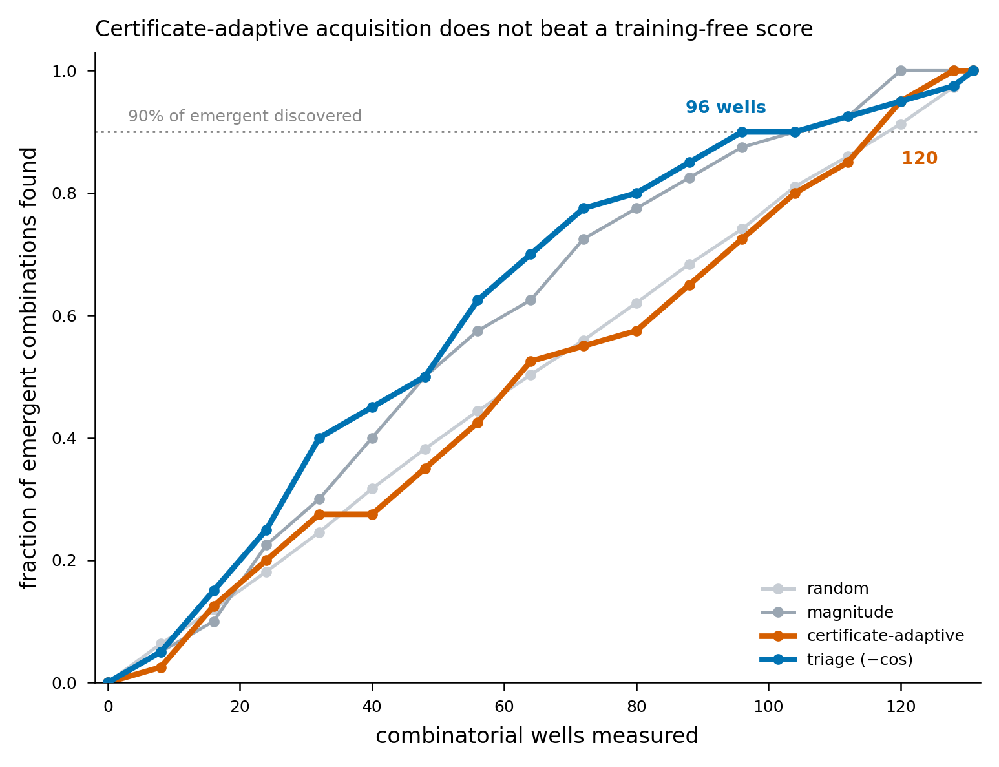

# CombiCone in a loop: certificate-guided sequential design

**Scope of this note.** CombiCone certifies whether a measured combination lands
*outside* the non-negative cone of a supplied set of measured effect atoms. The
Phase 2 layer scored and certified one combination at a time. This note puts the
certificate inside a *screening campaign* and asks the two questions a campaign
actually faces — which combination to measure next, and which new single
perturbation to add to the library — on two independent published screens. **Every
verdict here is model-relative** (outside the cone of the supplied atoms under the
chosen metric; not a claim of biological necessity), retrospective, and the
library-augmentation result is a statement about *cone geometry*, not a prediction
that a nominated perturbation will be effective at the bench. Code:
[`screenloop.py`](../../screenloop.py); driver:
[`scripts/run_screenloop_campaign.py`](../../scripts/run_screenloop_campaign.py);
tests: [`tests/test_screenloop.py`](../../tests/test_screenloop.py).

The headline is an **honest split**: the certificate does *not* win the acquisition
question, and it *uniquely* answers the library-design question.

---

## 1. Sequential acquisition — the certificate does not beat a training-free score

`replay_campaign()` replays a screen as batches (batch 8) revealed over rounds under
a pluggable acquisition policy, and records how fast each policy discovers the
two-bar noise-robust emergent combinations (the same label as
`certify_emergence`: p < 0.05 **and** floor ≥ 1.9×). Four policies: `random`
(40-seed average), `magnitude` (‖additive prediction‖), `triage` (the training-free
`−cos` score), and `cone_adaptive` (residual of each combo's additive prediction
against a cone that *grows* as measured combinations are appended).

**Wells to discover 90% of emergent combinations:**

| Screen | random | magnitude | triage (−cos) | certificate-adaptive |
|---|---|---|---|---|
| Norman (131 doubles, 40 emergent) | ~120 | 104 | **96** | 120 |
| CaRPool (158 doubles, 76 emergent) | ~144 | 144 | 144 | 144 |

On Norman the cheap training-free triage reaches 90% discovery fastest (96 wells);
the certificate-adaptive residual ties random (120). On CaRPool, where the emergent
base rate is 48%, there is little to triage and every policy ties at 144. **The
certificate-adaptive residual does not beat a training-free score at choosing what
to measure next** — consistent with the Phase 2 finding that the cone's value is
not ranking accuracy. We report this rather than bury it.

---

## 2. Library augmentation — the capability no forward predictor has

`nominate_atoms()` answers a different question. Given a library and a set of
measured combinations it cannot additively reach, each combination's cone
projection yields a model-relative **separator**: the direction the library is
missing. Aggregating those separators (residual-weighted) gives one "unmet demand"
direction, and candidate perturbations are ranked by alignment with it. A forward
predictor (GEARS, scGPT, STATE, CPA) emits a prediction for every input; **it never
emits "your library is missing an axis, and here is the axis."** The separator is
exactly that object.

**Falsifiable test (`held_out_single_recovery`).** For each single that participates
in ≥ 2 measured combinations, remove it from the library and use only the
combinations that involved it to nominate a replacement from the full candidate
pool. If the certificate captures the missing axis, the true held-out single should
rank at the top.

| Screen | eligible / candidates | separator top-1 | naive baseline top-1 | magnitude-only top-1 |
|---|---|---|---|---|
| Norman | 53 / 105 | **0.981** | 0.547 | 0.019 |
| CaRPool | 25 / 28 | **1.000** | 0.280 | 0.000 |

The separator recovers the held-out single at **median rank 1** on both screens.
The naive baseline is "average the combinations, take the most similar single"
(the obvious "the missing gene's effect dominates its own combinations" shortcut);
a random null would score ≈ 1/candidates (≈ 0.01 Norman, ≈ 0.04 CaRPool).

---

## 3. The 98% is real, not an artifact — three controls

A top-1 near 1.0 demands scrutiny. Three independent controls confirm the recovery
is *separator-driven*, not a magnitude or dominance shortcut:

| Control | Norman | CaRPool | Reading |
|---|---|---|---|
| **Permutation null** (shuffle the true-atom identity, 2000 draws) | p = 5×10⁻⁴, z = 72 | p = 5×10⁻⁴, z = 27 | recovery is far beyond chance |
| **Magnitude-only ranker** (match candidate ‖·‖ to mean combo ‖·‖) | top-1 0.019 | top-1 0.000 | magnitude alone recovers nothing |
| **Where the naive baseline fails** (separator top-1 on atoms with base rank > 1) | 0.958 (n=24) | 1.000 (n=18) | separator wins on the hard cases |
| **Dominance vs advantage** (Spearman: atom's dominance in its combos vs separator's rank gain over baseline) | ρ = −0.63 | ρ = −0.78 | advantage *grows* as the atom is *less* dominant |

The last row is the decisive one. If recovery were a trivial "the held-out gene
dominates its own combinations" effect, the separator's advantage would be largest
for the *most* dominant atoms. The opposite holds: mean dominance is 0.70 (Norman) /
0.58 (CaRPool), not ≈ 1, and the separator's edge over the naive baseline is
*largest* precisely where the held-out atom contributes *least* to its own
combinations — where the geometry, not the magnitude, must do the work.

---

## 4. What this adds to the CombiCone claim

Phase 2 established that the certificate of infeasibility is a real, noise-robust,
model-relative object distinct from effect magnitude. This note shows that object
has a **design** use a forward predictor structurally cannot provide: from the
combinations a library fails to reach, it nominates the single perturbation whose
effect supplies the missing axis, recovering a held-out ground-truth axis at
median rank 1 across two orthogonal perturbation modalities (CRISPRa and Cas13d
knockdown), under a permutation null and a magnitude-confound control. It does this
while *not* claiming to win the acquisition-ranking question — the honest boundary
that keeps the design claim credible.

**Reproduce:** `python scripts/run_screenloop_campaign.py` (≈ 7 min under
`reach-pinned`; rebuilds both emergence labels, runs the campaigns, the recovery,
and the nulls, and re-verifies the frozen headline numbers, failing closed on
drift). Substrates committed at repo root: `combicone_substrate.npz` (Norman),
`carpool_substrate.npz` (CaRPool). Metrics:
[`screenloop_norman_metrics.json`](screenloop_norman_metrics.json),
[`screenloop_carpool_metrics.json`](screenloop_carpool_metrics.json).
